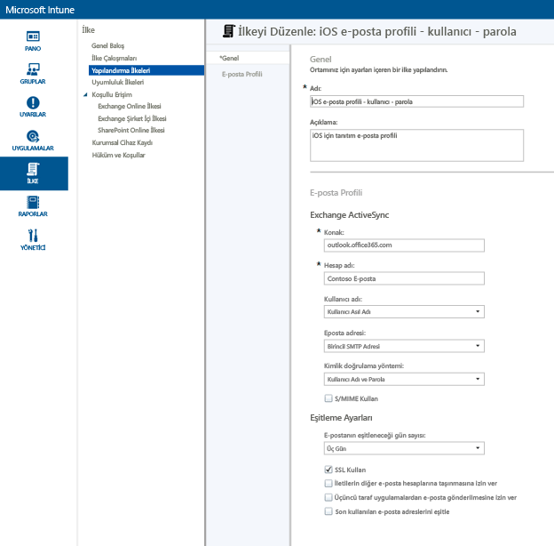
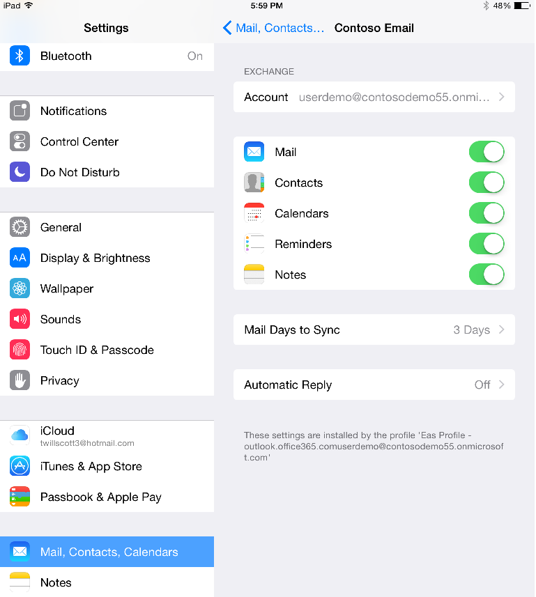
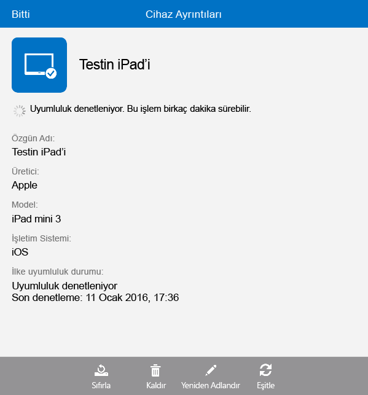

# Microsoft Intune kullanarak iOS cihazları için e-posta erişimi ayarlama
Cihazlar Intune’a kaydedildiğinde, kullanıcıların şirket e-postasına erişmesini sağlayacak şekilde cihazları yapılandırabilirsiniz. Belirli cihaz türlerinde bunu başarmanın yollarından biri, **e-posta profili** oluşturmak ve dağıtmaktır. E-posta profilleri, kullanıcının cihazını ayarlayan ve şirket e-posta hizmetinize bağlayan bir tür Intune ilkesidir.
E-posta profilinin kullanılması, kayıtlı cihazlarda e-posta erişimini otomatik hale getirir ve bu da cihazı el ile ayarlama gereğini ortadan kaldırır. E-posta profili tüm son kullanıcıların erişimi aynı yolla ayarlamasını ve aynı temel ayarları kullanmasını da güvence altına alır.

## Bu yönergelerin hedefleri

- iOS cihazları için e-posta profili oluşturma ve dağıtma
- E-posta profili ilkesinin başarıyla uygulandığını doğrulama

## Bu yönergelere başlamadan önce gerekenler

- Şirket içi veya Office/E3 aboneliğiniz kapsamında Azure’da barındırılan bir Exchange Server.
- Şirketinizin Exchange sunucusunun konak adı. Bu tam etki alanı adıdır (FQDN); örneğin, **contosodemo55.onmicrosoft.com**.
- E-posta profilinin dağıtılacağı kullanıcı grubu. [Microsoft Intune denemesi başlatma ve iOS PIN ilkesini dağıtma](start-a-microsoft-intune-trial-and-deploy-ios-pin-policy.md) yönergelerini tamamladıysanız, onun için oluşturduğunuz **GrupDemo** kullanıcı grubunu kullanabilirsiniz.
- Profilin dağıtılacağı kayıtlı iOS cihazları. Aynı şekilde, [Microsoft Intune denemesi başlatma ve iOS PIN ilkesini dağıtma](start-a-microsoft-intune-trial-and-deploy-ios-pin-policy.md) yönergelerini tamamladıysanız, kayıtlı bazı iOS cihazlarınız vardır.

## iOS cihazları için e-posta profili oluşturma ve dağıtma adımları

Bu yönergelerde, deneme aboneliğiyle birlikte gelen barındırılan Exchange sunucusunu kullanacağız.
1. Intune konsolunda **İlke**’ye tıklayın ve sonra da **İlke Ekle**’ye tıklayın.

2. **Yeni İlke Oluştur** iletişim kutusunda **iOS**’u genişletin, **E-posta Profili**’ni seçin ve ardından **İlke Oluştur**’a tıklayın.  

3. İlke oluştur sayfasında, ilke için bir ad (örneğin, **iOS e-posta profili - kullanıcı parolası**) ve açıklama girin. Farklı cihaz türleri ve farklı kimlik doğrulama yöntemleri için birden çok e-posta profiliniz olabileceğinden, profilin neye yönelik olduğunu göstermek için adını kullanabilirsiniz.
4. Exchange konak adını girin. Azure üzerinde barındırılan bir Exchange sunucusu kullandığımızdan, konak adı olarak basitçe şunu giriyoruz: **outlook.office365.com**

5. E-posta hizmetini belirlemelerine yardımcı olmak için kullanıcılara gösterilecek olan hesap adını girin. Örneğin, **Contoso E-posta**.
6. Exchange hizmetinde kullanıcının kimliğini doğrulamak için kullanıcı adı ve parola kullandığımızdan, kullanıcı adı ve parola ayarlarını olduğu gibi bırakın.
7. Eşitleme ayarlarını gereksinimlerinize uygun hale getirin. Şimdilik, özellikle değiştirmek istediğiniz bir ayar yoksa varsayılan değerleri olduğu gibi bırakın.  
8. **İlkeyi Kaydet**’e tıklayın.
9. İlkeyi şimdi dağıtmak isteyip istemediğinizi soran bir iletişim kutusu görüntülenir. **Evet**’e tıklayın.

10. Ardından görüntülenen pencerede, e-posta profilini dağıtmak istediğiniz kullanıcı grubunu seçin, **Ekle**’ye ve sonra da **Tamam**’a tıklayın.  
  
**Tamam**’a tıkladıktan sonra, bir veya iki dakika içinde ilkenin kayıtlı cihazlara akışı başlatılır.

## Profilin başarıyla uygulandığını doğrulama adımları

Profilin uygulandığını doğrulamak için, e-posta profilini dağıttığınız cihazlardan birine erişmelisiniz.
1. iOS cihazında Posta uygulamasını açın.
Uygulama sizden kullanıcının e-posta kullanıcı adını ve parolasını girmenizi ister.  

2. Kullanıcın Exchange e-posta hesabının kullanıcı adını ve parolasını girin, ardından **Tamam**’a dokunun.
 Posta uygulaması Exchange hesabını açar ve e-posta cihazla eşitlenmeye başlar.

3. Posta uygulamasının hesap ayarlarını denetleyin ve hesap adının e-posta profiline girdiğiniz adla aynı olduğundan (örneğin, **Contoso Posta**), eşitleme ayarlarının doğru belirlendiğinden emin olun.

  
  E-posta profili cihaza otomatik olarak uygulanmamış gibi görünüyorsa, cihazdaki Şirket Portalı uygulamasını kullanarak ilkeyi kendiniz uygulayabilirsiniz.
1. Şirket Portalı uygulamasını açın.
2. **Cihazlarım**’a dokunun.
3. Cihazınızın adına dokunun.

4. **Eşitle** > **Uyumluluğu Denetle**’ye dokunun.
 Birkaç dakika sonra e-posta profili cihaza uygulanmış olur. Bundan sonra, profilin doğru uygulandığından emin olmak için doğrulama adımlarını izleyebilirsiniz.

## Ayrıca Bkz.
[Intune değerlendirme kılavuzu](get-started-with-a-30-day-trial-of-microsoft-intune.md)

<!--HONumber=Jul16_HO4-->

