# Bir Microsoft Intune denemesi başlatma ve iOS PIN ilkesi dağıtma
Bu adım adım yönergeler bir Intune denemesi ayarlamanıza ve iOS cihazları için bir PIN ilkesi yapılandırmanıza yardımcı olur. Deneyebileceğiniz diğer ortak Intune değerlendirme görevlerinin listesi için bkz. [Ortak Microsoft Intune değerlendirme görevleri](common-microsoft-intune-evaluation-tasks.md).

## Bu görevin önkoşullarını gözden geçirme

-   Internet Explorer ile Windows bilgisayar - yönetim görevlerini gerçekleştirmek için

-   Kullanıcı ilkesi doğrulama testi için iOS 7.1 veya sonraki cihaz

-   Deneme hesabına kaydolma sırasında kimliğinizi doğrulamak için telefon

## Ücretsiz bir Intune deneme hesabı oluşturma
> [!NOTE]
> Intune aboneliğiniz zaten varsa bu bölüm atlayın ve sonraki bölüme gidin.

1.  Bir Windows PC kullanarak **Internet Explorer** (IE) öğesine sağ tıklayın ve **InPrivate Gözatma**’yı seçin.

    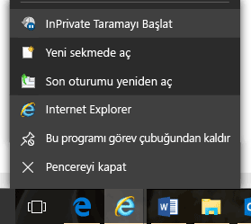

2.  [Intune kayıt portalı](https://portal.office.com/Signup/Signup.aspx?OfferId=40BE278A-DFD1-470a-9EF7-9F2596EA7FF9&dl=INTUNE_A&ali=1)’na gidin, istenen bilgileri sağlayın ve **İleri**’ye tıklayın.

    

3.  Yönetici hesabınız için bir kullanıcı kimliği ve parola girin ve **İleri**’ye tıklayın. Bu kimliği, yönetim görevlerinizi gerçekleştirmek üzere Intune portalında oturum açmak için kullanacaksınız.

    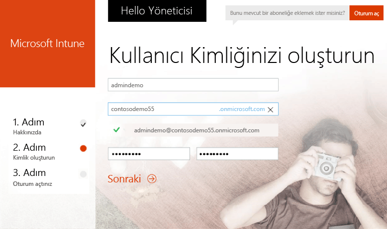

4.  Cep telefonu numaranızı girin ve telefon numaranızı doğrulamak için **Bana ileti gönder**’e tıklayın.

    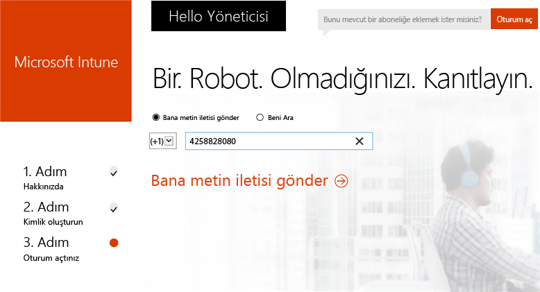

5.  Ekranda gösterilen bilgileri kaydedin ve ardından **Başlamaya hazırsınız...** öğesine tıklayın.

    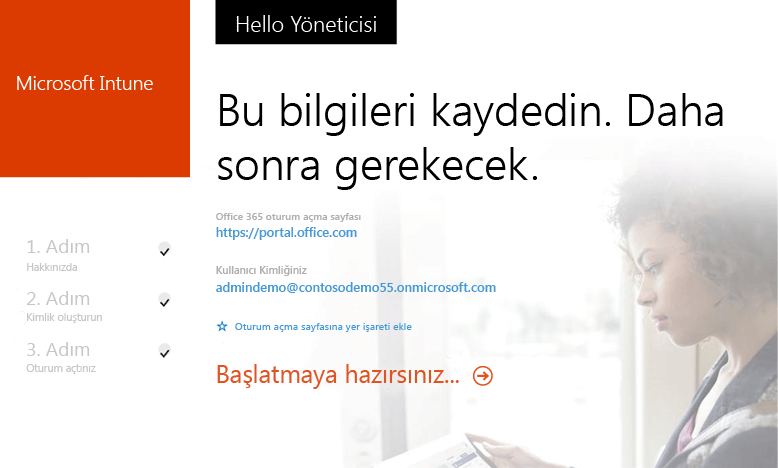

## Test kullanıcısı oluşturma

1.  Bir Windows bilgisayar kullanarak **Başlat**’a tıklayıp kullanıcı yönetimi sayfasına gidin.

    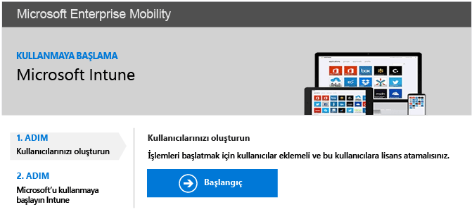

2.  Kullanıcı eklemek için **+** düğmesine tıklayın.

    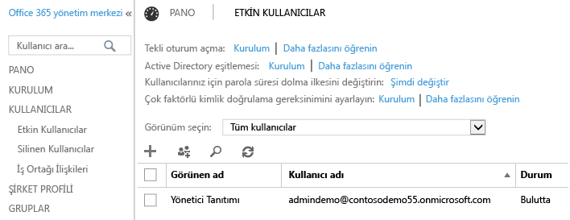

3.  **Yeni kullanıcı hesabı oluşturma** sayfasında:

    1.  Test kullanıcısı bilgilerini sağlayın.

    2.  **Parolayı yaz** seçeneğini belirleyin.

    3.  **Bir daha oturum açtığında bu kişinin parola değiştirmesini iste** onay kutusunun işaretini kaldırın.

    4.  **Oluştur**'a tıklayın.

    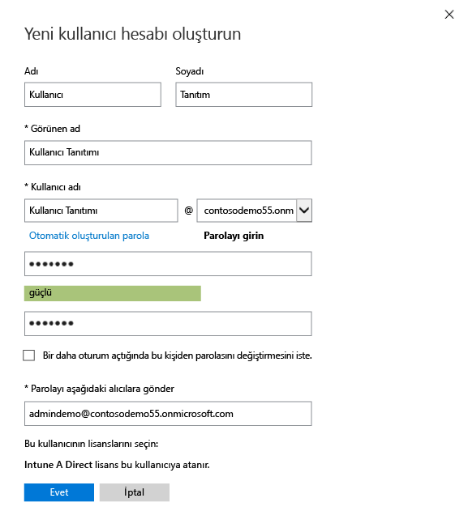

4.  Kullanıcı oluşturma onayı sayfasında **Kapat**’a tıklayın.

    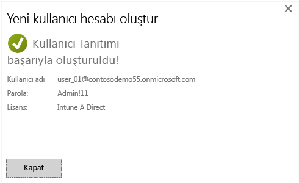

5.  Oluşturduğunuz test kullanıcısını görmek için **Yenile** düğmesine tıklayın.

    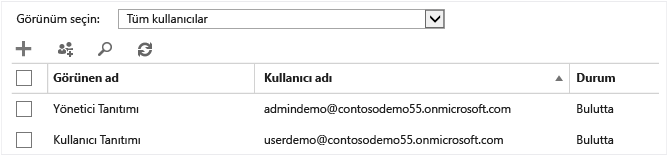

## Test kullanıcısı için bir iOS PIN ilkesi yapılandırma

1.  Bir Windows bilgisayar kullanarak MDM yetkilisini Intune olacak şekilde ayarlayın:

    1.  [Intune Yönetim Konsolu](http://manage.microsoft.com/)’na gidin, yönetici hesabınızla oturum açın ve **Mobil Cihazları Yönetmeyi Başlat**’a tıklayın. Mobil Cihaz Yönetimi yetkilisi sayfası açılır.

        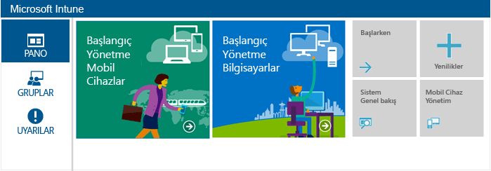

    2.  **Mobil Cihaz Yönetimi Yetkilisini Ayarla** bağlantısına tıklayın.

        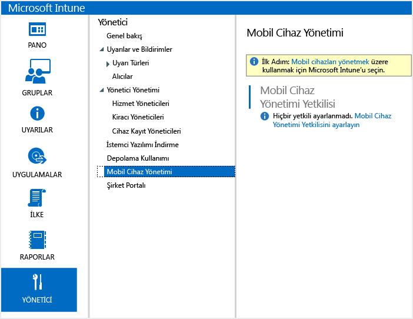

2.  iOS cihazlarının kaydını etkinleştirin. Bu işlem Apple Anında İletilen Bildirim Servisi (APN) ile Intune aboneliğiniz arasında güvenilen bir sertifika ayarlar.

    1.  **iOS ve Mac OS X platformunu etkinleştir** öğesine tıklayın.

        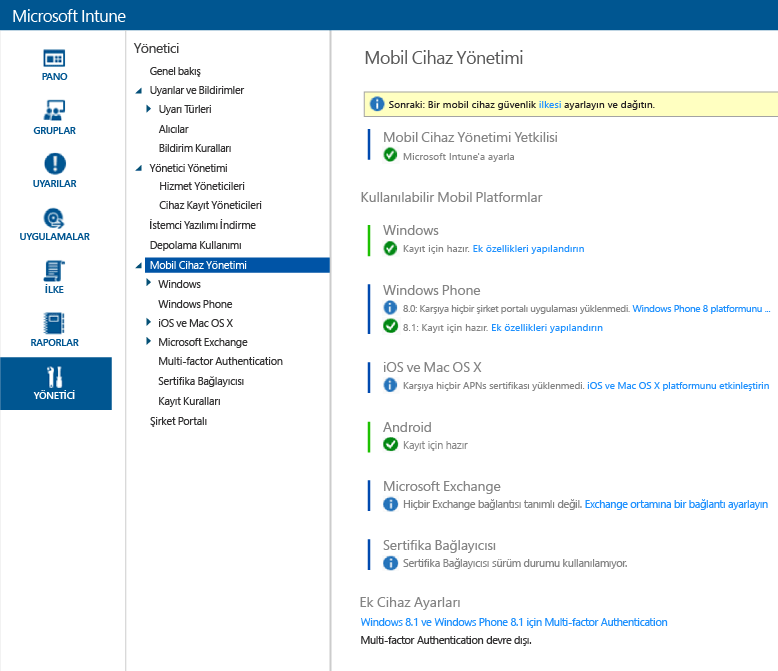

    2.  **APNs Sertifika İsteğini İndir** öğesine tıklayın.

        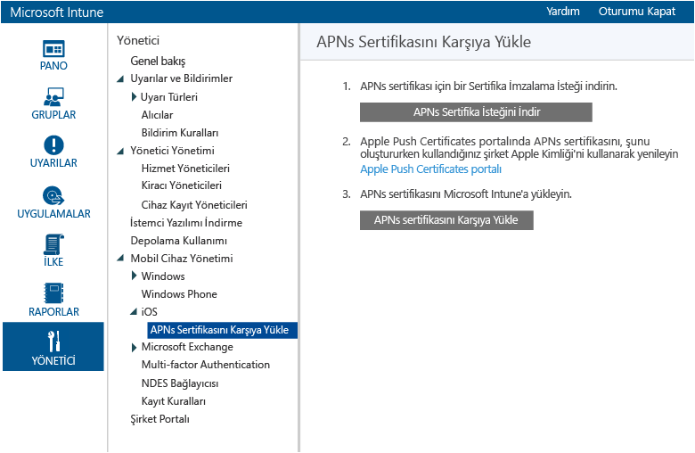

    3.  Sertifika İmzalama İsteği (CSR) için bir dosya adı ve konum belirtin ve ardından **Kaydet**’e tıklayın. Bu dosya Intune aboneliğiniz tarafından tutulan özel bir anahtara karşılık gelen ortak anahtarı saklar.

        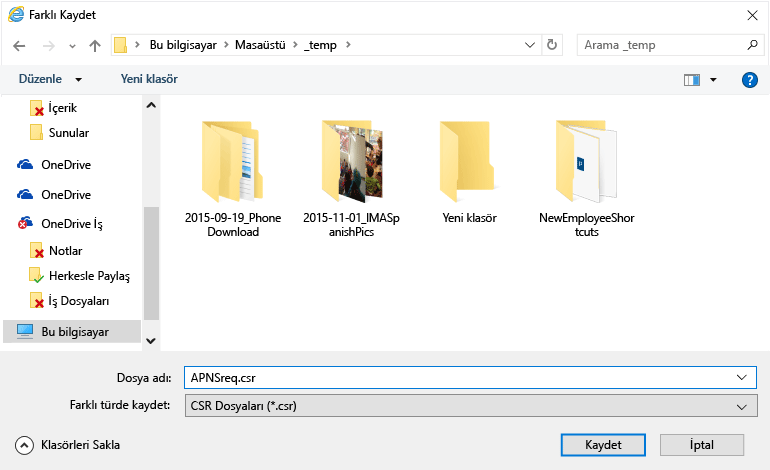

    4.  **Apple Push Certificates portalı**’na tıklayarak yeni bir sekme açın.

        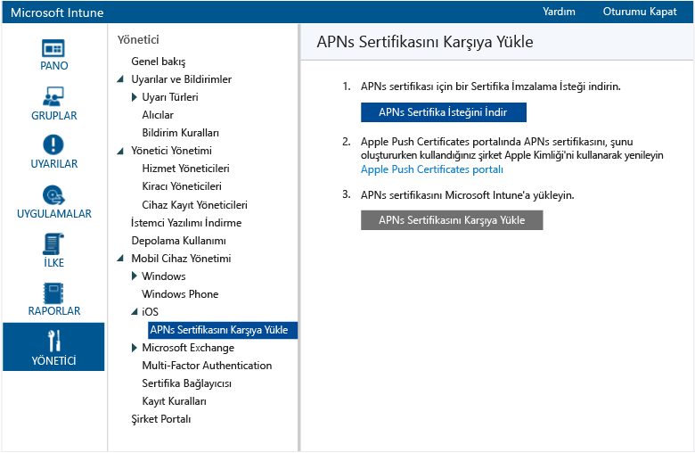

    5.  Apple kimliği ve parolanızı girin ve **Oturum Aç**’a tıklayın. Bu kimlik iOS cihazınızda iOS App Store'dan uygulama almak için kullandığınız kimlik olabilir.

        

    6.  **Sertifika Oluştur**’a tıklayın.

        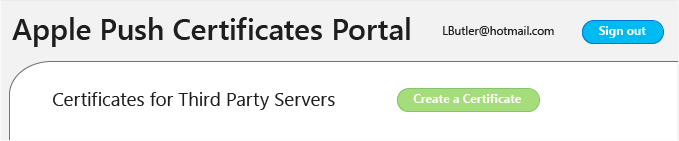

    7.  Apple’ın Kullanım Koşulları’nı okuyun, onay kutusunu işaretleyin ve **Kabul Et**’e tıklayın.

        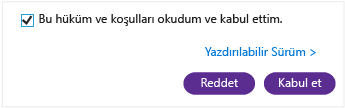

    8.  **Gözat**'a tıklayın.

        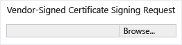

    9. Daha önce kaydettiğiniz CSR dosyasını seçin ve **Aç**’a tıklayın.

        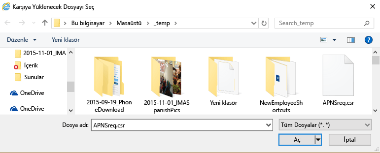

    10. **Karşıya Yükle** düğmesine tıklayın.

        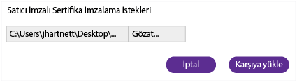

    11. JSON dosyası indirmeniz istendiğinde **Farklı Kaydet**’e tıklayın.

        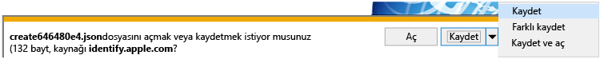

    12. JSON dosyanız için bir konum belirtin ve **Kaydet**’e tıklayın.

        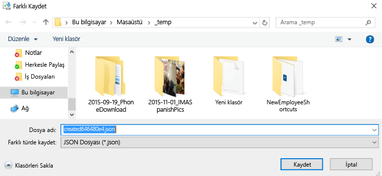

        Sayfanız birkaç saniye sonra otomatik olarak yönlendirmezse **İptal**’e tıklayın.

        

    13. Yeni oluşturduğunuz sertifikayı almak için **İndir**’e tıklayın.

        

    14. PEM dosyası indirmeniz istendiğinde **Farklı Kaydet**’e tıklayın.

        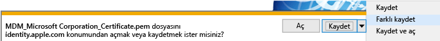

    15. PEM dosyası için bir konum belirtin ve **Kaydet**’e tıklayın.

        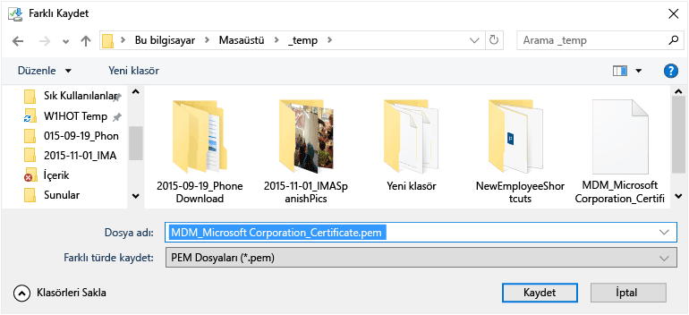

    16. Intune Yönetim Konsolu sekmesine geri dönün ve **APN Sertifikalarını Karşıya Yükle** öğesine tıklayın.

        

    17. Apple Kimliğinizi girin ve **Gözat**’a tıklayın.

        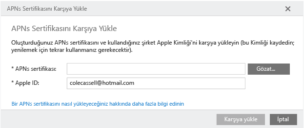

    18. Yeni kaydettiğiniz PEM dosyasını seçin ve **Aç**’a tıklayın.

        

    19. Tamamlamak için **Karşıya Yükle**.

        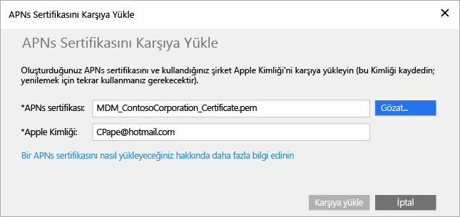

        APN sertifikanız artık yapılandırılmıştır.

        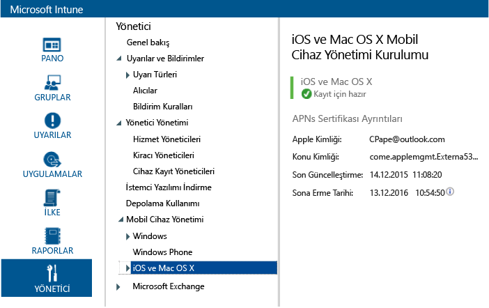

3.  İlke hedefleme için bir test kullanıcı grubu oluşturun:

    1.  Sol bölmede **Gruplar**’a tıklayın.

        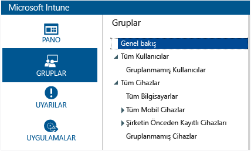

    2.  En sağdaki **Grup Oluştur**’a tıklayın.

        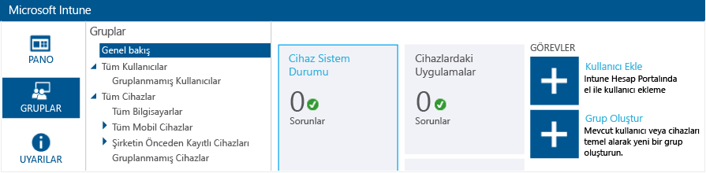

    3.  Bir grup adı belirtin, üst grup olarak **Tüm Kullanıcılar**’ı seçin ve **İleri**’ye tıklayın.

        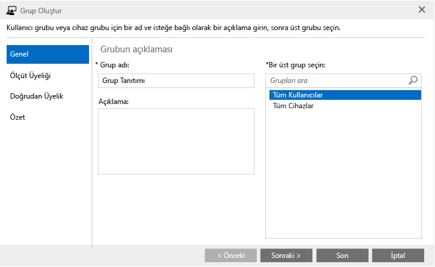

    4.  **Şununla grup üyeliği başlat:** alanında **Üst gruptaki Tüm Kullanıcılar**’ı seçin ve **Son**’a tıklayın.

        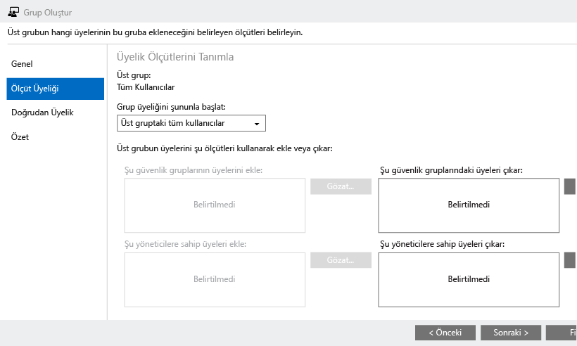

4.  Bir iOS PIN ilkesi oluşturun ve test kullanıcı grubu için hedefleyin:

    1.  Sol bölmede **İlke**’ye tıklayın.

        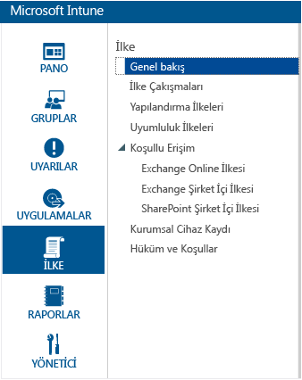

    2.  En sağdaki **İlke Ekle**’ye tıklayın.

        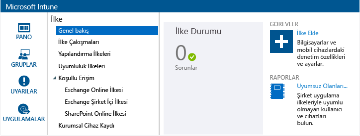

    3.  iOS düğümünü genişletin, **Genel Yapılandırma** satırını seçin ve **İlke Oluştur**’a tıklayın.

        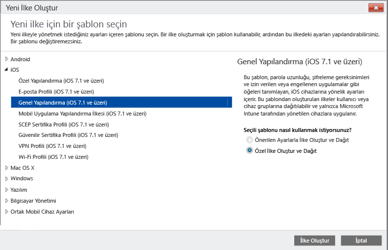

    4.  İlke için bir ad yazın, **Mobil cihazların kilidini açmak için bir parola gerektir** seçeneğini açın ve **En az parola uzunluğu**’nu **4** olarak ayarlayın.

        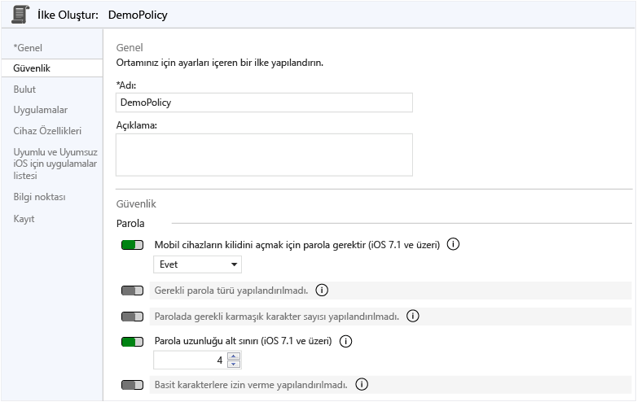

    5.  İlkeyi dağıtmak için **Evet**’e tıklayın.

        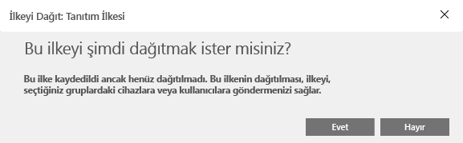

    6.  Daha önce oluşturulan kullanıcı grubuna, **Ekle** ve **Tamam**’a tıklayın.

        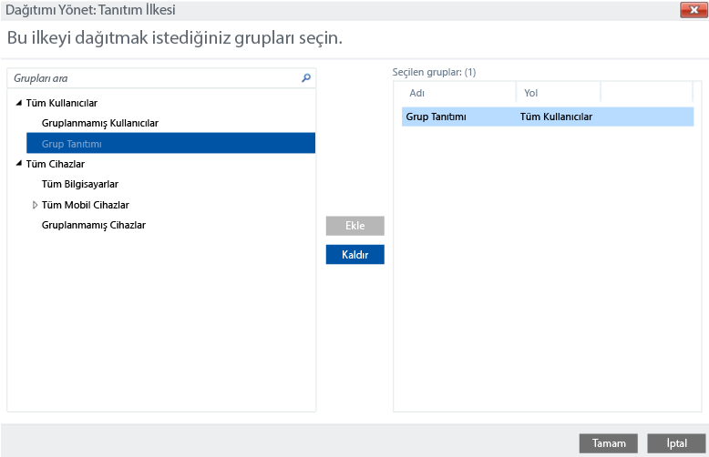

        Artık test kullanıcı grubunuzu hedefleyen bir iOS PIN ilkeniz vardır.

        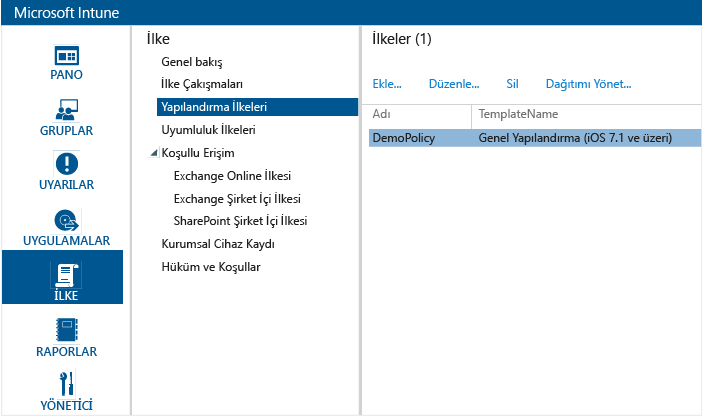

## İlkenin bir iOS cihazına uygulandığını doğrulama

1.  Bir iPad cihazında iOS App Store’u başlatın, ücretsiz **Microsoft Intune Şirket Portalı** uygulamasını yükleyin ve açın.

    

2.  Test kullanıcı hesabı adını ve parolasını girin ve **Oturum Aç**’a dokunun.

    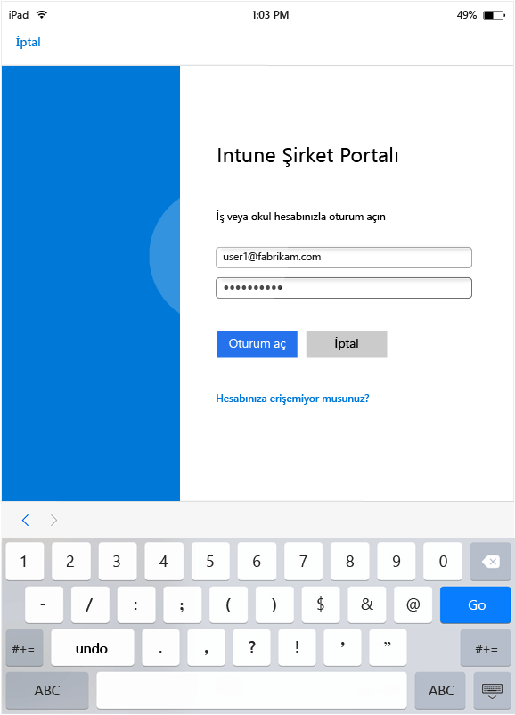

3.  **Kaydet**’e dokunarak cihazı Intune’a kaydetmeye başlayın.

    

4.  **Profil Yükle** ekranında **Yükle** öğesine dokunun.

    

5.  **Profil Yükle** iletişim kutusunda **Yükle** öğesine dokunun.

    

6.  **Uyarı** ekranında **Yükle** öğesine dokunun.

    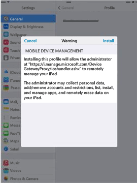

7.  **Uzak Yönetim** iletişim kutusunda **Güven**’e dokunun.

    

8.  Yönetim profilini yükleme tamamlandığında **Bitti**’ye dokunun. Kayıt tamamlanmıştır.

    

9. Kayıt tamamlandığında **Tamam**’a dokunun ve ardından Şirket Portalı uygulamasını kapatın.

    

10. Bir geçiş kodu yapılandırmanız istendiğinde **Devam**’a dokunun.

    

11. Geçiş kodunuzu girin, **Devam**’a dokunun, geçiş kodunuzu tekrar girin ve **Kaydet**’e dokunun.

    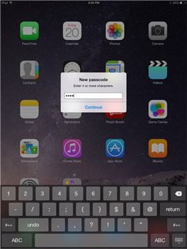

12. iPad cihazınızı kilitlemek için güç düğmesine basın, kilidini açmak için kaydırın ve cihazın kilidini açmak için geçiş kodunuzu girmeniz gerektiğini görün.

### Ayrıca bkz.
[Intune değerlendirme kılavuzu](get-started-with-a-30-day-trial-of-microsoft-intune.md)

<!--HONumber=Jul16_HO3-->

