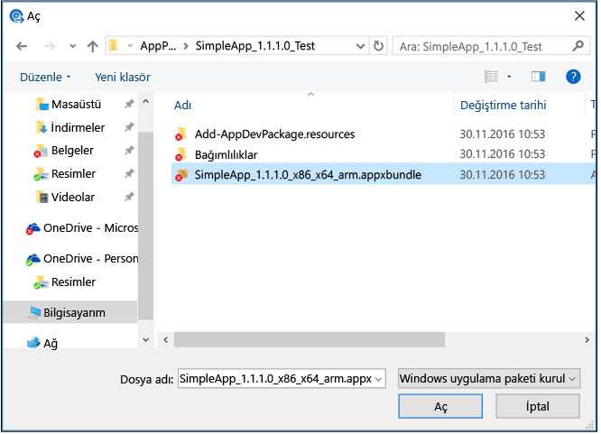

# Microsoft Intune’la uygulamaları ekleme
Microsoft Intune’la uygulamaları dağıtmaya başlamadan önce, biraz zaman ayırın ve bu konu başlığı altında tanıtılan kavramları öğrenin. Bu kavramlar hangi uygulamaları hangi platforma dağıtabileceğinizi anlamanıza yardımcı olur. Ayrıca uygulamaları dağıtmadan önce karşılanması gereken önkoşulları anlamanıza da yardımcı olur.

## Dağıtabileceğiniz uygulama türleri

### Yazılım yükleyicisi

|Uygulama türü|Ayrıntılar|
|----------------|-------|
|**Windows Installer (&#42;.exe, &#42;.msi)**|Bu uygulama türü, kullanıcı girişi gerektirmeyen sessiz yüklemeyi desteklemelidir. Uygulama belgelerinizde, uygulamayı sessiz yüklemek için uygun komut satırı seçenekleri verilmiş olmalıdır (örneğin, **/q**). [Microsoft Windows Installer Aracı için Komut Satırı Anahtarları](https://support.microsoft.com/en-us/kb/227091) bölümünde sık kullanılan komut satırı seçeneklerinin bir listesini bulabilirsiniz.  Uygulamanın kurulum programının gerektirdiği tüm ek dosya ve klasörler, uygulama kurulum dosyaları için belirttiğiniz konumda bulunmalıdır.  Genellikle Windows Installer (.msi) ve Windows Installer Düzeltme Eki (.msp) dosyaları, Intune tarafından herhangi bir komut satırı bağımsız değişkeni yüklenmesini gerektirmez. Uygulama belgelerinize bakın.  Komut satırı bağımsız değişkenleri gerekiyorsa, bu bağımsız değişkenler Ad=Değer çiftleri halinde girilmelidir (örneğin, TRANSFORMS=custom_transform.mst).|
|**Android için Uygulama Paketi (&#42;.apk)**|Android uygulamalarını dağıtmak için geçerli bir .apk paketiniz olmalıdır.|
|**iOS için Uygulama Paketi (&#42;.ipa)**|iOS uygulamalarını dağıtmak için geçerli bir .ipa paketiniz olmalıdır.  .ipa paketi Apple tarafından imzalanmalı ve sağlama profilinde belirtilen sona erme tarihi geçerli olmalıdır. Intune, kuruluş sertifikası iOS uygulamalarını dağıtabilir.  Tüm Apple geliştirici sertifikası uygulamaları desteklenmez.  Şirketiniz iOS Geliştirici Kurumsal Programı'na kayıtlı olmalıdır.  Kuruluşunuzun güvenlik duvarının iOS sağlama ve sertifika web sitelerine erişim izni verdiğinden emin olun.  Uygulamayla birlikte bildirim dosyası (.plist) dağıtmanız gerekmez.|
|**Windows Phone uygulama paketi (&#42;.xap, .appx, .appxbundle)**|Uygulamaları dağıtmak için, bir kurumsal mobil kod imzalama sertifikası gerekir. Ayrıntılar için bkz. [Microsoft Intune ile Windows Phone yönetimini ayarlama](set-up-windows-phone-management-with-microsoft-intune.md).|
|**Windows uygulama paketi (.appx, .appxbundle)**|Uygulamaları dağıtmak için, bir kurumsal mobil kod imzalama sertifikası gerekir. Ayrıntılar için bkz. [Microsoft Intune ile Windows cihazı yönetimini ayarlama](set-up-windows-device-management-with-microsoft-intune.md).|
|**MDM aracılığıyla Windows Installer (&#42;.msi)**|Bu uygulamayı Windows Installer tabanlı uygulamalar oluşturmak ve Windows 10 çalıştıran kayıtlı bilgisayarlara dağıtmak için kullanırsınız. Bu bilgisayarlar, mobil cihaz yönetimi (MDM) üzerinden yönetilir.  Yalnızca .msi uzantılı tek bir dosyayı karşıya yükleyebilirsiniz.  Dosyanın ürün kodu ve ürün sürümü, uygulama algılama için kullanılır.  Uygulamanın varsayılan yeniden başlatma davranışı kullanılır. Intune bunu denetlemez.  Tek bir kullanıcı için kullanıcı başına MSI paketleri yüklenir.  Cihazdaki tüm kullanıcılar için makine başına MSI paketleri yüklenir.  Çift modlu MSI paketleri şu anda yalnızca cihazdaki tüm kullanıcılar için yüklenir.  Her sürümün MSI ürün kodu aynı olduğunda uygulama güncelleştirmeleri desteklenir. 
Tüm yazılım yükleyicisi uygulama türleri bulut depolama alanınıza yüklenir.

### **Dış Bağlantı**
Aşağıdakilere sahipseniz dış bağlantı kullanın:
- Kullanıcıların uygulama mağazasından bir uygulama indirmesini sağlayan URL.
- Web tarayıcısından çalıştırılan web tabanlı bir uygulamanın bağlantısı.

Dış bağlantılara dayalı uygulamalar, Intune bulut depolama alanınızda depolanmaz.
### **Uygulama mağazasından yönetilen iOS uygulaması**
Uygulama mağazasından ücretsiz olarak sağlanan iOS uygulamalarını yönetebilir ve dağıtabilirsiniz. Ayrıca, yönetilen iOS uygulamalarını [mobil uygulama yönetim ilkelerini](configure-and-deploy-mobile-application-management-policies-in-the-microsoft-intune-console.md) [uyumlu uygulamalar](https://www.microsoft.com/en-us/server-cloud/products/microsoft-intune/partners.aspx) ile ilişkilendirmek ve yönetici konsolundaki durumlarını gözden geçirmek için kullanabilirsiniz.  Yönetilen iOS uygulamaları Intune bulut depolama alanınızda depolanmaz.

> [!TIP]
> Intune’u [MDM yetkilisi](prerequisites-for-enrollment.md) olarak ayarlamadığınız sürece, mobil cihazlara yönelik seçenekler kullanılamaz.

## Intune yazılım yayımcısı
Microsoft Intune Yazılım Yayımcısı, Intune yönetici konsolundan uygulama eklediğinizde veya değiştirdiğinizde başlatılır. Yayımcıdan şunlardan birini yapacak bir yazılım yükleyicisi türü seçin ve yapılandırın:

- Intune bulut depolama hizmetinde depolanacak uygulamaları (bilgisayarlar için programlar veya mobil cihazlar için uygulamalar) karşıya yükleyin.
- Bir çevrimiçi mağaza ya da web uygulaması bağlantısı kurun.

Yazılım yayımcısını kullanmaya başlamadan önce [Microsoft .NET Framework 4.0](https://www.microsoft.com/download/details.aspx?id=17851)'ın tam sürümünü yüklemeniz gerekir. Yüklemeden sonra yazılım yayımcısının doğru şekilde açılması için bilgisayarınızı yeniden başlatmanız gerekebilir.

## Bulut depolama alanı
Yazılım yükleyicisi yükleme türünü kullanarak oluşturduğunuz tüm uygulamalar (örneğin, bir iş kolu uygulaması) paketlenir ve Microsoft Intune bulut depolama alanına yüklenir. Intune deneme aboneliği, yönetilen uygulamaları ve güncelleştirmeleri depolamak için kullanılan 2 gigabayt (GB) bulut tabanlı depolama alanı içerir. Tam aboneliğiniz 20 GB depolama alanı içerir.

**Yönetici** çalışma alanının **Depolama Kullanımı** düğümünde ne kadar alan kullandığınızı görebilirsiniz.

Bulut depolama alanı gereksinimleri aşağıda belirtilmiştir:

-   Tüm uygulama yükleme dosyaları aynı klasörde olmalıdır.
-   Karşıya yüklediğiniz her dosya için dosya boyutu üst sınırı 2 GB'dir.

## Evrensel Windows Platformu (UWP) uygulamaları desteği
Windows 10 bilgisayarları, iş kolu uygulamalarını yüklemek için dışarıdan yükleme anahtarı gerektirmez. Bununla birlikte, dışarıdan yüklemeyi etkinleştirmek için, **HKEY_LOCAL_MACHINE\Software\Policies\Microsoft\Windows\Appx\AllowAllTrustedApps** kayıt defteri anahtarının değeri **1** olmalıdır.

Bu kayıt defteri anahtarı yapılandırılmazsa, cihaza ilk kez uygulama dağıttığınızda Intune bu değeri otomatik olarak **1**’e ayarlar. Bu değeri **0** olarak ayarlarsanız, Intune değeri otomatik olarak değiştiremez ve iş kolu uygulamalarının dağıtımı başarısız olur.

Evrensel Windows Platformu iş kolu uygulamaları, uygulamanın dağıtıldığı her cihazda güvenilen bir kod imzalama sertifikasıyla imzalanmalıdır. Şirket içi ortak anahtar altyapısından (PKI) bir sertifika veya cihaza yüklenmiş üçüncü taraf genel kök sertifikasından bir sertifika kullanabilirsiniz.

Windows 10 Mobile cihazlarında, evrensel **.appx** uygulamalarını imzalamak için Symantec dışında bir kod imzalama sertifikası kullanabilirsiniz. **.xap** uygulamaları ve aynı zamanda Windows 10 Mobile cihazlarının üzerine yüklemek istediğiniz Windows Phone 8.1 için oluşturulmuş **.appx** paketleri için, Symantec kod imzalama sertifikası kullanmalısınız.

### UWP uygulamaları için bağımlılıklar

Intune’a bir Windows 10 Evrensel appxbundle paketi eklediğinizde, uygulama için tüm bağımlılıkların karşıya yüklendiğinden emin olmalısınız.
Bunu yapmak için uygulama oluşturulduğunda oluşturulan **Bağımlılıklar** klasörünün .appxbundle dosyası ile aynı klasörde olduğundan emin olun.
Bu şekilde, uygulamayı Intune’a yüklediğinizde **Bağımlılıklar** klasöründeki tüm dosyalar da karşıya yüklenir. Aşağıdaki ekran görüntüsü bunu göstermektedir:

## Sonraki adımlar

Uygulamaları dağıtabilmek için önce Intune konsoluna eklemeniz gerekir. [Kayıtlı cihazlar](add-apps-for-mobile-devices-in-microsoft-intune.md) için veya [Intune istemci yazılımıyla yönettiğiniz Windows bilgisayarları](add-apps-for-windows-pcs-in-microsoft-intune.md) için uygulamalar ekleyebilirsiniz.

<!--HONumber=Dec16_HO2-->

