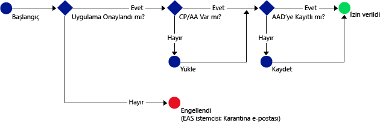

# Yalnızca Intune uygulama koruma ilkelerini destekleyen mobil uygulamaların Office 365 hizmetlerine erişimine izni verme

[!INCLUDE[classic-portal](../includes/classic-portal.md)]

[Intune uygulama koruma ilkeleri](protect-apps-and-data-with-microsoft-intune.md) yönetilmek üzere Intune’da kayıtlı cihazlarda şirket verilerinizi korumaya yardımcı olur. Uygulama koruma ilkelerini, **yönetilmek üzere Intune’da kaydedilmemiş çalışan cihazları** üzerinde de uygulayabilirsiniz.  Bu durumda, cihazı yönetmiyor olmanıza rağmen, şirket verilerinizin ve kaynaklarınızın korunmasını sağlamanız gerekir. MAM ile Uygulama tabanlı koşullu erişim kullanarak, Exchange Online gibi O365 hizmetlerine yalnızca Intune uygulama koruma ilkelerini destekleyen mobil uygulamaların erişimine izin veren bir ilke oluşturabilirsiniz.

Örneğin, yalnızca **Microsoft Outlook uygulamasının** Exchange Online'a erişmesine izin vermek için **Exchange Online**’dan e-posta almak üzere Intune MAM ilkeleri tarafından sağlanan veri korumasına sahip olmayan **iOS ve Android’de yerleşik posta uygulamalarını engelleyebilirsiniz**.

Aşağıdaki diyagramda Uygulama tabanlı koşullu erişim ilkeleri tarafından erişime ne zaman izin verilip ne zaman engelleneceğini belirlemek için kullanılan akış gösterilmektedir: .

Diyagramlarda kullanılan kısaltmaların açıklaması:
* **CP**: Şirket Portalı uygulaması
* **AA**: Azure Authenticator uygulaması
* **AAD**: Azure Active Directory
* **EAS**: Exchange Active Sync

## Önkoşullar
Bir Uygulama tabanlı koşullu erişim ilkesi yapılandırmadan **önce**, bir **Enterprise Mobility + Security veya bir Azure Active Directory premium aboneliğinizin** olması ve kullanıcıların EMS veya Azure AD lisansına sahip olması gerekir. Daha fazla ayrıntı için bkz. [Enterprise Mobility fiyatlandırma sayfası](https://www.microsoft.com/en-us/cloud-platform/enterprise-mobility-pricing) veya [Azure Active Directory fiyatlandırma sayfası](https://azure.microsoft.com/en-us/pricing/details/active-directory/).

## Desteklenen uygulamalar
**Exchange Online**: Android ve iOS için **Microsoft Outlook**.

Uygulama tabanlı koşullu erişim ilkelerine sahip bir uygulama ile kullanıcı deneyimi hakkında bilgi edinmek için bkz. [MAM CA ile bir uygulama kullanırken beklenmesi gerekenler](use-apps-with-mam-ca.md).

## Sonraki adımlar
[MAM uygulamaları için bir Exchange Online İlkesi oluşturma](mam-ca-for-exchange-online.md)

[Modern kimlik doğrulaması olmayan uygulamaları engelleme](block-apps-with-no-modern-authentication.md)

### Ayrıca bkz.

[Uygulama verilerini uygulama koruma ilkeleriyle koruma](protect-app-data-using-mobile-app-management-policies-with-microsoft-intune.md)

