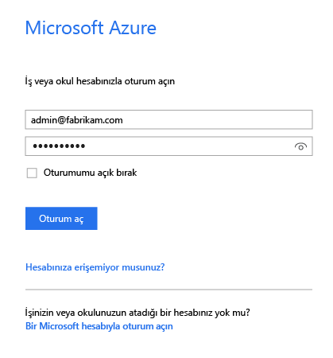
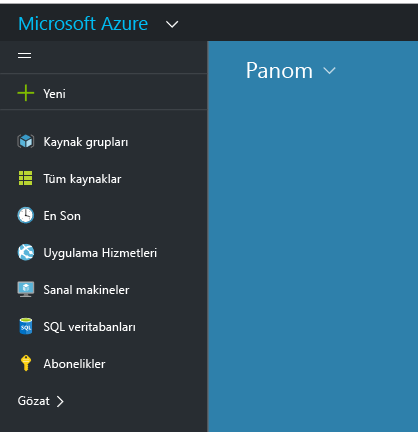
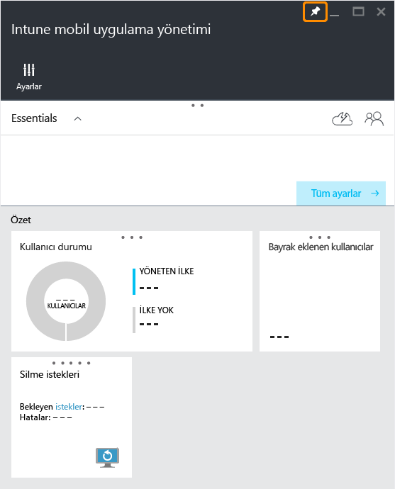
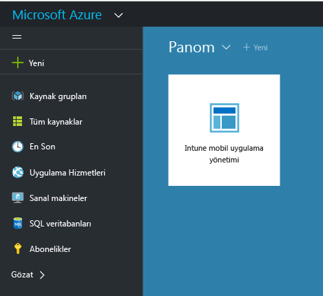

# Microsoft Intune MAM ilkeleri için Azure portalı

[!INCLUDE[classic-portal](../includes/classic-portal.md)]

Azure portalı, mobil uygulama yönetimi (MAM) ilkelerini aşağıdakiler için oluşturmak ve yönetmek için kullanılır:

- **Intune’a kaydedilmiş ve Intune’da yönetilen** cihazlarda çalıştırılan uygulamalar.

- Herhangi bir MDM çözümüne **kaydedilmemiş** cihazlarda çalıştırılan uygulamalar.
- **Üçüncü taraf bir MDM çözümüne kaydedilmiş** cihazlarda çalıştırılan uygulamalar.

>[!IMPORTANT]
> Azure portalı MAM ilkeleri oluşturmak için yeni yönetim konsoludur ancak MDM senaryoları için [Intune yönetim konsolunu](configure-and-deploy-mobile-application-management-policies-in-the-microsoft-intune-console.md) kullanarak Intune’a kaydedilen cihazlara yönelik uygulamaları destekleyen bir MAM ilkesi de oluşturabilirsiniz.

> Intune yönetim konsolunda kullanılabilir tüm MAM ilkesi ayarlarını göremeyebilirsiniz. Ayrıca, hem Intune yönetim konsolu hem de Azure portalında MAM ilkelerini oluşturursanız Azure portalında oluşturulan ilkeler, Intune yönetim konsolunda oluşturulan ilkeleri geçersiz kılar. Bu senaryoda Azure portalı MAM ilkeleri, uygulamalarda geçerli kılınır ve kullanıcılara dağıtılır.

## Azure portalında oturum açma ve başlangıç sayfanızı özelleştirme

1.  [Azure portalına](https://portal.azure.com) gidin ve [!INCLUDE[wit_nextref](../includes/wit_nextref_md.md)] kimlik bilgilerinizle oturum açın.

    

2.  Oturumunuz başarıyla açıldıktan sonra **Pano**'yu görürsünüz. **Pano** sayfası özelleştirilebilir.

    

3.  **Gözat** menüsünde **Intune**‘u bulun.

    

4.  **Intune** > **Intune mobil uygulama yönetimi** > **Ayarlar**‘ı seçin.

    

5. (İsteğe bağlı): **Başlat** sayfasına bir dikey pencere sabitlemek için dikey penceredeki **sabitle** seçeneğini kullanabilirsiniz. **Intune mobil uygulama yönetimi dikey penceresi** üzerindeki sabitleme simgesine tıklayarak dikey pencereyi **Başlat** sayfasına sabitleyin.

    

    

## Sonraki adımlar
[Mobil uygulama yönetimi ilkelerini yapılandırmak için hazırlama](get-ready-to-configure-mobile-app-management-policies-with-microsoft-intune.md)

<!--HONumber=Jan17_HO2-->

