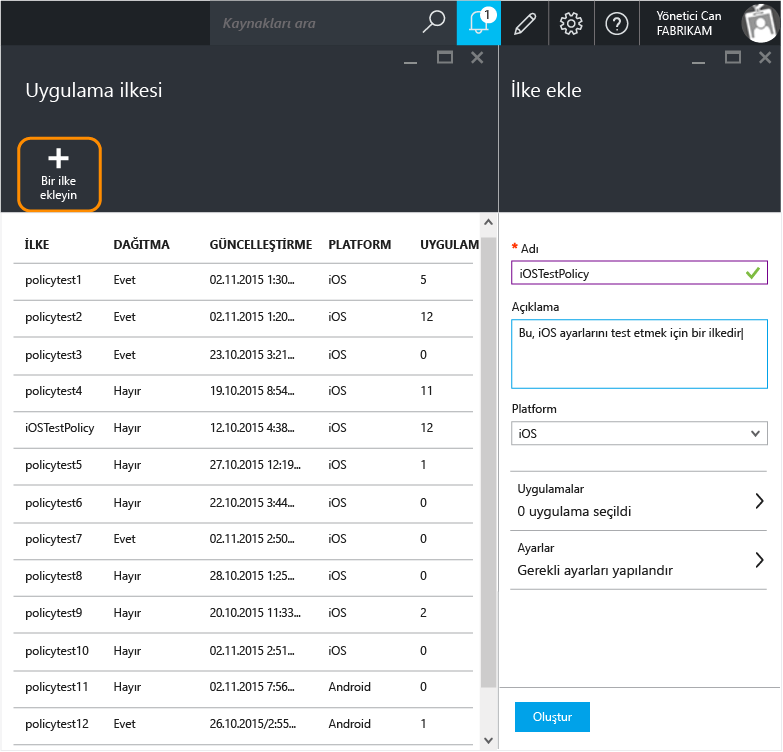
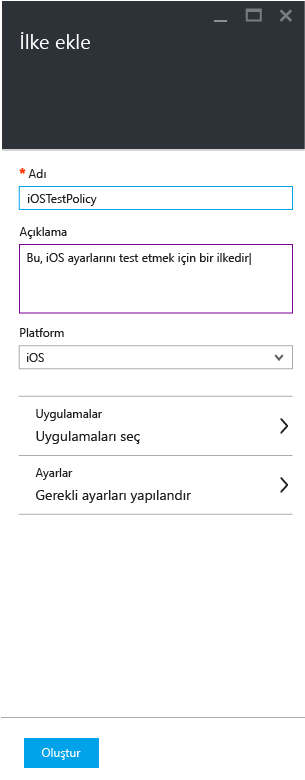
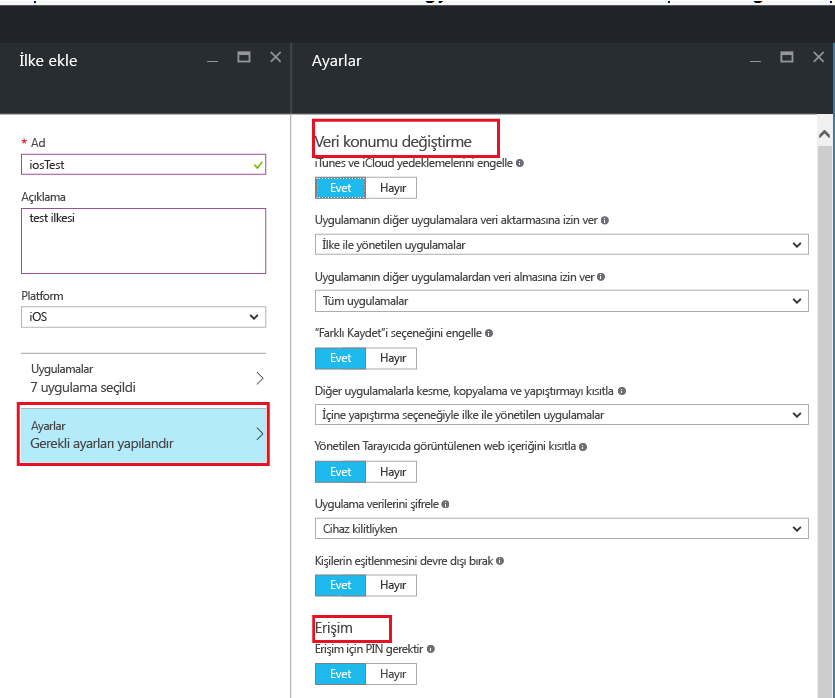
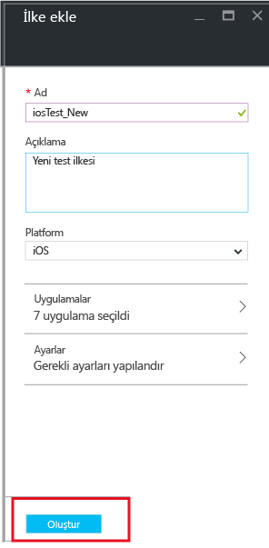
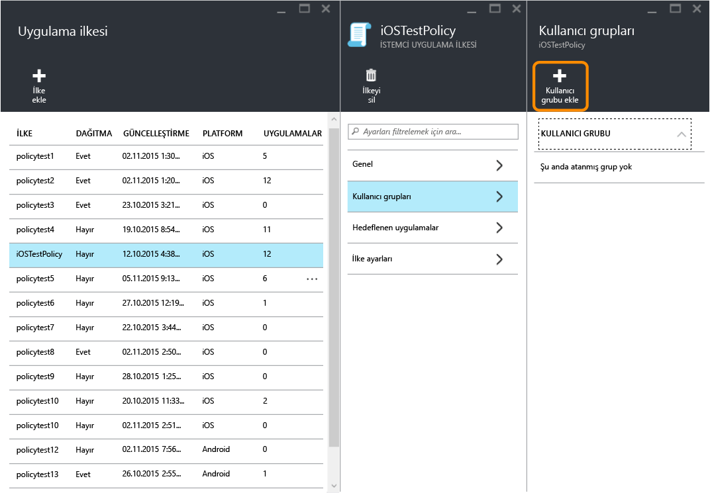
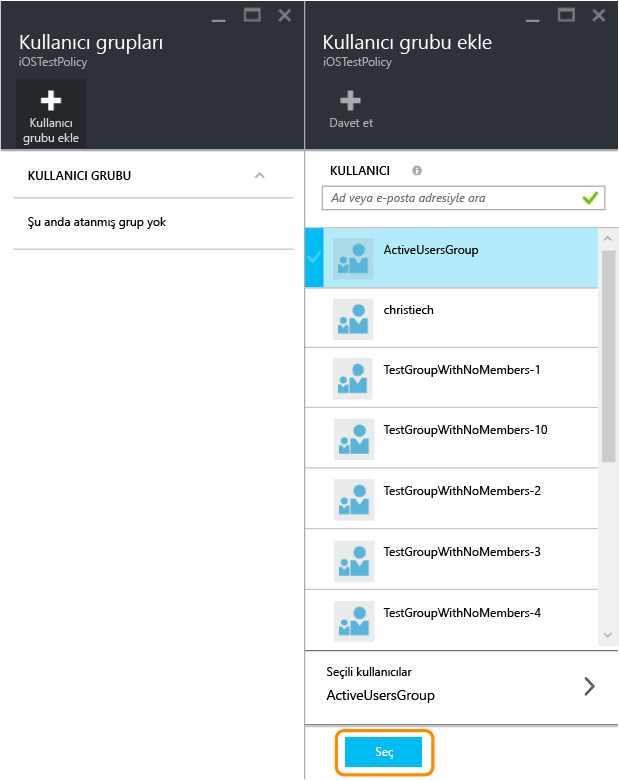
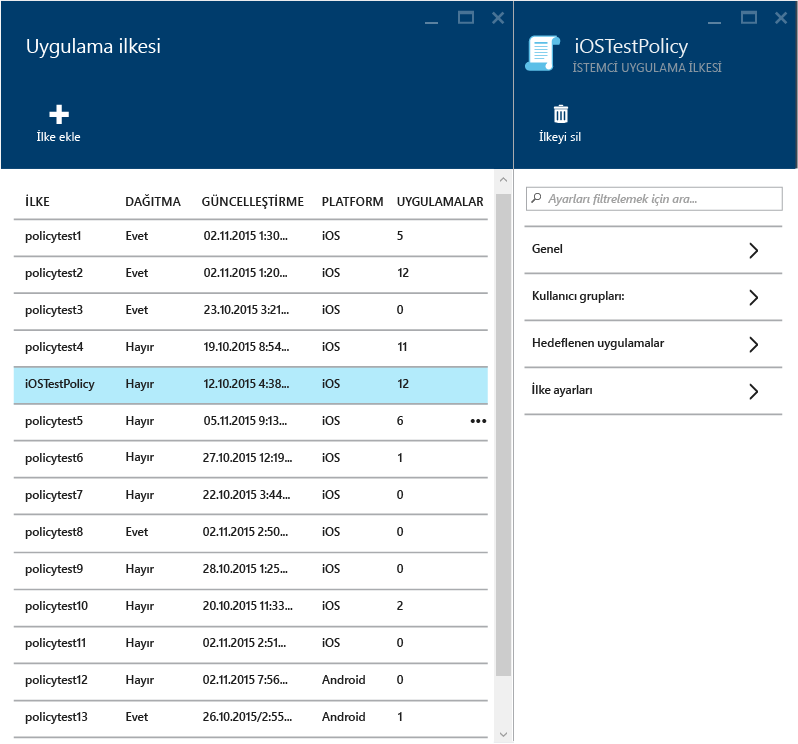
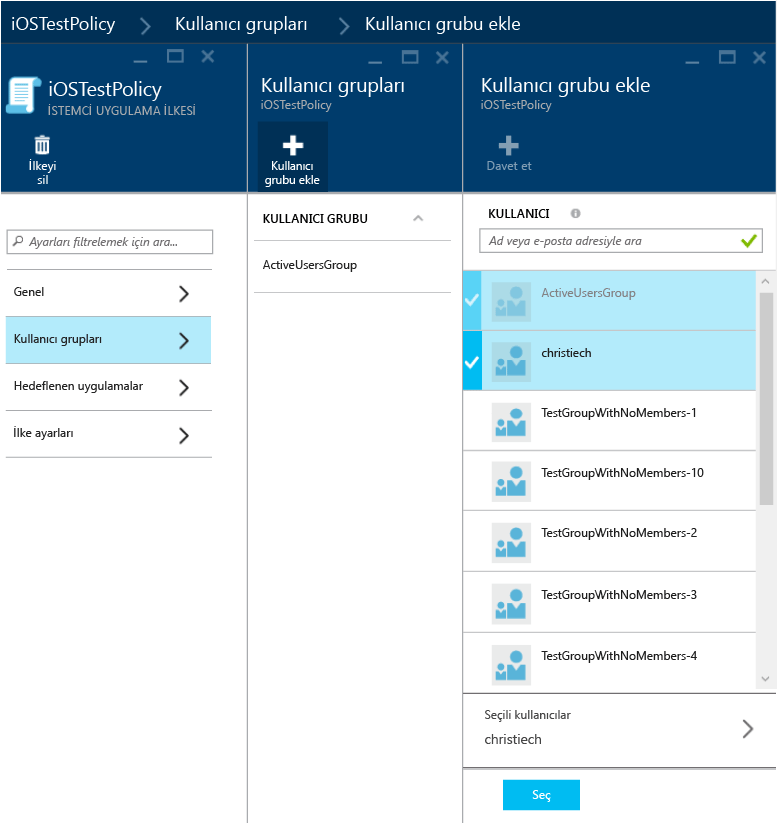
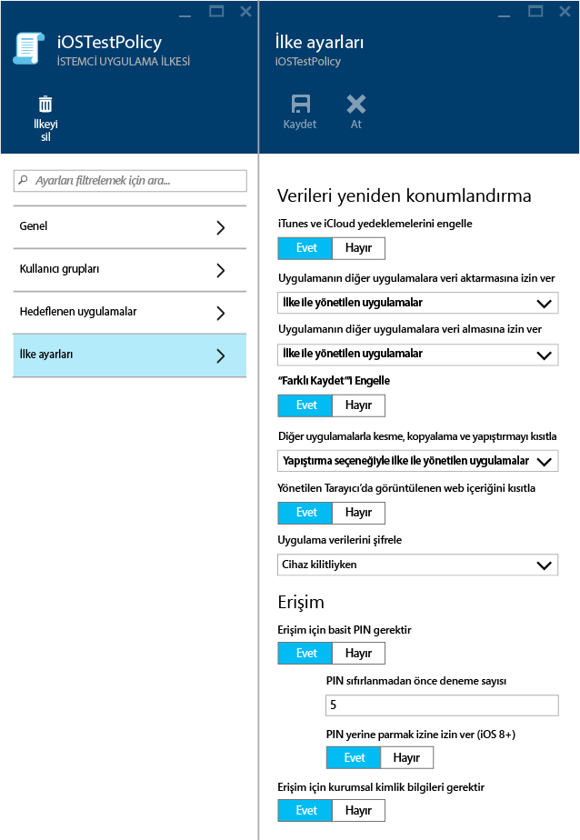

# Microsoft Intune ile uygulama koruma ilkelerini oluşturma ve dağıtma

[!INCLUDE[classic-portal](../includes/classic-portal.md)]

Bu konuda, **Azure portalında** uygulama koruma ilkesi oluşturma işlemi açıklanır. Azure portalı, uygulama koruma ilkelerinin oluşturulacağı yeni yönetim konsoludur ve uygulama koruma ilkelerini oluştururken bu portalı kullanmanız önerilir. Azure portalı, aşağıdaki MAM senaryolarını destekler:

- Intune'a kayıtlı cihazlar.
- Üçüncü taraf MDM çözümleri tarafından yönetilen cihazlar.
- Hiçbir MDM çözümü tarafından yönetilmeyen cihazlar (KGC).

>[!IMPORTANT]
Cihazlarınızı yönetmek için **Intune yönetici konsolunu** kullanıyorsanız aşağıdakileri göz önünde bulundurun:

> * [Intune yönetici konsolu](configure-and-deploy-mobile-application-management-policies-in-the-microsoft-intune-console.md) kullanılarak Intune’a kaydedilmiş cihazlara yönelik uygulamaları destekleyen bir uygulama koruma ilkesi oluşturabilirsiniz.
> * Intune yönetici konsolunda oluşturulan uygulama koruma ilkeleri Azure portalına aktarılamaz.  Uygulama koruma ilkeleri, Azure portalında yeniden oluşturulmalıdır.

> * Intune yönetici konsolunda tüm uygulama koruma ilkesi ayarlarını göremeyebilirsiniz. Azure portalı, uygulama koruma ilkeleri oluşturmaya yönelik yeni yönetim konsoludur.

> * Yönetilen uygulamaları dağıtmak için, Intune yönetici konsolunda bir uygulama koruma ilkesi oluşturmalısınız. Bu durumda, hem Intune yönetici konsolunda hem de Azure portalında uygulama koruma ilkeleri oluşturmak isteyebilirsiniz: yönetilen uygulamaları dağıtabileceğinizden emin olmak için Intune yönetici konsolunda ve tüm uygulama koruma ilkesi ayarlarını barındıran yeni yönetici konsolu olduğu için Azure portalında.

> * Hem Intune yönetici konsolunda hem de Azure portalında uygulama koruma ilkeleri oluşturursanız, uygulamalara Azure portalında oluşturulan ilke uygulanır.

Android ve iOS platformlarında desteklenen ilke ayarları listesini görmek için, aşağıdakilerden birini seçin:

> [!div class="op_single_selector"]
- [iOS ilkeleri](ios-mam-policy-settings.md)
- [Android ilkeleri](android-mam-policy-settings.md)

- Uygulama koruma ilkelerinin çalışmasıyla ve Intune uygulama koruma ilkeleri tarafından desteklenen senaryolarla ilgili daha ayrıntılı bir açıklama için bkz. [Uygulama koruma ilkelerini kullanarak uygulama verilerini koruma](protect-app-data-using-mobile-app-management-policies-with-microsoft-intune.md).

##  Uygulama koruma ilkesi oluşturma
Uygulama koruma ilkeleri Azure Portal’da oluşturulur. Azure portalını ilk kez kullanıyorsanız, Azure Portal’ı hakkında bilgi edinmek için bkz. [Microsoft Intune uygulama koruma ilkeleri için Azure portalı](azure-portal-for-microsoft-intune-mam-policies.md). Uygulama koruma ilkesi oluşturmadan önce, [önkoşullar ve destek](get-ready-to-configure-mobile-app-management-policies-with-microsoft-intune.md) bilgilerini gözden geçirin.

Uygulama koruma ilkeleri oluşturmak için aşağıdaki adımları izleyin:

1. [Azure portalına](https://portal.azure.com) gidin ve kimlik bilgilerinizi girin.

2. **Diğer Hizmetler**’i seçin ve "Intune" yazın.

3. **Intune Uygulama Koruması**’nı seçin.

4. **Intune mobil uygulama yönetimi &gt; Ayarlar**’ı seçerek **Tüm Ayarlar** dikey penceresini açın.

    

2.  **Tüm Ayarlar** dikey penceresinde **Uygulama ilkesi**’ni seçin. Yeni ilkeler oluşturacağınız ve mevcut ilkeleri düzenleyeceğiniz **Uygulama ilkesi** dikey penceresi açılır. **İlke ekle**‘yi seçin.

    

3.  İlke için bir ad yazın, kısa bir açıklama ekleyin ve iOS veya Android için ilke oluşturmak üzere platform türünü seçin. Her platform için birden çok ilke oluşturabilirsiniz.

    

4.  Kullanılabilir uygulamaların listesini görüntüleyen **Uygulamalar dikey penceresini** açmak için **Uygulamalar**'ı seçin. Oluşturmakta olduğunuz ilke ile ilişkilendirmek istediğiniz bir veya daha fazla uygulamayı listeden seçin. Uygulamaları seçtikten sonra, seçiminizi kaydetmek için **Uygulamalar** dikey penceresinin altındaki **Seç**'i kullanın.

    > [!IMPORTANT]
    > Bir ilke oluşturmak için en az bir uygulama seçmeniz gerekir.

5.  **İlke ekle dikey penceresinde** **Gerekli ayarları yapılandır**’ı seçerek ilke ayarları dikey penceresini açın.

    İlke ayarlarının iki kategorisi vardır: **Veri konumu değiştirme** ve **Erişim**.  Veri konumu değiştirme ilkeleri, uygulama içindeki ve dışındaki veri hareketleri için geçerlidir. Erişim ilkeleri ise son kullanıcının uygulamalara iş bağlamında nasıl eriştiğini belirler.
    Başlamanıza yardımcı olması için ilke ayarlarına varsayılan değerler atanmıştır. Varsayılan değerler gereksinimlerinizi karşılıyorsa değişiklik yapmanız gerekmez.

    > [!TIP]
    > Bu ilke ayarları, yalnızca uygulamalar iş bağlamında kullanılırken uygulanır.  Son kullanıcı, uygulamayı kişisel bir görev için kullanırken bu ilkelerden etkilenmez.

    

6.  Bu yapılandırmayı kaydetmek için **Tamam**’ı seçin. **İlke ekle** dikey penceresine geri dönersiniz. İlkeyi oluşturmak ve ayarlarınızı kaydetmek için **Oluştur**’u seçin.

    

İlke oluşturmayı önceki yordamda açıklandığı şekilde tamamladığınızda, ilke kullanıcılara dağıtılmaz. Bir ilkeyi dağıtmak için aşağıdaki "Bir ilkeyi kullanıcılara dağıtma" bölümüne bakın.

> [!IMPORTANT]
> Uygulama için, Intune yönetici konsolunu kullanarak bir uygulama koruma ilkesi ve Azure portalını kullanarak başka bir uygulama koruma ilkesi oluşturursanız, Azure portalını kullanarak oluşturduğunuz ilke önceliklidir. Ancak, Intune veya Configuration Manager konsolunda yapılan raporlamada, Intune yönetici konsolunda oluşturulan ilke ayarları belirtilir. Örneğin:
>
> -   Intune yönetici konsolunda, uygulamadan kopyalama yapılmasını engelleyen bir uygulama koruma ilkesi oluşturdunuz.
> -   Azure konsolunda, uygulamadan kopyalama yapılmasına izin veren bir uygulama koruma ilkesi oluşturdunuz.
> -   Bu ilkelerin ikisini de aynı uygulamayla ilişkilendirdiniz.
> -   Azure konsolunda oluşturduğunuz ilke öncelik kazanır ve kopyalamaya izin verilir.
> -   Ancak, Intune konsolundaki durum ve raporlar, hatalı bir şekilde kopyalamanın engellendiğini belirtir.

## İş Kolu (LOB) uygulamaları (isteğe bağlı)

Intune 1703 sürümünden başlayarak yeni uygulama koruma ilkesi oluşturma sırasında Intune'a LOB uygulamalarını genel olarak ekleme seçeneğine sahip olacaksınız. Bu sayede MAM SDK kullanarak tam uygulama dağıtımı izinlerine ihtiyaç duymadan LOB uygulamaları için uygulama koruma ilkeleri tanımlayabilirsiniz.

> [!TIP]
> Ayrıca [Intune Uygulama SDK'sı](https://docs.microsoft.com/intune/develop/intune-app-sdk-get-started) iş akışında da Intune'a LOB uygulamaları ekleyebilirsiniz.

> [!IMPORTANT]
> Intune'a herhangi bir uygulamayı dağıtabilecekleri tam uygulama dağıtım izinleri yerine MAM uygulamalarını dağıtma izinlerine sahip olan kullanıcılar Intune SDK iş akışını kullanamaz ancak bu kullanıcılar MAM uygulama koruma ilkesi oluşturma iş akışı sayesinde LOB uygulamalarını ekleyebilirler.

### LOB uygulamalarını eklemek için (iOS ve Android)

1.  İlke ekle dikey penceresinde **Uygulamaları** Yapılandır'ı seçerek Uygulamalar dikey penceresini açın.

    

2.  **Diğer uygulamalar**'a tıklayın, **Paket kimliği** (iOS için), **paket kimliği** (Android için) bilgisini girin ve Seç'e tıklayarak LOB uygulamalarınızı ekleyin.

    

### LOB uygulamalarını eklemek için (Windows)

> [!IMPORTANT]
> Yeni uygulama koruma ilkesi oluşturma adımında açılır listeden Windows 10 platformunu seçmeniz gerekir.

1.  İlke ekle dikey penceresinde **İzin verilen uygulamalar** veya **Muaf uygulamalar**'ı seçerek İzin verilen veya Muaf uygulamalar dikey penceresini açın.

    > [!NOTE]
    >
    - **İzin verilen uygulamalar**: Bunlar, bu ilkeye bağlı kalması gereken uygulamalardır.
    - **Muaf uygulamalar**: Bu uygulamalar bu ilkeden muaftır ve kurumsal verilere kısıtlama olmadan erişebilir.
  
2. İzin verilen veya Muaf uygulamalar dikey penceresinde **Uygulama ekle**'ye tıklayın. Önerilen Microsoft uygulamalarının yanı sıra mağaza veya masaüstü uygulamalarını ekleyebilirsiniz.

    a.  **Önerilen uygulamalar:** Yöneticilerin ilkeye kolayca aktarabilmesi için önceden doldurulmuş uygulama listesi (çoğunlukla Office uygulamaları).

    b.  **Mağaza uygulamalar:** Yönetici, Windows mağazasındaki tüm uygulamaları ilkeye ekleyebilir.

    c.  **Windows masaüstü uygulamaları:** Yönetici ilkeye geleneksel Windows masaüstü uygulamalarını ekleyebilir (exe, dll vs.)

## Bir ilkeyi kullanıcılara dağıtma

1.  **İlke** dikey penceresinde  **Kullanıcı grupları**‘nı seçerek **Kullanıcı grupları** dikey penceresini açın. **Kullanıcı grupları** dikey penceresinde **Kullanıcı grubu ekle**’yi seçerek **Kullanıcı grubu ekle** dikey penceresini açın.

    

2.  **Kullanıcı grubu ekle** dikey penceresinde kullanıcı gruplarının listesi gösterilir. Bu liste **Azure Active Directory**’deki tüm güvenlik gruplarını içerir. Bu ilkenin geçerli olmasını istediğiniz kullanıcı gruplarını seçin ve sonra da **Seç**'i belirleyin. **Seç** öğesi seçildiğinde, ilke kullanıcılara dağıtılır.

    

    Bir ilke oluşturdunuz ve kullanıcılara dağıttınız.

Yalnızca [!INCLUDE[wit_nextref](../includes/wit_nextref_md.md)] lisansları atanmış kullanıcılar ilkeden etkilenir. Seçtiğiniz güvenlik grubunda olan ve atanmış [!INCLUDE[wit_nextref](../includes/wit_nextref_md.md)] lisansı bulunmayan kullanıcılar etkilenmez.

>[!IMPORTANT]
> iOS ve Android cihazlarınızı yönetmek için Configuration Manager ile Intune kullanıyorsanız ilke yalnızca doğrudan seçtiğiniz grupta bulunan kullanıcılara uygulanır. Seçtiğiniz grubun içindeki alt grupların üyeleri etkilenmez.

Son kullanıcılar uygulamaları App Store veya Google Play’den indirebilir. Daha fazla bilgi için bkz.:
* [Android uygulamanız uygulama koruma ilkeleriyle yönetildiğinde beklemeniz gerekenler](user-experience-for-mam-enabled-android-apps-with-microsoft-intune.md)
* [iOS uygulamanız uygulama koruma ilkeleriyle yönetildiğinde beklemeniz gerekenler](user-experience-for-mam-enabled-ios-apps-with-microsoft-intune.md)

##  Mevcut ilkeleri değiştirme
Mevcut ilkeyi düzenleyebilir ve bunu hedeflenen kullanıcılara uygulayabilirsiniz. Bununla birlikte, mevcut ilkeleri değiştirdiğinizde, uygulamalarda oturum açmış olan kullanıcılar bu değişiklikleri 8 saat boyunca görmez.

Değişikliklerin etkisini hemen görmek için, son kullanıcının uygulama oturumunu kapatması ve yeniden oturum açması gerekecektir.

### İlkeyle ilişkili uygulamalar listesini değiştirmek için

1.  **Uygulama ilkesi** dikey penceresinde değiştirmek istediğiniz ilkeyi seçin. Seçtiğiniz ilkeye özel bir dikey pencere açılır.

    

2.  İlke dikey penceresinde **Hedeflenen uygulamalar**’ı seçerek uygulama listesini açın.

3.  Uygulamaları listeden kaldırın veya listeye ekleyin ve değişikliklerinizi kaydetmek için **Kaydet** simgesini seçin.

### Kullanıcı grupları listesini değiştirmek için

1.  **Uygulama ilkesi** dikey penceresinde değiştirmek istediğiniz ilkeyi seçin. Seçtiğiniz ilkeye özel bir dikey pencere açılır.

2.  İlke dikey penceresinde **Kullanıcı grupları**’nı seçerek, bu ilkeye sahip geçerli kullanıcı gruplarının listesini gösteren **Kullanıcı grubu** dikey penceresini açın.

3.  İlkeye yeni kullanıcı grubu eklemek için **Kullanıcı grubu ekle**'yi seçin ve sonra da kullanıcı grubunu seçin. İlkeyi seçtiğiniz gruba dağıtmak için **Seç**öğesini seçin.

    

4.  Bir kullanıcı grubunu silmek için önce kaldırmak istediğiniz kullanıcı grubunu vurgulayın. Ardından üç noktaya (…) tıklayın ve **Sil**'i seçerek kullanıcı grubunu kaldırın.

    

### İlke ayarlarını değiştirmek için

1.  **Uygulama ilkesi** dikey penceresinde değiştirmek istediğiniz ilkeyi seçin. Seçtiğiniz ilkeye özel bir dikey pencere açılır.

    

2.  **İlke ayarları**’nı seçerek **İlke ayarları** dikey penceresini açın.

3.  Ayarları değiştirin ve **Kaydet** simgesini seçerek yaptığınız değişiklikleri kaydedin.

    

## İlke ayarları
iOS ve Android ilke ayarlarının tam listesini görmek için, aşağıdakilerden birini seçin:

> [!div class="op_single_selector"]
- [iOS ilkeleri](ios-mam-policy-settings.md)
- [Android ilkeleri](android-mam-policy-settings.md)

## Sonraki adımlar
[Uyumluluğu ve kullanıcı durumunu izleme](monitor-mobile-app-management-policies-with-microsoft-intune.md)

### Ayrıca bkz.
* [Android uygulamanız uygulama koruma ilkeleriyle yönetildiğinde beklemeniz gerekenler](user-experience-for-mam-enabled-android-apps-with-microsoft-intune.md)
* [iOS uygulamanız uygulama koruma ilkeleriyle yönetildiğinde beklemeniz gerekenler](user-experience-for-mam-enabled-ios-apps-with-microsoft-intune.md)

