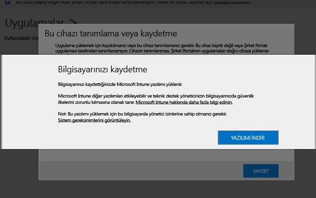

---

title: "Bilgisayar istemci yazılımını yükleme | Microsoft Intune"
description: "Windows bilgisayarlarınızın Microsoft Intune istemci yazılımıyla yönetilmesini sağlamanıza yardımcı olması için bu kılavuzu kullanın."
keywords: 
author: staciebarker
ms.date: 07/19/2016
ms.topic: article
ms.prod: 
ms.service: microsoft-intune
ms.technology: 
ms.assetid: 64c11e53-8d64-41b9-9550-4b4e395e8c52
ms.reviewer: owenyen
ms.suite: ems
translationtype: Human Translation
ms.sourcegitcommit: 103e7065d1e2c3281f8f04808ee2546d3c7e2b53
ms.openlocfilehash: 32af8a615453b8c72e704f40dcdf0de6fbf10907


---

# <a name="install-the-intune-software-client-on-windows-pcs"></a>Windows bilgisayarlara Intune yazılım istemcisini yükleme
Windows bilgisayarlar Intune istemci yazılımı yüklenerek kaydedilebilir. Intune istemci yazılımı aşağıdaki yollar kullanılarak yüklenebilir:

- El ile yükleme
- Grup İlkesi kullanarak yükleme
- Bir disk görüntüsüne dahil etme
- Kullanıcıların yüklemesi

İlk indirilen Intune yazılım istemcisi, bilgisayarı Intune yönetimine kaydetmek için gerekli en düşük yazılımı içerir. Bilgisayar kaydolduktan sonra, Intune yazılım istemcisi bilgisayar yönetimi için gereken tam istemciyi indirir.

Bu bir dizi indirme işlemi, bilgisayarınızı Intune'a ilk kez kaydetmek için gereken süreyi en aza indirir. Ayrıca ikinci indirme işlemi bittikten sonra istemcinin mevcut en yeni yazılıma sahip olmasını sağlar.

## <a name="download-the-intune-client-software"></a>Intune istemci yazılımını indirme

Kullanıcıların Intune istemci yazılımını kendilerinin yüklemesi hariç kullanılan tüm yöntemler, dağıtılabilmesi için yazılımı indirmenizi gerektirir.

1.  [Microsoft Intune yönetim konsolunda](https://manage.microsoft.com/), **Yönetici** &gt; **İstemci Yazılımı İndirme**’ye tıklayın.

  

2.  **İstemci Yazılımı İndirme** sayfasında, **İstemci Yazılımını İndir**'e tıklayın. Ardından yazılımı içeren **Microsoft_Intune_Setup.zip** paketini ağınızda güvenli bir yere kaydedin.

    > [!NOTE]
    > Intune istemci yazılımı yükleme paketi, hesabınız hakkında bilgiler içerir. Yetkisiz kullanıcılar yükleme paketine erişirse paketin yerleşik sertifikası tarafından temsil edilen hesaba bilgisayar kaydedip şirketin kaynaklarına erişim elde edebilir.

3.  Yükleme paketinin içeriğini ağınızda güvenli bir konuma ayıklayın.

    > [!IMPORTANT]
    > Ayıklanan **ACCOUNTCERT** dosyasını yeniden adlandırmayın veya kaldırmayın, aksi takdirde istemci yazılımının yüklenmesi başarısız olur.

## <a name="deploy-the-client-software-manually"></a>İstemci yazılımını el ile dağıtma

Bir bilgisayarda, istemci yazılımı yükleme dosyalarının bulunduğu klasöre gidin. Ardından, istemci yazılımını yüklemek için **Microsoft_Intune_Setup.exe**'yi çalıştırın.

    > [!NOTE]
    > The status of the installation is displayed when you hover over the icon in the taskbar on the client computer.

## <a name="deploy-the-client-software-by-using-group-policy"></a>İstemci yazılımını Grup İlkesi kullanarak dağıtma

1.  **Microsoft_Intune_Setup.exe** ve **MicrosoftIntune.accountcert** dosyalarını içeren klasörde, 32 bit ve 64 bit bilgisayarlar için Windows Installer tabanlı yükleme programlarını ayıklamak için aşağıdaki komutu çalıştırın:

    ```
    Microsoft_Intune_Setup.exe/Extract <destination folder>
    ```

2.  **Microsoft_Intune_x86.msi**, **Microsoft_Intune_x64.msi** ve **MicrosoftIntune.accountcert** dosyalarını, istemci yazılımının yükleneceği tüm bilgisayarlar tarafından erişilebilen bir ağ konumuna kopyalayın.

    > [!IMPORTANT]
    > Dosyaları ayırmayın veya yeniden adlandırmayın, aksi takdirde yazılım yüklemesi başarısız olur.

3.  Yazılımı ağınızdaki bilgisayarlara dağıtmak için Grup İlkesi'ni kullanın.

    Otomatik olarak yazılım dağıtmak için Grup İlkesi'ni kullanma hakkında daha fazla bilgi için Windows Server belgelerinize bakın.

## <a name="deploy-the-client-software-as-part-of-an-image"></a>İstemci yazılımını bir görüntünün parçası olarak dağıtma
Aşağıdaki yordamı örnek alarak Intune istemci yazılımını bilgisayarlara bir işletim sistemi görüntüsünün parçası olarak dağıtabilirsiniz:

1.  **Microsoft_Intune_Setup.exe** ve **MicrosoftIntune.accountcert** istemci yükleme dosyalarını, referans bilgisayarındaki **%Systemdrive%\Temp\Microsoft_Intune_Setup** klasörüne kopyalayın.

2.   **SetupComplete.cmd** betiğine aşağıdaki komutu ekleyerek **WindowsIntuneEnrollPending** kayıt defteri girişini oluşturun:

    ```
    %windir%\system32\reg.exe add HKEY_LOCAL_MACHINE\Software\Microsoft\Onlinemanagement\Deployment /v
    WindowsIntuneEnrollPending /t REG_DWORD /d 1
    ```

3.  /PrepareEnroll komut satırı bağımsız değişkeniyle kayıt paketini çalıştırmak için **setupcomplete.cmd**’ye aşağıdaki komutu ekleyin:

    ```
    %systemdrive%\temp\Microsoft_Intune_Setup\Microsoft_Intune_Setup.exe /PrepareEnroll
    ```
    > [!TIP]
    > **SetupComplete.cmd** betiği, bir kullanıcı oturum açmadan önce Windows Kurulumu’nun sistemde değişiklik yapmasını sağlar. **/PrepareEnroll** komut satırı bağımsız değişkeni, Windows Kurulumu tamamlandıktan sonra, hedeflenen bir bilgisayarı Intune hizmetine otomatik olarak kaydolmaya hazırlar.

4.  **SetupComplete.cmd**'yi başvuru bilgisayarındaki **%Windir%\Setup\Scripts** klasörüne koyun.

5.  Başvuru bilgisayarının bir görüntüsünü yakalayın ve bu görüntüyü hedef bilgisayarlara dağıtın.

Windows Kur tamamlandıktan sonra hedef bilgisayar yeniden başlatıldığında, **WindowsIntuneEnrollPending** kayıt defteri anahtarı oluşturulur. Kayıt paketi, bilgisayarın kayıtlı olup olmadığını denetler. Bilgisayar kayıtlıysa, başka eyleme gerek yoktur. Bilgisayar kayıtlı değilse, kayıt paketi bir Microsoft Intune Otomatik Kayıt Görevi oluşturur.

Otomatik kayıt görevi bir sonraki zamanlanan saatte çalıştığında, **WindowsIntuneEnrollPending** kayıt defteri değerinin var olup olmadığını denetler ve hedeflenen bilgisayarı Intune’a kaydetmeye çalışır. Kayıt herhangi bir nedenden dolayı başarısız olursa, görev bir daha çalıştığında kayıt yeniden denenir. Yeniden deneme işlemleri bir ay devam eder.

Intune Otomatik Kayıt Görevi, **WindowsIntuneEnrollPending** kayıt defteri değeri ve hesap sertifikası, kayıt başarılı olduğunda veya bir ay sonra (hangisi önce geliyorsa) hedeflenen bilgisayardan silinir.

## <a name="instruct-users-to-self-enroll"></a>Kullanıcıdan kendi kendine kaydolmasını isteme

Kullanıcılar, [Şirket Portalı web sitesine](http://portal.manage.microsoft.com) giderek Intune istemci yazılımını yükleyebilir. Web portalı, cihazın bir Windows bilgisayarı olduğunu algılayabilirse kullanıcılardan Intune yazılım istemcisini indirerek bilgisayarı kaydetmesini ister. Kullanıcılar, yazılım indirildikten sonra bilgisayarlarını yönetime almak için yazılımı yükleyebilir.



## <a name="monitor-and-validate-successful-client-deployment"></a>Başarılı istemci dağıtımını izleme ve doğrulama
Başarılı istemci dağıtımını izlemenize ve doğrulamanıza yardımcı olması için aşağıdaki yordamlardan birini kullanın.

### <a name="to-verify-the-installation-of-the-client-software-from-the-microsoft-intune-administrator-console"></a>Microsoft Intune yönetici konsolundan istemci yazılımının yüklendiğini doğrulamak için

1.  [Microsoft Intune yönetim konsolunda](https://manage.microsoft.com/), **Gruplar** &gt; **Tüm Cihazlar** &gt; **Tüm Bilgisayarlar**’a tıklayın.

2.  Listede Intune ile iletişim kuran bilgisayarları bulun veya **Cihaz ara** kutusuna bilgisayar adını (veya adının bir parçasını) yazarak belirli bir yönetilen bilgisayar arayın.

3.  Konsolun alt bölmesinden bilgisayarın durumunu inceleyin. Hataları giderin.

### <a name="to-create-a-computer-inventory-report-to-display-all-enrolled-computers"></a>Tüm kayıtlı bilgisayarları görüntülemek üzere bir bilgisayar envanteri raporu oluşturmak için

1.  [Microsoft Intune yönetim konsolunda](https://manage.microsoft.com/), **Raporlar** &gt; **Bilgisayar Envanteri Raporları**’na tıklayın.

2.  **Yeni Rapor Oluştur** sayfasında, (filtre uygulamak istemiyorsanız) tüm alanlardaki varsayılan değerleri bırakın ve **Raporu Görüntüle**'ye tıklayın.

3.  **Bilgisayar Envanteri Raporu** sayfası, Intune’a başarılı bir şekilde kaydedilen tüm bilgisayarların görüntülendiği yeni bir pencerede açılır.

    > [!TIP]
    > Raporu herhangi bir sütunun içeriğine göre sıralamak için sütun başlığına tıklayın.


### <a name="see-also"></a>Ayrıca bkz.
[Microsoft Intune ile Windows bilgisayarlarını yönetme](manage-windows-pcs-with-microsoft-intune.md)
[İstemci kurulumu sorunlarını giderme](../troubleshoot/troubleshoot-client-setup-in-microsoft-intune.md)


<!--HONumber=Nov16_HO5-->


