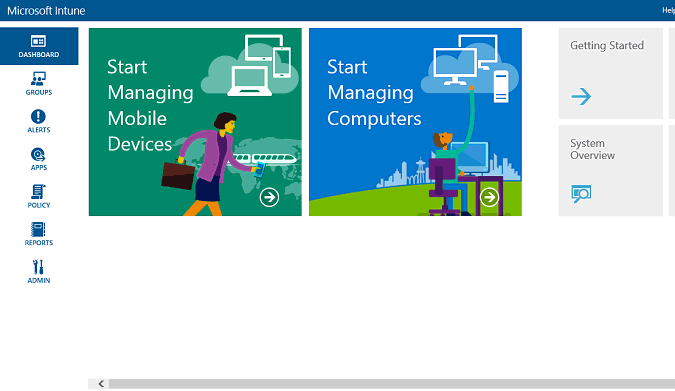
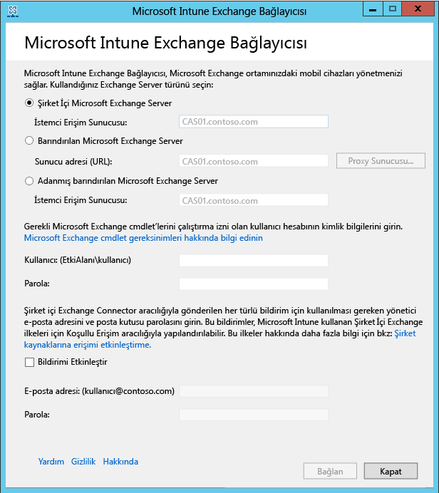

# Intune Şirket İçi Exchange Connector’ı yükleme

[!INCLUDE[classic-portal](../includes/classic-portal.md)]

Microsoft Intune’la mobil cihazların posta kutularını barındıran Exchange Server'ın iletişim kurmasını sağlayan bir bağlantı ayarlamak için Intune yönetici konsolundan Şirket İçi Exchange Connector’ı indirip yapılandırmanız gerekir. Intune, abonelik başına herhangi bir türde tek bir Exchange Connector bağlantısını destekler.

## Şirket içi Exchange Connector gereksinimleri
Aşağıdaki tabloda Şirket İçi Exchange Connector’ı yüklediğiniz bilgisayara ilişkin gereksinimler listelenmiştir.

|Gereksinim|Daha fazla bilgi|
|---------------|--------------------|
|İşletim sistemleri|Intune; Windows Server 2008 SP2 64 bit, Windows Server 2008 R2, Windows Server 2012 veya Windows Server 2012 R2’nin herhangi bir sürümünü çalıştıran bilgisayarlarda Şirket İçi Exchange Connector’ı destekler.  Bağlayıcı hiçbir Sunucu Çekirdeği yüklemesinde desteklenmez.|
|Microsoft Exchange|Şirket içi Bağlayıcılar için Microsoft Exchange 2010 SP1 veya üzeri ya da eski Exchange Online Dedicated gerekir. Exchange Online Dedicated ortamınızın **yeni** yapılandırmada mı yoksa **eski** yapılandırmada mı olduğunu belirlemek için hesap yöneticinize başvurun.|
|Mobil cihaz yönetimi yetkilisi| [Mobil cihaz yönetimi yetkilisi olarak Intune’u ayarlama](prerequisites-for-enrollment.md#step-2-set-mdm-authority).|
|Donanım|Bağlayıcıyı yüklediğiniz bilgisayar 2 GB RAM ve 10 GB boş disk alanı ile birlikte 1,6 GHz CPU gerektirir.|
|Active Directory eşitlemesi|Intune’u Exchange Server'a bağlamak üzere Bağlayıcıyı kullanabilmeniz için yerel kullanıcılarınızın ve güvenlik gruplarınızın Azure Active Directory örneğinizle eşitlenebilmesi amacıyla [Active Directory eşitlemesini](/intune/get-started/start-with-a-paid-subscription-to-microsoft-intune-step-3) ayarlamanız gerekir.|
|Ek yazılım|Bağlayıcıyı barındıran bilgisayara Microsoft .NET Framework 4.5 ve Windows PowerShell 2.0 tam yüklemesi yapılmalıdır.|
|Ağ|Bağlayıcıyı yüklediğiniz bilgisayar, Exchange Server'ı barındıran etki alanı ile güven ilişkisi olan bir etki alanında olmalıdır.  Bilgisayar, 80 ve 443 numaralı Bağlantı Noktaları üzerinden güvenlik duvarları ve proxy sunucular aracılığıyla Intune hizmetine erişmesine olanak sağlayacak yapılandırmalar gerektirir. Intune tarafından kullanılan etki alanları manage.microsoft.com, &#42;manage.microsoft.com ve &#42;.manage.microsoft.com’dur.|

### Exchange cmdlet gereksinimleri

Intune Exchange Bağlayıcısı tarafından kullanılacak bir Active Directory kullanıcı hesabı oluşturmanız gerekir. Hesabın aşağıdaki gerekli Windows PowerShell Exchange cmdlet'lerini çalıştırma izni olması gerekir:

 -   Get-ActiveSyncOrganizationSettings, Set-ActiveSyncOrganizationSettings
 -   Get-CasMailbox, Set-CasMailbox
 -   Get-ActiveSyncMailboxPolicy, Set-ActiveSyncMailboxPolicy, New-ActiveSyncMailboxPolicy, Remove-ActiveSyncMailboxPolicy
 -   Get-ActiveSyncDeviceAccessRule, Set-ActiveSyncDeviceAccessRule, New-ActiveSyncDeviceAccessRule, Remove-ActiveSyncDeviceAccessRule
 -   Get-ActiveSyncDeviceStatistics
 -   Get-ActiveSyncDevice
 -   Get-ExchangeServer
 -   Get-ActiveSyncDeviceClass
 -   Get-Recipient
 -   Clear-ActiveSyncDevice, Remove-ActiveSyncDevice
 -   Set-ADServerSettings
 -   Get-Command

## Şirket İçi Exchange Connector yazılım yükleme paketini indirme

1. Şirket İçi Exchange Connector için desteklenen bir Windows Server işletim sisteminde, Exchange kiracısında yönetici olan ve Exchange Server’ı kullanma lisansı bulunan bir kullanıcı hesabıyla [Microsoft Intune yönetim konsolunu](http://manage.microsoft.com) (http://manage.microsoft.com) açın.

2.  Çalışma alanı kısayolları bölmesinde, **Yönetici**>**Mobil Cihaz Yönetimi** > **Microsoft Exchange**>**Exchange Bağlantısını Ayarla**'yı seçin.

3.  **Exchange Bağlantısı Ayarla** sayfasında **Şirket İçi Bağlayıcı'yı İndir**'i seçin.

4.  Şirket İçi Exchange Connector, açılabilen veya kaydedilebilen sıkıştırılmış (.zip) bir klasörde yer alır. **Dosya İndirme** iletişim kutusunda **Kaydet**'i seçerek sıkıştırılmış klasörü güvenli bir konuma depolayın.

> [!IMPORTANT]
> Şirket İçi Exchange Connector klasöründeki dosyaları yeniden adlandırmayın veya taşımayın. Klasörün içeriğini taşımak veya yeniden adlandırmak, yüklemenin başarısız olmasına neden olur.

## Intune Şirket İçi Exchange Connector’ı yükleme ve yapılandırma
Intune Şirket İçi Exchange Connector'ı yüklemek için aşağıdaki adımları gerçekleştirin. Şirket İçi Exchange Connector, Intune aboneliği başına yalnızca bir kez ve yalnızca bir bilgisayara yüklenebilir. Bir Şirket İçi Exchange Connector daha yapılandırmayı denerseniz, yeni bağlantı ilkinin yerini alır.

1.  Şirket İçi Bağlayıcı için desteklenen işletim sistemlerinden birinde, **Exchange_Connector_Setup.zip** içindeki dosyaları güvenli bir konuma ayıklayın.

2.  Dosyalar ayıklandıktan sonra, Şirket İçi Exchange Connector'ı yüklemek için ayıklanan klasörü açın ve **Exchange_Connector_Setup.exe** dosyasına çift tıklayın.

    > [!IMPORTANT]
    > Hedef klasör güvenli bir konum değilse, Şirket İçi Bağlayıcı'yı yükledikten sonra **WindowsIntune.accountcert** sertifika dosyasını silmelisiniz.

3.  **Microsoft Intune Exchange Connector** iletişim kutusunda, **Şirket içi Microsoft Exchange Server** veya **Barındırılan Microsoft Exchange Server** seçeneklerinden birini belirleyin.

  

  Şirket içi Exchange sunucusu için **İstemci Erişimi Sunucu** rolünü barındıran Exchange sunucusunun sunucu adını veya tam etki alanı adını belirtin.

  Barındırılan bir Exchange sunucusu için, Exchange sunucusunun adresini belirtin. Barındırılan Exchange sunucusunun URL'sini bulmak için:

    1. Office 365 için Outlook Web App'i açın.

    2. Sol üst taraftaki **?** simgesini ve ardından **Hakkında**’yı seçin.

    3. **POP Dış Sunucu** değerini bulun.

    4. Barındırılan Exchange sunucunuzun proxy sunucusu ayarlarını belirtmek için **Proxy Sunucusu**'nu seçin.
        1. **Mobil cihaz bilgileri eşitlenirken proxy sunucusu kullan**'ı seçin.

        2. Sunucuya erişmek için kullanılan **proxy sunucusu adı** ve **bağlantı noktası numarasını** belirtin.

        3. Proxy sunucusuna erişmek için kullanıcı kimlik bilgilerinin sağlanması gerekiyorsa, **Proxy sunucusuna bağlanmak için kimlik bilgilerini kullan**'ı seçin. Ardından **etki alanı\kullanıcı** ve **parola** girin.

        4. **Tamam**’ı seçin.

    5. **Kullanıcı (Etki alanı\kullanıcı)** ve **Parola** alanlarında Exchange sunucunuza bağlanmak için gereken kimlik bilgilerini sağlayın.

    6.  Kullanıcıların Exchange Server posta kutularına bildirim göndermek için gereken yönetici kimlik bilgilerini sağlayın. Bu bildirimleri Intune’da Koşullu Erişim ilkeleriyle yapılandırabilirsiniz.

        Otomatik Bulma hizmeti ve Exchange Web Hizmetleri'nin Exchange İstemci Erişimi Sunucusu'nda yapılandırıldığından emin olun. Daha fazla bilgi için bkz. [İstemci Erişimi sunucusu](https://technet.microsoft.com/library/dd298114.aspx).

    7.  **Parola** alanında, Intune’un Exchange Server'a erişmesini etkinleştirmek için bu hesabın parolasını sağlayın.

    8. **Bağlan**’ı seçin.

Bağlantının yapılandırılması birkaç dakika sürebilir.

Yapılandırma sırasında Exchange Bağlayıcısı İnternet erişimini sağlamak için proxy ayarlarınızı depolar. Proxy ayarlarınız değişirse, güncelleştirilen proxy ayarlarını Exchange Connector’a uygulamak için Exchange Connector’ı yeniden yapılandırmanız gerekir.

Exchange Connector bağlantıyı ayarladıktan sonra, Exchange Connector’da yönetilen kullanıcılarla ilişkili mobil cihazlar otomatik olarak eşitlenir ve Exchange Connector’a eklenir. Bu eşitlemenin tamamlanması biraz sürebilir.

> [!NOTE]
> Şirket İçi Exchange Connector'ı yüklediyseniz ve ileride Exchange bağlantısını silerseniz, Şirket İçi Exchange Connector'ı yüklü olduğu bilgisayardan kaldırmanız gerekir.

## Exchange bağlantısını doğrulama

Exchange Bağlayıcısı’nı başarıyla yapılandırdıktan sonra, bağlantının durumunu ve son başarılı eşitleme girişimini görüntüleyebilirsiniz. [Microsoft Intune yönetici konsolunda](http://manage.microsoft.com) **YÖNETİCİ** çalışma alanını seçin. **Mobil Cihaz Yönetimi**’nin altında **Microsoft Exchange**’i seçin ve ardından, sağladığınız ayrıntıların **Exchange Bağlantı Bilgileri** altında gösterildiğini doğrulayın.

Ayrıca son başarılı eşitleme denemesinin tarih ve saatini kontrol edebilirsiniz.

<!--HONumber=Dec16_HO2-->

