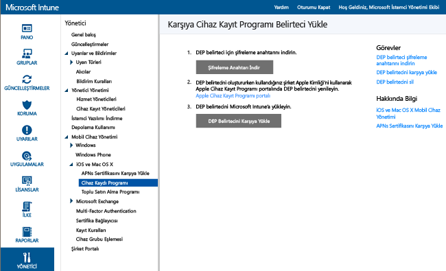
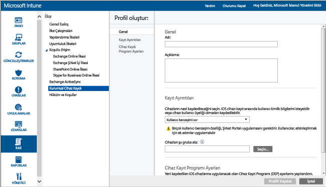

# Şirkete ait Cihaz Kayıt Programı iOS cihazlarını kaydetme

[!INCLUDE[classic-portal](../includes/classic-portal.md)]

Microsoft Intune, Aygıt Kayıt Programı (DEP) aracılığıyla “uzaktan” satın alınmış iOS cihazlarını kaydeden bir kayıt profili dağıtabilir. Kayıt paketi, cihaz için kurulum yardımcısı seçenekleri içerebilir.

>[!NOTE]
>Bu kayıt yöntemi, [cihaz kaydı yöneticisi](enroll-corporate-owned-devices-with-the-device-enrollment-manager-in-microsoft-intune.md) yöntemiyle birlikte kullanılamaz.

## Apple DEP yönetimini kullanarak iOS cihazlarını kaydetme önkoşulları

- [APNs sertifikası yükleme](set-up-ios-and-mac-management-with-microsoft-intune.md)

- Kuruluşunuzun Apple DEP programına katılması ve cihazları bu program aracılığıyla alması gerekir. Bu işlemin ayrıntıları şurada bulunabilir:  [https://deploy.apple.com](https://deploy.apple.com). Programın sağladığı avantajlar arasında, her cihazı bir USB kablosu ile bilgisayara bağlamaya gerek bırakmayan kendiliğinden kurulum olanağı da vardır.

- Şirketin sahibi olduğu iOS cihazlarını DEP ile kaydedebilmeniz için bir Apple DEP belirtecine ihtiyacınız vardır. Bu belirteç Intune'un şirketinize ait olup DEP'e katılan cihazlar hakkındaki bilgileri eşitlemesini sağlar. Ayrıca Intune'un Kayıt Profilini Apple'a yüklemesine ve cihazları bu profillere atamasına izin verir.

## Apple DEP yönetimini kullanarak iOS cihazlarını kaydetme adımları

Aşağıdaki adımlar, Apple DEP yönetimini kullanarak iOS cihazlarının "0. gün" kaydının nasıl yapılacağını açıklamaktadır. Kuruluşunuzdaki cihaz ekleme ve kaldırma işlemleri nedeniyle seri numara ekleme veya kaldırma gibi bazı adımları aşağıda gösterilen şekilde tekrarlamak istersiniz.

### Şifreleme Anahtarı Alma

1. Yönetici kullanıcı olarak, [Microsoft Intune yönetici konsolunu](http://manage.microsoft.com) açın, **Yönetici** &gt; **Mobil Cihaz Yönetimi** &gt; **iOS** &gt; **Aygıt Kayıt Programı**’na gidin ve **Şifreleme Anahtarını İndir**’i seçin. 

2. Şifreleme anahtarı (.pem) dosyasını yerel olarak kaydedin. .pem dosyası Apple Cihaz Kayıt Programı portalından güven ilişkisi sertifikası istemek için kullanılır.

### Bir Cihaz Kayıt Programı belirteci edinme

1. [Aygıt Kayıt Programı Portalı](https://deploy.apple.com)’na (https://deploy.apple.com) gidin ve şirketinizin Apple kimliğiyle oturum açın. Bu Apple kimliğinin daha sonra DEP belirtecinizi yenilemek için kullanılması gerekir.

2.  Cihaz Kayıt Programı Portalı'nda, **Cihaz Kayıt Programı** &gt; **Sunucuları Yönet**'e gidin ve **MDM Sunucusu Ekle**'ye tıklayın.

3.  **MDM Sunucu Adı**'nı girin ve ardından **İleri**'yi seçin. Sunucu adı, mobil cihaz yönetimi (MDM) sunucusunu tanımlarken kullanmanız içindir. Microsoft Intune sunucusunun adı veya URL'si değildir.

4.  **&lt;SunucuAdı&gt; Ekle** iletişim kutusu açılır. **Dosya Seç…** öğesini seçin .pem dosyasını karşıya yükleyin ve ardından **İleri**'yi seçin.

5.  **&lt;SunucuAdı&gt; Ekle** iletişim kutusunda **Sunucu Belirteciniz** bağlantısı gösterilir. Sunucu belirteci (.p7m) dosyasını bilgisayarınıza indirin ve ardından **Bitti**'yi seçin.

   Bu sertifika (.p7m) dosyası Intune ile Apple'ın Cihaz Kayıt Programı sunucuları arasında bir güven ilişkisi oluşturmak için kullanılır.

### DEP belirtecini Intune'a ekleme

1. [Microsoft Intune yönetici konsolunda](http://manage.microsoft.com) **Yönetici** &gt; **Mobil Cihaz Yönetimi** &gt; **iOS** &gt; **Aygıt Kayıt Programı**'na gidin.

2. **DEP Belirtecini Karşıya Yükle**'yi seçin. Sertifika (.p7m) dosyasına **göz atın**, **Apple Kimliği**'nizi girin ve **Karşıya Yükle**’yi seçin.

### Kurumsal Cihaz Kaydı İlkesi Ekleme

1. [Microsoft Intune yönetici konsolu](http://manage.microsoft.com)’nda **İlke** &gt; **Kurumsal Cihaz Kaydı**’na gidin ve **Ekle**’yi seçin.

2. **Ad** ve **Açıklama** dahil olmak üzere **Genel** ayrıntıları sağlayın ve profile atanmış cihazların kullanıcı benzeşimine sahip olduğunu veya bir gruba ait olduğunu belirtin:

   - **Kullanıcı benzeşimi istemi**: Cihaz ilk kurulum sırasında bir kullanıcıya bağlı olmalıdır. Cihazın şirket verilerine ve e-postalara bu kullanıcı aracılığıyla erişmesine izin verilmesi için bu gereklidir. DEP tarafından yönetilen kullanıcılara ait olan ve şirket portalını kullanması gereken (uygulama yüklemek için) cihazlarda **kullanıcı benzeşimi** ayarlanmalıdır. Multifactor authentication (MFA) kullanıcı benzeşimi özellikli DEP cihazlarında kayıt sırasında çalışmaz. Kayıttan sonra MFA bu cihazlar üzerinde beklendiği gibi çalışır. İlk kez oturum açarken parola değiştirmesi istenen yeni kullanıcılara, DEP cihazlarının kaydı sırasında istemde bulunulamaz. Ayrıca, parolalarının süresi dolmuş olan kullanıcılardan DEP kaydı sırasında parolalarını sıfırlamaları istenmez ve farklı bir cihazdan parolayı sıfırlamaları gerekir. 

   > [!NOTE]
   > Kullanıcı benzeşimi ile DEP’in kullanıcı belirteci istemesini etkinleştirmek için WS-Trust 1.3 Kullanıcı Adı/Karma uç nokta gerekir.

   - **Kullanıcı benzeşimi yok**: Cihaz bir kullanıcıya bağlı değil. Bu ilişkiyi, yerel kullanıcı verilerine erişmeden görevleri gerçekleştiren cihazlar için kullanın. İş kolu uygulamalarını yüklemek için kullanılan Şirket Portalı uygulaması da dahil olmak üzere, kullanıcı benzeşimi gerektiren uygulamalar çalışmaz.

   Ayrıca, **Aşağıdaki gruba cihazlar atayabilirsiniz**. Bir grup seçmek için **Seç...** öğesini belirleyin.

   > [!Important]
   > Grup atamaları, Intune'dan Azure Active Directory'ye taşınıyor. Intune hesabınız ilgili güncelleştirmeyi aldıktan sonra **Cihazları şu gruba ata** seçeneğini görmeyeceksiniz. [Daha fazla bilgi edinin](/intune/deploy-use/ios-device-enrollment-program-in-microsoft-intune#changes-to-intune-group-assignments).

3. DEP'i desteklemek için **Bu ilke için Cihaz Kayıt Programı ayarlarını yapılandırın** seçeneği etkinleştirin.

      

   DEP ile yönetilen cihazlar için aşağıdaki ayarlar kullanılabilir:

   - **Bölüm** - Kullanıcı etkinleştirme sırasında **Yapılandırma Hakkında** öğesine dokunduğunda görüntülenir
   - **Destek telefon numarası** - Kullanıcı etkinleştirme sırasında **Yardım Gerekli** düğmesine tıkladığında görünür
   - **Hazırlık modu** - Etkinleştirme sırasında ayarlanır ve cihaz fabrika ayarlarına sıfırlanmadan değiştirilemez:
       - **Denetimsiz** -Sınırlı yönetim yetenekleri
       - **Denetimli** - Varsayılan olarak daha fazla yönetim seçeneğini etkinleştirir ve Etkinleştirme Kilidi’ni devre dışı bırakır
   - **Kayıt profilini cihaza kilitle** - Etkinleştirme sırasında ayarlanır ve fabrika ayarlarına sıfırlamadan değiştirilemez
       - **Devre dışı bırak** - Yönetim profilinin **Ayarlar** menüsünden kaldırılmasına olanak tanır
       - **Etkinleştir** - (**Hazırlık Modu** = **Denetimli** ayarının yapılmasını gerektirir) Yönetim profilini kaldırmak için iOS Ayarları menü seçeneğini devre dışı bırakır
   - **Kurulum Yardımcısı Seçenekleri** - Bu isteğe bağlı ayarlar daha sonra iOS **Ayarlar** menüsünden ayarlanabilir.
        - **Geçiş kodu** - Etkinleştirme sırasında geçiş kodu ister. Cihazın güvenliği sağlanmayacaksa veya erişim denetimi başka bir yolla (cihazı tek uygulamayla sınırlandıran bilgi noktası modu) uygulanmayacaksa her zaman geçiş kodu gerektirir
       - **Konum Hizmetleri** - Etkinleştirilirse, Kurulum Yardımcısı etkinleştirme sırasında hizmeti sorar
       - **Geri Yükle** - Etkinleştirilirse, Kurulum Yardımcısı etkinleştirme sırasında iCloud yedeklemesini sorar
       - **Apple kimliği** - Etkinleştirilirse, Intune kimlik girilmeden bir uygulama yüklemeyi denediğinde iOS kullanıcılardan Apple kimliği ister. Intune tarafından yüklenenler de dahil olmak üzere, iOS Uygulama Mağazası uygulamalarını indirmek için Apple Kimliği gerekir.
       - **Hüküm ve Koşullar** - Etkinleştirilirse, Kurulum Yardımcısı etkinleştirme sırasında kullanıcılardan Apple’ın hüküm ve koşullarını kabul etmelerini ister
       - **Touch ID** - Etkinleştirilirse, Kurulum Yardımcısı etkinleştirme sırasında bu hizmeti sorar
       - **Apple Pay** - Etkinleştirilirse, Kurulum Yardımcısı etkinleştirme sırasında bu hizmeti sorar
       - **Zoom** - Etkinleştirilirse, Kurulum Yardımcısı etkinleştirme sırasında bu hizmeti sorar
       - **Siri** - Etkinleştirilirse, Kurulum Yardımcısı etkinleştirme sırasında bu hizmeti sorar
       - **Apple’a tanılama verileri gönder** - Etkinleştirilirse, Kurulum Yardımcısı etkinleştirme sırasında bu hizmeti sorar
   -  **Ek Apple Configurator yönetimini etkinleştir** - Dosyaların Apple Configurator üzerinden iTunes ile veya yönetimle eşitlenmesini önlemek için **İzin Verme**olarak ayarlayın. Bu ayarı kullanarak sertifikalı veya sertifikasız el ile dağıtıma izin vermek yerine, **İzin Verme** seçeneğini belirlemek, diğer yapılandırmaları Apple Configurator’dan dışarı aktarmak ve ardından Intune üzerinden Özel iOS yapılandırma profili olarak dağıtmak iyi bir fikirdir.
       - **İzin Verme** - Cihazın USB üzerinden iletişim kurmasını önler (eşlemeyi devre dışı bırakır)
       - **İzin Ver** - Herhangi bir PC veya Mac bilgisayar için bir cihazın USB bağlantısı üzerinden iletişim kurmasına izin verir
       - **Sertifika gerektir** - Kayıt profiline aktarılan bir sertifika kullanılarak Mac bilgisayarla eşlemeye izin verir

### Profili cihazlara atama

1. [Microsoft Intune yönetici konsolunda](http://manage.microsoft.com) **İlke** &gt; **Kurumsal Cihaz Kaydı**'na gidin ve **Ata**'yı seçin.

2. Oluşturduğunuz profili atamak istediğiniz cihazları seçin. **Tüm cihazlar**'ı belirleyebilir veya belirli cihazları seçip ardından **Ekle**'yi belirleyin.

> [!Important]
> Intune şu anda "varsayılan" cihaz kayıt profili belirleyerek Apple DEP ile eşitlediğiniz yeni seri numaralarının otomatik olarak varsayılan profile atanmasını sağlamanızı mümkün kılıyor. Kiracınız yakın gelecekte yeni Azure portalına geçiş yaptığında artık varsayılan profil belirleyip seri numaraların bu profile otomatik olarak atanmasını sağlayamayacaksınız. Bunun yerine seri numaraları belirli bir profile atamanız gerekecek. [Daha fazla bilgi edinin](https://docs.microsoft.com/intune-azure/enroll-devices/enroll-ios-devices-using-device-enrollment-program)

### Yönetim için DEP Cihazları Atama

1. [Cihaz Kayıt Programı Portalı](https://deploy.apple.com)’na (https://deploy.apple.com) gidin ve şirketinizin Apple kimliğiyle oturum açın.

2. **Dağıtım Programı** &gt; **Aygıt Kayıt Programı** &gt; **Cihazları Yönet**’e gidin.

3. **Cihaz Seç**bölümünden cihaz tercihinizi yapın, cihaz bilgilerini belirtin ve **Seri Numarası**, **Sipariş Numarası**bilgileriyle veya **CSV Dosyasını Karşıya Yükle**seçeneğiyle cihaz ayrıntılarını belirtin.

4. **Sunucuya Ata**'yı ve Microsoft Intune için belirtilen &lt;ServerName&gt; öğesini belirleyip **Tamam**'ı seçin.

### DEP ile Yönetilen Cihazları Eşitleme

Bu adım cihazları Apple DEP Service ile eşitler ve cihazların Intune konsolunda görünmesini sağlar.

1. Yönetici kullanıcı olarak, [Microsoft Intune yönetici konsolunu](http://manage.microsoft.com) açın, **Yönetici** &gt; **Mobil Cihaz Yönetimi** &gt; **iOS** &gt; **Aygıt Kayıt Programı**'na gidin ve **Şimdi eşitle**'yi seçin. Apple'a bir eşitleme isteği gönderilir.

2. Eşitleme sonrasında DEP ile yönetilen cihazları görmek için [Microsoft Intune yönetim konsolunda](http://manage.microsoft.com) **Gruplar** &gt; **Tüm Cihazlar** &gt; **Şirketin Önceden Kayıtlı Cihazları** &gt; **iOS Seri Numarasına Göre**’ye gidin. **iOS Seri Numarasına Göre** çalışma alanında yönetilen cihazlar için **Durum**, cihaz çalıştırılıp kayıt için Kurulum Yardımcısı çalıştırılana kadar “Bağlantı kurulmadı” olarak gösterilir.

   Apple’ın kabul edilebilir DEP trafiği koşullarına uymak için, Intune aşağıdaki kısıtlamaları getirir:

   - Tam DEP eşitlemesi en fazla yedi günde bir çalıştırılabilir. Intune tam eşitleme sırasında, Apple’ın Intune’a atadığı her seri numarasını, bu numaranın daha önceden eşitlenmiş olup olmamasına bakılmaksızın yeniler. Önceki tam eşitlemenin üzerinden yedi gün geçmeden bir tam eşitleme girişiminde bulunulursa, Intune yalnızca henüz Intune’da listelenmeyen seri numaralarını yeniler.

   - Herhangi bir eşitleme isteğinin tamamlanması için 10 dakika verilir. Bu süre boyunca veya istek başarılı olana kadar **Eşitle** düğmesi devre dışı bırakılır.

### Cihazları kullanıcılara dağıtma

Şirketinizin sahip olduğu cihazlar artık kullanıcılara dağıtılabilir. Bir iOS cihazı açıldığında Intune tarafından yönetim için kaydedilir.

## Intune grubu atamalarına değişiklikler

2016 Aralık ayından başlayarak cihaz grup yönetimi Azure Active Directory’ye taşınıyor. Azure Active Directory gruplarına geçişten sonra grup ataması Kurumsal Kayıt Profili seçeneklerinde görünmeyecektir. Bu değişiklik birkaç ay boyunca sunulacağından, değişikliği hemen göremeyebilirsiniz. Yeni portala geçildikten sonra, Kurumsal Kayıt Profili adlarını temel alan dinamik cihaz grubu atamaları tanımlanabilir. Azure Active Directory cihaz gruplarına geçiş sırasında, önceden bir Şirket Cihaz Kaydı profili tarafından atanmış olan her Intune cihaz grubu için Şirket Cihaz Kaydı profilinin adına göre AAD'de karşılık gelen bir dinamik cihaz grubu oluşturulacaktır. Bu işlem bir cihaz grubuna atanmış cihazların, ilke ve uygulamaları dağıtılmış bir şekilde otomatik olarak gruba kaydolmasını sağlar. [Azure Active Directory grupları hakkında daha fazla bilgi edinin](https://azure.microsoft.com/documentation/articles/active-directory-accessmanagement-manage-groups/)

### Ayrıca bkz.
[Cihaz kaydetme önkoşulları](prerequisites-for-enrollment.md)

