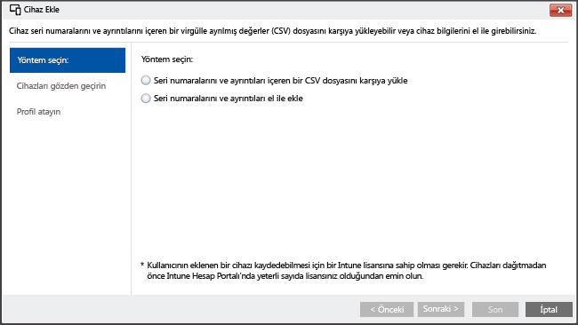

# <a name="enroll-ios-devices-with-apple-configurator-by-using-setup-assistant"></a>Kurulum Yardımcısı’nı kullanarak Apple Configurator ile iOS cihazlarını kaydetme

[!INCLUDE[classic-portal](../includes/classic-portal.md)]

Intune, bir Mac bilgisayarda çalıştırılan [Apple Configurator](http://go.microsoft.com/fwlink/?LinkId=518017) kullanarak şirketin sahip olduğu iOS cihazlarının kaydedilmesini destekler. Bu işlem cihazı fabrika ayarlarına sıfırlar ve şirketin ilkelerini cihazın yeni kullanıcısı için yükleyerek Kurulum Yardımcısı’nın çalıştırılabilmesi için hazırlar.

>[!NOTE]
>Bu kayıt yöntemi, [cihaz kaydı yöneticisi](enroll-corporate-owned-devices-with-the-device-enrollment-manager-in-microsoft-intune.md) yöntemiyle birlikte kullanılamaz.

Apple Configurator kullanarak, bir iOS cihazını fabrika ayarlarına sıfırlayabilir ve cihazın yeni kullanıcısı için ayarlanmak üzere hazırlayabilirsiniz. Bu yöntem, kurumsal kayıt kurulumu için iOS cihazını USB ile bir Mac bilgisayara bağlamanızı gerektirir ve Apple Configurator 2.0 kullandığınızı varsayar. Çoğu senaryoda, Intune Şirket Portalı uygulamasını etkinleştirmek için iOS cihazına uygulanmış olan ilkenin **kullanıcı benzeşimi** içermesi gerekir.

## <a name="prerequisites-for-enrolling-ios-devices-by-using-apple-configurator-with-setup-assistant"></a>Kurulum Yardımcısı ile Apple Configurator'u kullanarak iOS cihazlarını kaydetme önkoşulları

- [APNs sertifikası yükleme](set-up-ios-and-mac-management-with-microsoft-intune.md)

- iOS cihazlarına fiziksel erişime sahip olduğunuzdan emin olun&mdash;cihazların fabrika ayarlarına sıfırlanması ve parola korumasının olmaması gerekir

- Cihaz seri numaralarını alın&mdash;bkz. [iOS seri numarası alma](https://support.apple.com/en-us/HT204308)

- USB bağlantı kablolarını hazır bulundurun

- [Apple Configurator 2.0](https://itunes.apple.com/us/app/apple-configurator-2/id1037126344?mt=12) yüklü Mac bilgisayar kullanın


## <a name="steps-to-enroll-ios-devices-by-using-apple-configurator-with-setup-assistant"></a>Kurulum Yardımcısı ile Apple Configurator'u kullanarak iOS cihazlarını kaydetme adımları

Aşağıdaki adımlar, Kurulum Yardımcısı ile Apple Configurator'u kullanarak iOS cihazlarının "0. gün" kaydının nasıl yapılacağını açıklamaktadır. Kuruluşunuzdaki cihaz ekleme ve kaldırma işlemleri nedeniyle seri numara ekleme veya kaldırma gibi bazı adımları aşağıda gösterilen şekilde tekrarlamak istersiniz.

### <a name="create-mobile-device-groups-optional"></a>Mobil cihaz grupları oluşturma (isteğe bağlı)

İşiniz mobil cihazların yönetimine yardımcı olmak için cihaz gruplarının oluşturulmasını gerektiriyorsa, bu isteğe bağlı grupları oluşturabilirsiniz. Daha fazla bilgi edinmek için bkz. [Microsoft Intune'la kullanıcı ve cihazları yönetmek için grupları kullanma](use-groups-to-manage-users-and-devices-with-microsoft-intune.md).

### <a name="create-a-profile-for-devices"></a>Cihazlar için profil oluşturma

Cihaz kayıt profili bir cihaz grubuna uygulanan ayarları tanımlar.

1. [Microsoft Intune yönetici konsolu](http://manage.microsoft.com)’nda **İlke** &gt; **Kurumsal Cihaz Kaydı**’na gidin ve **Ekle**’yi seçin.

  

2. Cihaz profillerinin ayrıntılarını girin:

   -   **Ad**&mdash;Cihaz kayıt profilinin adı (kullanıcılara gösterilmez).

   -   **Açıklama**&mdash; Cihaz kayıt profilinin açıklaması (kullanıcılara gösterilmez).

   -   **Kayıt Ayrıntıları**&mdash; Cihazların nasıl kaydedildiğini belirtir.

       -   **Kullanıcı benzeşimi istemi**&mdash; Cihaz ilk kurulum sırasında bir kullanıcıya bağlı olmalıdır. Böylece, cihazın şirket verilerine ve e-postalara erişmesine izin verilebilir. DEP tarafından yönetilen kullanıcılara ait olan ve uygulama yüklemek gibi hizmetler için şirket portalını kullanması gereken cihazlarda **kullanıcı benzeşimi** ayarlanmalıdır.

       -   **Kullanıcı benzeşimi yok**&mdash; Cihaz bir kullanıcıya bağlı değil. Bu ilişkiyi, yerel kullanıcı verilerine erişmeden görevleri yerine getiren cihazlar için kullanın. Kullanıcı benzeşimi gerektiren uygulamalar (iş kolu uygulamalarını yüklemek için kullanılan Şirket Portalı uygulaması da dahil) çalışmaz.

   -   **Cihaz grubu ön ataması**&mdash; Bu profille dağıtılan tüm cihazlar başlangıçta bu gruba ait olur. Cihazları kayıttan sonra yeniden atayabilirsiniz.

   > [!Important]
   > Grup atamaları, Intune'dan Azure Active Directory'ye taşınıyor. Intune hesabınız ilgili güncelleştirmeyi aldıktan sonra **Cihazları şu gruba ata** seçeneğini görmeyeceksiniz. [Daha fazla bilgi edinin](/intune/deploy-use/ios-device-enrollment-program-in-microsoft-intune#changes-to-intune-group-assignments).

   -  **Cihaz Kayıt Programı**&mdash; Apple Cihaz Kayıt Programı (DEP), Kurulum Yardımcısı kaydıyla birlikte kullanılamaz. Düğmenin **kapalı** olarak ayarlandığından emin olun.

3.  Profili eklemek için **Profili Kaydet**’i seçin.

### <a name="add-ios-devices-to-enroll-with-setup-assistant"></a>Kurulum Yardımcısı ile kaydedilecek iOS cihazları ekleme

1. [Microsoft Intune yönetim konsolunda](http://manage.microsoft.com) **Gruplar** &gt; **Tüm Cihazlar** &gt; **Şirkete Ait Tüm Cihazlar** &gt; **Tüm Cihazlar**’a gidin ve **Cihaz ekle**’yi seçin.

   İki yolla cihaz ekleyebilirsiniz:

   

   -  **Seri numaraları içeren bir CSV dosyası yükleme**&mdash;Üst bilgi içermeyen iki sütunun virgülle ayrılmış değer (.csv) listesini oluşturun ve csv dosyası başına 5,000 cihaz veya 5 MB ile sınırlayın.

    |||
    |-|-|
    |&lt;Seri 1&gt;|&lt;Cihaz 1 Ayrıntıları&gt;|
    |&lt;Seri 2&gt;|&lt;Cihaz 2 Ayrıntıları&gt;|

  Bu .csv dosyası bir metin düzenleyicisinde görüntülendiğinde aşağıdaki gibi görünür:

    ```
    0000000,PO 1234
    111111111,PO 1234
    ```

  -  **Cihaz ayrıntılarını el ile ekle**&mdash;En fazla 15 cihazın seri numarasını ve varsa cihaz ayrıntılarını veya notları girin.

  **Cihazları Gözden Geçir** bölmesinde, seri numaralarını onaylayabilirsiniz. Ayrıca tekrar içeri aktarılan seri numaraların **Ayrıntıları** için üzerine yazma seçeneklerini belirleyebilir veya **Üzerine yaz** kutusunun işaretini kaldırarak Geçerli ayrıntıları koruyabilirsiniz.

> [!NOTE]
> Mevcut Intune yönetici konsolunda yöneticiler yüklenen CSV dosyasından ayrıntıları alabilir ve her seri numarası için geçerli ayrıntıların üzerine yazabilir. Yeni Azure portalında yalnızca tüm seri numaraları için üzerine yazma seçeneğini kullanabilecek veya tüm seri numaraları için yeni ayrıntıları yoksayabileceksiniz.

> [!NOTE]
> Şirkete ait cihazları daha sonra Intune yönetiminden kaldırmak isterseniz, cihaz kaydını devre dışı bırakmak için **Şirkete Ait Önceden Kaydedilmiş cihazlar** altındaki **iOS Seri Numarasına Göre** cihaz grubuna gitmeniz ve cihaz seri numarasını Intune'dan kaldırmanız gerekebilir. Intune, seri numaralarını kaldırdığınız sıralarda olağanüstü durum kurtarma yordamı gerçekleştirirse, o grupta yalnızca etkin cihazların seri numaralarının bulunduğunu doğrulamanız gerekir.

2. **İleri**’yi seçin.

3. Kaydedilecek cihazları seçin. Zaten kayıtlı olan veya başka yollarla kaydedilmiş seri numaraları içeri aktarılamaz. Devam etmek için **İleri**’yi seçin.

### <a name="assign-a-profile"></a>Profil atama

Kullanılabilir profiller listesinden eklenen cihazlara atanacak profili belirtin, **Kayıt profili ayrıntıları**’e gidin ve **Son**’a tıklayın. El ile eklenen cihazlar herhangi bir kayıt profiline atanabilir.

> [!Important]
> Intune şu anda "varsayılan" cihaz kayıt profili belirleyerek Apple DEP ile eşitlediğiniz yeni seri numaralarının otomatik olarak varsayılan profile atanmasını sağlamanızı mümkün kılıyor. Kiracınız yakın gelecekte yeni Azure portalına geçiş yaptığında artık varsayılan profil belirleyip seri numaraların bu profile otomatik olarak atanmasını sağlayamayacaksınız. Bunun yerine seri numaraları bir profile atamanız gerekecek. [Daha fazla bilgi edinin](https://docs.microsoft.com/intune-azure/enroll-devices/enroll-ios-devices-using-device-enrollment-program)

### <a name="export-a-profile-to-deploy-to-ios-devices"></a>iOS cihazlarına dağıtılacak bir profili dışarı aktarma

1. [Microsoft Intune yönetim konsolunda](http://manage.microsoft.com), **İlke** &gt; **Kurumsal Cihaz Kaydı**’na gidin ve mobil cihazlara dağıtılacak cihaz profilini seçin.

2. Görev çubuğunda **Dışarı Aktar**’ı seçin. **Profil URL'si**öğesini kopyalayıp kaydedin. iOS cihazlar tarafından kullanılan Intune profilini tanımlamak için daha sonra Apple Configurator'a yüklemeniz gerekecektir.

  Apple Configurator 2’nin desteklenmesi için, 2.0 Profil URL’sinin düzenlenmesi gerekir. Bunu yapmak için şu kodu değiştirin:

  ```
  https://manage.microsoft.com/EnrollmentServer/Discovery.svc/iOS/ESProxy?id=
  ```
  Bu kod ile:

  ```
  https://appleconfigurator2.manage.microsoft.com/MDMServiceConfig?id=
  ```

   iOS cihazlarında kullanılan Intune profilini tanımlamak için, aşağıdaki yordamda Apple Configurator kullanarak bu profil URL’sini Apple DEP hizmetine yükleyeceksiniz.

### <a name="prepare-the-device-with-apple-configurator"></a>Cihazı Apple Configurator ile hazırlama

iOS cihazlar Mac bilgisayara bağlanır ve mobil cihaz yönetimine kaydedilir.

1.  Mac bilgisayarda **Apple Configurator 2**'yi açın. Menü çubuğunda **Apple Configurator 2**’yi, sonra **Tercihler**’i seçin.

   > [!WARNING]
   > Cihazlar kayıt işlemi sırasında fabrika yapılandırmalarına sıfırlanır. En iyi uygulama olarak cihazı sıfırlayın ve açın. Cihazı bağladığınızda cihazın **Merhaba** ekranında olması gerekir.

2. Tercihler bölmesinde **Sunucular**’ı seçin ve MDM Sunucusu sihirbazını başlatmak için (+) artı simgesini seçin. **İleri**’yi seçin.

3. Microsoft Intune ile iOS cihazları için Kurulum Yardımcısı kaydı altındaki 6. adımdan MDM sunucusunun **Adı** ve **Kayıt URL'sini** girin. Kayıt URL’si olarak Intune’dan dışarı aktarılan kayıt profili URL’sini girin. **İleri**’yi seçin.  

   “Sunucu URL'si doğrulanmadı” uyarısı alırsanız göz ardı edebilirsiniz. Devam etmek için sihirbaz tamamlanana kadar **İleri**’yi seçin.

4.  iOS mobil cihazları bir USB bağdaştırıcısı ile Mac bilgisayara bağlayın.

    > [!WARNING]
    > Cihazlar kayıt işlemi sırasında fabrika yapılandırmalarına sıfırlanır. En iyi uygulama olarak cihazı sıfırlayın ve açın. Kurulum Yardımcısı’nı başlattığınızda cihazlar **Merhaba** ekranında olmalıdır.

5.  **Hazırla**’yı seçin. iOS Cihazı Hazırla bölmesinde, **El ile**’yi, sonra **İleri**’yi seçin.

6. MDM Sunucusuna Kaydol bölmesinde, oluşturduğunuz sunucunun adını, sonra **İleri**’yi seçin.

7. Cihazları Denetle bölmesinde, denetim düzeyini seçin, sonra **İleri**’yi seçin.

8. Kuruluş Oluştur bölmesinde **Kuruluş**’u seçin veya yeni bir kuruluş oluşturun, sonra **İleri**’yi seçin.

9. iOS Kurulum Yardımcısı’nı Yapılandır bölmesinde, kullanıcıya sunulan adımları, sonra da **Hazırla**’yı seçin. İstenirse, güven ayarlarını güncelleştirmek için kimlik doğrulaması yapın.  

10. iOS cihazı hazırlanmayı tamamladığında USB kablosunun bağlantısını kesin.  

### <a name="distribute-devices"></a>Cihazları dağıtma

Cihazlar artık kurumsal kayıt için hazırdır. Cihazları kapatın ve kullanıcılara dağıtın. Kullanıcılar cihazlarını açtığında Kurulum Yardımcısı başlatılır.

>[!NOTE]
>Bir kullanıcı bir DEP cihazını kaydetmeyi denerse ve cihaz sınırını aştıysa, kayıt işlemi kullanıcıya uyarı vermeden sessizce başarısız olur.


### <a name="see-also"></a>Ayrıca bkz.
[Cihaz kaydetme önkoşulları](prerequisites-for-enrollment.md)

