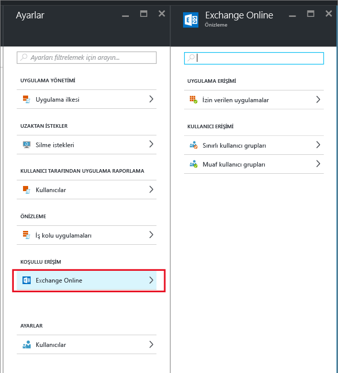
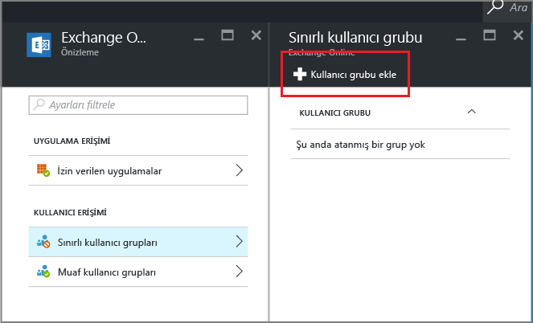

# Yalnızca MAM tarafından desteklenen uygulamalara izin vermek için bir Exchange Online koşullu erişimi oluşturma

[!INCLUDE[classic-portal](../includes/classic-portal.md)]

Bu konu, yalnızca Intune mobil uygulama yönetimi (MAM) ilkelerini destekleyen mobil uygulamalara izin vermek üzere, Exchange Online için koşullu erişimin nasıl ayarlanacağına yönelik adım adım yönergeler sağlar.

## Exchange Online ilkesi oluşturma
1.  Uygulama erişim özelliğini içeren [Azure portal](https://portal.azure.com)’ında oturum açın. Azure portalı deneyiminde yeniyseniz, bkz. [MAM ilkeleri için Azure portalı](azure-portal-for-microsoft-intune-mam-policies.md).

2.  **Gözat > Intune > Intune mobil uygulama yönetimi dikey penceresi > Ayarlar**’ı ve **koşullu erişim** bölümünde **Exchange Online**’ı seçin.

  

3.  **İzin verilen uygulamalar** dikey penceresinde, yalnızca Intune MAM ilkeleri tarafından desteklenen uygulamaların Exchange Online’a erişmesine izin vermek için **Intune uygulama ilkelerini destekleyen uygulamalara izin ver** seçeneğini belirleyin. Bu seçeneği belirlediğinizde, desteklenen uygulamalar listesi görüntülenir.

  >[!NOTE]
  >iOS ve Android’de Exchange Online’a bağlanan yerleşik posta istemcilerini de içeren tüm Exchange Active Sync posta istemcilerinin e-posta göndermesi veya alması engellenir. Kullanıcılar, bunun yerine Outlook posta uygulamasını kullanmaları gerektiğini belirten tek bir e-posta alır. 
4.   Bu ilkeyi kullanıcılara uygulamak için **Kısıtlı Kullanıcı grupları** dikey penceresini açın ve **Kullanıcı grubu ekle**’yi seçin. Bu ilkeyi alması gereken bir veya daha fazla kullanıcı grubu seçin.

  

5.  Önceki adımda seçtiğiniz kullanıcı grubundaki bazı kullanıcıların bu ilkeden etkilenmemesini isteyebilirsiniz. Bu gibi durumlarda, kullanıcı grubunu muaf tutulan kullanıcı grupları listesine ekleyin. **Exchange Online** dikey penceresinden **Muaf tutulan kullanıcı grupları**’nı seçin. Kullanıcı grupları listesini açmak için **Kullanıcı grubu ekle**’yi seçin. Bu ilkeden muaf tutmak istediğiniz grupları seçin.  

## Geçerli bir ilkeyi değiştirme
### Kullanıcı gruplarını ekleme veya silme

**Kısıtlı kullanıcı grupları** listesinden **bir kullanıcı grubu silmek** için **Kısıtlı kullanıcı grupları** dikey penceresini açın, silmek istediğiniz kullanıcı grubunu vurgulayın ve **Sil** seçeneğini görmek için **üç nokta(...)**’ya tıklayın. Kullanıcı grubunu listeden silmek için **Sil**’i seçin. Bir kullanıcı grubunu **muaf tutulan kullanıcı grubu** listesinden kaldırmak için aynı yordamı izleyebilirsiniz.

## Sonraki adımlar
[Modern kimlik doğrulaması olmayan uygulamaları engelleme](block-apps-with-no-modern-authentication.md)
### Ayrıca bkz.
[Uygulama verilerini MAM ilkeleriyle koruma](protect-app-data-using-mobile-app-management-policies-with-microsoft-intune.md)

<!--HONumber=Dec16_HO2-->

