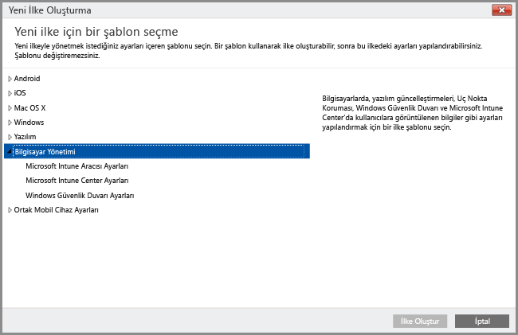

# Intune bilgisayar istemcisiyle Windows bilgisayarlarını yönetme
[Windows bilgisayarlarını mobil cihaz olarak kaydetmek](set-up-windows-device-management-with-microsoft-intune.md) yerine, Windows bilgisayarlarını Intune istemci yazılımını yükleyerek kaydedebilir ve yönetebilirsiniz.

Intune, Windows Server Active Directory Etki Alanı Hizmetleri (AD DS) Grup İlkesi Nesneleri’ne (GPO'lar) benzer bir biçimde, Windows bilgisayarlarını ilkelerle yönetir. Intune ile Active Directory etki alanına katılmış bilgisayarları yönetecekseniz kurumunuzda yürürlükte olan herhangi bir [GPO ile Intune ilkelerinin çakışmadığından emin olun](resolve-gpo-and-microsoft-intune-policy-conflicts.md).

Intune yazılımı istemcisi, yazılım güncelleştirmelerini, Windows güvenlik duvarını ve Endpoint Protection’ı yöneterek [bilgisayarları korumaya yardımcı olan yönetim özelliklerini](policies-to-protect-windows-pcs-in-microsoft-intune.md) desteklerken, diğer Intune ilkeleri, mobil cihaz yönetimine özgü **Windows** ilke ayarları da dahil olmak üzere Intune yazılım istemcisiyle yönetilen bilgisayarları hedefleyemez.

> [!NOTE]
> Windows 8.1 veya üzerini çalıştıran cihazlar daha sonra Intune istemcisiyle veya mobil cihazlar olarak yönetilebilir. Bu konu, Intune yazılım istemcisini çalıştıran bilgisayarlar için geçerlidir. Intune istemcisini yükleme ve mobil cihaz yönetiminde kaydetme desteklenmez.

## Intune bilgisayar istemcisi yönetimi gereksinimleri

**Donanım**: Intune istemcisini yüklemeye yönelik en düşük donanım gereksinimleri aşağıda verilmiştir:

|Gereksinim|Daha fazla bilgi|
|---------------|--------------------|
|Ağ|İstemci, bilgisayarınızın İnternet bağlantısının olmasını gerektirir.|
|İşlemci ve Bellek|Bilgisayarın işletim sistemine ait işlemci ve RAM gereksinimlerine bakın.|
|Disk alanı|İstemci yazılımı yüklenmeden önce 200 MB kullanılabilir disk alanı.|

**Yazılım**: Aşağıda, istemciyi yüklemeye ilişkin yazılım gereksinimleri verilmiştir:

|Gereksinim|Daha fazla bilgi|
|---------------|--------------------|
|İşletim sistemi | Windows Vista veya üstünü çalıştıran Windows cihazı. Home Edition sürümleri desteklenmez.|
|Yönetim izinleri|İstemci yazılımını yükleyen hesabın bu cihaz üzerinde yerel yönetici izinleri olmalıdır.|
|Windows Installer 3.1|Bilgisayarda en azından Windows Installer 3.1 olmalıdır.  Bir bilgisayardaki Windows Installer sürümünü görüntülemek için:  -   Bilgisayarda **%windir%\System32\msiexec.exe** dosyasına sağ tıklayın ve ardından **Özellikler**’e tıklayın.  En son Windows Installer sürümünü Microsoft Developer Network web sitesindeki [Windows Installer Yeniden Dağıtılabilir Öğeleri](http://go.microsoft.com/fwlink/?LinkID=234258) bölümünden indirebilirsiniz.|
|Uyumsuz istemci yazılımını kaldırma|Intune istemci yazılımını yüklemeden önce, bu bilgisayardan tüm Configuration Manager, Operations Manager, Operations Management Suite ve Service Manager istemci yazılımlarını kaldırmalısınız.|

## Intune bilgisayar istemcisi ile bilgisayar yönetimi
Intune istemci yazılımı yüklendikten sonra, şu yönetim olanaklarına sahip olunur: [uygulama yönetimi](deploy-apps-in-microsoft-intune.md), [gerçek zamanlı izleme ve Endpoint Protection](help-secure-windows-pcs-with-endpoint-protection-for-microsoft-intune.md), [Windows Güvenlik Duvarı ayarları yönetimi](help-protect-windows-pcs-using-windows-firewall-policies-in-microsoft-intune.md), donanım ve yazılım envanteri, uzaktan denetim (uzaktan yardım istekleri aracılığıyla), [yazılım güncelleştirme ayarları](keep-windows-pcs-up-to-date-with-software-updates-in-microsoft-intune.md) ve uyumluluk ayarları raporlama.

Mobil cihaz olarak yönetilen bilgisayarlarda kullanılabilen aşağıdaki gibi bazı yönetim seçenekleri yazılım istemcisiyle yönetilen bilgisayarlarda bulunmaz:

-   Tam silme (seçmeli silme bulunur)
-   Koşullu erişim
-   **Bilgisayar yönetimi** ilkelerinden başka Windows ilkeleri

Tek tek bilgisayarlarda yerel olarak Intune istemci aracısı tarafından gerçekleştirilen eylemlere ek olarak, Intune yönetici konsolunu kullanarak istemcinin yüklendiği Windows bilgisayarlarında diğer [yaygın bilgisayar yönetimi görevlerini](common-windows-pc-management-tasks-with-the-microsoft-intune-computer-client.md) de gerçekleştirebilirsiniz:

-   Yönetilen bilgisayarlar hakkında donanım ve yazılım envanteri bilgilerini görüntüleme

-   Bir bilgisayarı uzaktan yeniden başlatma

-   İstemci yazılımını kaldırmak için bir bilgisayarı kullanımdan kaldırma ve Intune ile yönetimden kaldırma

-   Kullanıcıları belirli yönetilen bilgisayarlara bağlama

-   Uzaktan yardım isteklerini yanıtlama

Intune istemci aracısı genellikle fazla kullanıcı etkileşimi veya sorun giderme gerektirmeden, arka planda sessizce çalışır. Ancak, bilgisayar yönetimi sorunlarını çözme konusunda yardıma ihtiyacınız olursa [sorunları çözmenize yardımcı olacak kaynaklar](/intune/troubleshoot/troubleshoot-client-setup-in-microsoft-intune) vardır.

<!--HONumber=Nov16_HO1-->

