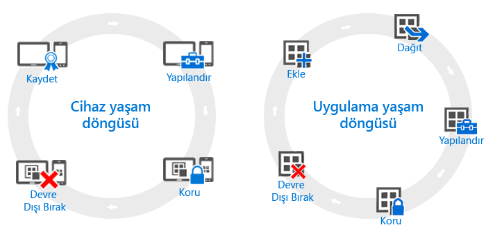

# Cihaz ve uygulama yaşam döngülerine genel bakış

Kuruluşların gereksinimleri farklılık gösterebilse de, operasyonel gereksinimleri ne olursa olsun tüm kuruluşların sürekli izlemek zorunda olacakları bazı ortak adımlar vardır. Bunlar, **yaşam döngüleri** terimiyle gösterilen iki ana kategoride gruplandırılabilir. Takip ettiğiniz dağıtım yaşam döngüsü, etkinleştirmeye çalıştığınız senaryoya bağlıdır. Örneğin, yalnızca cihaz yaşam döngüsüne, yalnızca uygulama yaşam döngüsüne veya her ikisine birden ihtiyacınız olabilir.

Yönetim amaçları için tüm cihazların bir yaşam döngüsü vardır. Bu, cihazı kaydettiğinizde başlar ve devre dışı bırakılana kadar sürer. [Cihaz yönetimi yaşam döngüsü](overview-of-device-lifecycle-in-microsoft-intune.md), cihazın nasıl kaydedileceği, nasıl yapılandırılacağı, korunacağı ve yönetimden nasıl kaldırılacağı hakkında adım adım bilgiler verir.

Benzer şekilde, üzerinde çalıştığınız uygulamaların da kendi [uygulama yaşam döngüleri](overview-of-app-lifecycle-in-microsoft-intune.md) vardır. Bu, uygulamayı Intune’a eklemekle başlar ve artık gerekmedikleri aşamada kaldırılmalarına kadar sürer.

<!--HONumber=Nov16_HO5-->

