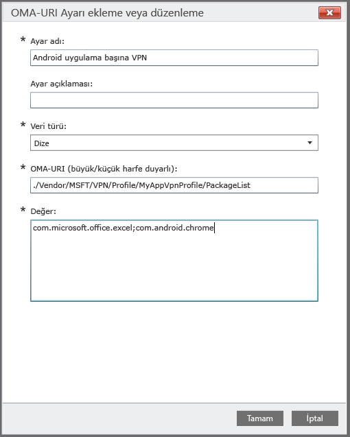

# Özel ilke kullanarak Android cihazları için uygulama başına VPN profili oluşturma

[!INCLUDE[classic-portal](../includes/classic-portal.md)]

Intune tarafından yönetilen Android 5.0 ve üzeri cihazlar için uygulama başına VPN profili oluşturabilirsiniz. İlk olarak, Pulse Secure veya Citrix bağlantı türünü kullanan bir VPN profili oluşturun. Ardından, VPN profilini belirli uygulamalarla ilişkilendiren özel bir yapılandırma ilkesi oluşturun. 

İlkeyi Android cihazınıza veya kullanıcı gruplarına dağıttıktan sonra kullanıcılar Pulse Secure veya Citrix VPN’i başlatmalıdır. Bağlantı bundan sonra yalnızca belirtilen uygulamalardan gelen trafiğin VPN bağlantısını kullanmasına izin verir.

> [!NOTE]
>
> Bu profil için yalnızca Pulse Secure bağlantı türü desteklenir.

### 1. Adım: VPN profili oluşturma

1. [Microsoft Intune yönetim konsolunda](https://manage.microsoft.com), **İlke** > **İlke Ekle**’yi seçin.
2. Yeni ilkede kullanılacak bir şablon seçmek için, **Android**’i genişletin ve **VPN Profili (Android 4 ve üzeri)** öğesini seçin.
3. Şablonda, **Bağlantı türü** olarak **Pulse Secure** veya **Citrix** seçin.
4. VPN profilini bitirin ve kaydedin. VPN profilleri hakkında daha fazla bilgi için bkz. [VPN bağlantıları](../deploy-use/vpn-connections-in-microsoft-intune.md).

> [!NOTE]
>
> Sonraki adımda kullanmak üzere VPN profili adını not edin. Örneğin, UygulamaVpnProfilim.

### 2. Adım: Özel yapılandırma ilkesi oluşturma

   1. Intune yönetici konsolunda **İlke** > **İlke Ekle** > **Android** > **Özel yapılandırma** > **İlke Oluştur**’u seçin.
   2. İlke için bir ad girin.
   3. **OMA-URI ayarları**’nın altında **Ekle**’yi seçin.
   4. Bir ayar adı girin.
   5. **Veri türü** olarak **Dize**’yi belirtin.
   6. **OMA-URI** için şu dizeyi belirtin: **./Vendor/MSFT/VPN/Profile/*Ad*/PackageList**; burada *Ad*, 1. Adım’da not ettiğiniz VPN profili adıdır. Bizim örneğimizde, dize şöyle olabilir: **./Vendor/MSFT/VPN/Profile/UygulamaVpnProfilim/PakatListesi**.
   7.   **Değer** için, profille ilişkilendirilecek paketlerin noktalı virgülle ayrılmış bir listesini oluşturun. Örneğin, Excel’in ve Google Chrome tarayıcısının VPN bağlantısını kullanmasını istiyorsanız, **com.microsoft.office.excel;com.android.chrome** girin.

#### Uygulama listenizi kara liste veya beyaz liste olarak ayarlama (isteğe bağlı)
  **KARA LİSTE** değerini kullanarak, VPN bağlantısını *kullanamayacak* uygulamaların listesini belirtebilirsiniz. Diğer tüm uygulamalar VPN üzerinden bağlanır.
Alternatif olarak, **BEYAZ LİSTE** değerini kullanabilir ve VPN bağlantısını *kullanabilecek* uygulamaların listesini belirtebilirsiniz. Listede yer almayan uygulamalar VPN üzerinden bağlanamaz.
  1.    **OMA-URI ayarları**’nın altında **Ekle**’yi seçin.
  2.    Bir ayar adı girin.
  3.    **Veri türü** olarak **Dize**’yi belirtin.
  4.    **OMA-URI** için şu dizeyi kullanın: **./Vendor/MSFT/VPN/Profile/*Ad*/Mode**; burada *Ad*, 1. Adım’da not ettiğiniz VPN profili adıdır. Bizim örneğimizde, dize şöyle olabilir: **./Vendor/MSFT/VPN/Profile/UygulamamVpnProfili/Mode**.
  5.    **Değer** alanı için **KARA LİSTE** veya **BEYAZ LİSTE** girin.

### 3. Adım: Her iki ilkeyi de dağıtma

*Her iki* ilkeyi de *aynı* Intune gruplarına dağıtmalısınız.

1.  **İlke** çalışma alanında, dağıtmak istediğiniz ilkeyi ve ardından **Dağıtımı Yönet**’i seçin.
2.  **Dağıtımı Yönet** iletişim kutusunda:
    -   **İlkeyi dağıtmak için**, ilkenin dağıtılacağı bir veya daha fazla grup seçin ve ardından **Ekle** > **Tamam**'ı seçin.
    -   **Dağıtmadan iletişim kutusunu kapatmak için** **İptal**’i seçin.

**İlke** çalışma alanının **Genel Bakış** sayfasında, bir durum özeti ve uyarılar ilkeyle ilgili işlem yapmanız gereken durumları tanımlar. Ayrıca, **Pano** çalışma alanında bir durum özeti de görüntülenir.

<!--HONumber=Dec16_HO2-->

