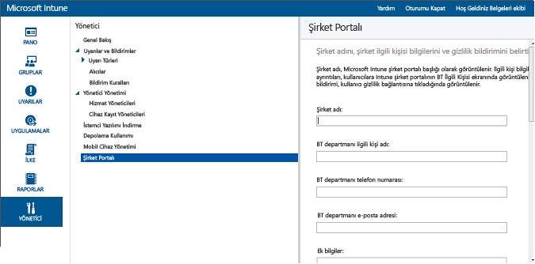

# Intune’da mobil cihaz yönetimi için önkoşullar
Çalışanların kendi cihazlarını Intune’a kaydetmesini etkinleştirmek için aşağıdaki adımları uygulamanız gerekir. Şirkete ait cihazları yönetmek için de aynı adımlar gerekir.

|Adımlar|Ayrıntılar|  
|-----------|-------------|  
|**1. Adım:** [Bağlantıları etkinleştirme](#step-1-enable-connections)|Özel etki alanı adınızın yapılandırıldığından ve ağ iletişiminin hazır olduğundan emin olun|  
|**2. Adım:** [MDM yetkilisini ayarlama](#step-2-set-mdm-authority)|Mobil cihaz yönetimi yetkilisi, cihazlarınıza atanan hizmeti tanımlar|
|**3. Adım:** [Grup oluşturma](#step-3-create-groups)|Şirket Portalı uygulamasına yönelik kullanıcıya açık ayarları yapılandırın|  
|**4. Adım:** [Şirket Portalı’nı yapılandırma](#step-4-configure-company-portal)|Şirket Portalı uygulamasına yönelik kullanıcıya açık ayarları yapılandırın|  
|**5. Adım:** [Kullanıcı lisanslarını atama](#step-5-assign-user-licenses)|Cihazlarını kaydedebilmeleri için Intune lisanslarını kullanıcılara atayın|
|**6. Adım:** [Kaydı etkinleştirme](#step-6-enable-enrollment)|iOS ve Windows yönetimine yönelik platforma özel ayarları etkinleştirin. Android cihazlarda ek yapılandırma gerekmez.|
|**7. adım:** [Sonraki adımlar](#step-7-next-steps)|iOS ve Windows yönetimine yönelik platforma özel ayarları etkinleştirin. Android cihazlarda ek yapılandırma gerekmez.|

Configuration Manager ile Intune mu arıyorsunuz?
> [!div class="button"]
[SCCM belgelerini görüntüleyin >](https://docs.microsoft.com/sccm/mdm/deploy-use/setup-hybrid-mdm)

## 1. Adım: Bağlantıları etkinleştirme

Mobil cihaz kaydını etkinleştirmeden önce aşağıdakileri yaptığınızdan emin olun:
- [Gerekli ağ URL'lerini ve bağlantı noktalarını gözden geçirin](../get-started/network-infrastructure-requirements-for-microsoft-intune.md)
- [Etki alanınızın adını ekleyin ve doğrulayın](../get-started/domain-names-for-microsoft-intune.md)

## 2. Adım: MDM yetkilisini ayarlama
MDM yetkilisi, bir grup cihazı yönetme iznine sahip olan yönetim hizmetini tanımlar. MDM yetkilisi seçenekleri arasında Intune’un kendisi ve Intune ile Configuration Manager vardır. Configuration Manager’ı yönetim yetkilisi olarak ayarlarsanız, mobil cihaz yönetimi için başka bir hizmet kullanılamaz.

>[!IMPORTANT]
> Mobil cihazları yalnızca Intune kullanarak mı (çevrimiçi hizmet) yoksa Intune ile System Center Configuration Manager kullanarak mı (çevrimiçi hizmetle birlikte şirket içi yazılım çözümü) yönetmek istediğinizi dikkatle düşünün. Mobil cihaz yönetim yetkilisini ayarlandıktan sonra, bu değiştirilemez.

1.  [Microsoft Intune yönetim konsolunda](http://manage.microsoft.com) **Yönetim** &gt; **Mobil Cihaz Yönetimi**’ni seçin.

2.  **Görevler** listesinde **Mobil Cihaz Yönetimi Yetkilisini Ayarla**öğesine tıklayın. **MDM Yetkilisini Ayarla** iletişim kutusu açılır.

    

3.  Intune, Intune’u MDM yetkiliniz olarak isteyip istemediğinizi onaylamanızı ister. Mobil cihazları yönetmek için Microsoft Intune kullanmak istiyorsanız onay kutusunu işaretleyin ve ardından **Evet**'i seçin.

## 3. Adım: Grup oluşturma

Yönetimi basitleştirmek ve dağıtılan uygulamaları, ilkeleri ve şirket kaynaklarını daha iyi hedeflemek için kullanıcı ve cihaz grupları oluşturabilirsiniz. [Grupların nasıl oluşturulacağını öğrenin](use-groups-to-manage-users-and-devices-with-microsoft-intune.md#create-groups).

## 4. Adım: Şirket Portalı’nı yapılandırma

Intune Şirket Portalı, kullanıcıların şirket verilerine eriştiği ve cihaz kaydetmek, uygulama yüklemek ve BT departmanınızdan yardım için bilgi bulmak gibi genel görevleri gerçekleştirebilecekleri yerdir.

> [!TIP]
> Şirket Portalı’nı özelleştirdiğinizde, yapılandırmalar hem Şirket Portalı web sitesi hem de Şirket Portalı uygulamaları için geçerli olur.

Şirket Portalı’nı özelleştirmek, son kullanıcılarınız için tanıdık ve yararlı bir deneyim sağlamaya yardımcı olur. Bunu yapmak için, bir kiracı veya hizmet yöneticisi olarak [Microsoft Intune yönetim konsolunda](https://manage.microsoft.com) oturum açmanız, **Yönetici** &gt; **Şirket Portalı**’nı seçmeniz ve Şirket Portalı ayarlarını yapılandırmanız yeterli olur.

### Şirket iletişim bilgileri ve gizlilik bildirimi

Şirket adı, Şirket Portalı’nın başlığı olarak görüntülenir. Kullanıcılara kişi bilgileri ve ayrıntıları Şirket Portalı’nın BT’ye Başvur ekranında görüntülenir. Gizlilik bildirimini, kullanıcı gizlilik bağlantısına tıkladığında görüntülenir.

|Alan adı|Uzunluk üst sınırı|Daha fazla bilgi|
    |----------|------------------------|----------------|
    |Şirket adı|40|Bu ad Şirket Portalı’nın başlığı olarak gösterilir. **Not**: Yalnızca alfasayısal karakterler. Bu alan özel karakterleri desteklemez.|
    |BT departmanı ilgili kişi adı|40|Bu ad **BT’ye Başvur**sayfasında gösterilir.|
    |BT departmanı telefon numarası|20|Bu iletişim numarası **BT'ye Başvur** sayfasında gösterilir.|
    |BT departmanı e-posta adresi|40|Bu iletişim adresi **BT'ye Başvur** sayfasında gösterilir. **alias@domainname.com** biçiminde geçerli bir e-posta adresi girmeniz gerekir.|
    |Ek bilgiler|120|Bu bilgiler **BT'ye Başvur** sayfasında gösterilir.|
    |Şirket gizlilik bildirimi URL'si|79|Kullanıcılar Şirket Portalı’nda gizlilik bağlantılarına tıkladığında görüntülenecek kendi şirket gizlilik bildiriminizi belirtebilirsiniz. https://www.contoso.com biçiminde geçerli bir URL girmelisiniz.|

### Destek kişileri
Şirket Portalı’nda kullanıcılara, çevrimiçi desteğe erişebilmeleri için destek web sitesi gösterilir.

|Alan adı|Uzunluk üst sınırı|Daha fazla bilgi|
    |----------|------------------------|----------------|
    |Destek web sitesi URL'si|150|Kullanıcılarınızın kullanmasını istediğiniz bir destek web siteniz varsa, URL'sini burada belirtin. URL, https://www.contoso.com biçiminde olmalıdır. Bir URL belirtmezseniz, Şirket Portalı’ndaki **BT'ye Başvur** sayfasında destek web sitesi için hiçbir şey görünmez.|
    |Web sitesinin adı|40|Bu ad destek web sitesi URL'si için görüntülenen kolay addır. Bir destek web sitesi URL'si belirtir ve bir kolay ad belirtmezseniz, Şirket Portalı’ndaki **BT'ye Başvur** sayfasında **BT web sitesine gidin** ifadesi gösterilir.|

### Şirket markasıyla özelleştirme

Şirket Portalınızı şirket logonuz, şirket adınız, tema renginiz ve arka planınızla özelleştirebilirsiniz.

|Alan adı|Daha fazla bilgi|
    |----------|----------------|
    |Tema rengi|Şirket Portalı’na uygulamak için bir tema rengi seçin.|
    |Şirket logosunu ekle|Bu seçeneği etkinleştirdiğinizde, Şirket Portalınızda görüntülemek için şirket logonuzu yükleyebilirsiniz. İki logo yükleyebilirsiniz: birisi Şirket Portalı’nın arka planı beyaz olduğunda, diğeriyse Şirket Portalı arka planında seçilen Tema rengi kullanıldığında görüntülenir. Her logo bir .png veya .jpg dosyası olmalı, en yüksek çözünürlüğü 400 x 100 piksel olmalı ve boyutu 750 KB veya daha az olmalıdır.|
    |Şirket Portalı uygulaması için bir arka plan seçin|Bu ayar yalnızca Şirket Portalı uygulamasının arka planını etkiler.|

Değişiklikleri kaydettikten sonra, Şirket Portalı web sitesini görüntülemek için yönetim konsolunun **Şirket Portalı** sayfasının sonunda sağlanan bağlantıları kullanabilirsiniz. Bu bağlantılar değiştirilemez. Bir kullanıcı oturum açtığında bu bağlantılar Şirket Portalı’ndaki aboneliklerinizi görüntüler.

## 5. Adım: Kullanıcı lisanslarını atama

Bulut tabanlı kullanıcıları el ile eklemek ve hem bulut tabanlı kullanıcı hesaplarına hem de şirket içi Active Directory’nizden Azure Active Directory’ye (Azure AD) eşitlenen hesaplara lisans atamak için **Office 365 yönetim portalını** kullanırsınız. [Şirket içi kullanıcıları Azure AD ile eşitleyebilirsiniz](../get-started/start-with-a-paid-subscription-to-microsoft-intune-step-3.md#how-to-sync-on-premises-users-with-azure-ad).

1.  Kiracı yöneticisi kimlik bilgilerinizi kullanarak [Office 365 yönetim portalında](https://portal.office.com/Admin/Default.aspx) oturum açın.

2.  Intune kullanıcı lisansı atamak istediğiniz kullanıcı hesabını seçin ve kullanıcı hesabı özelliklerinde **Microsoft Intune** onay kutusunu seçin.

3.  Kullanıcı hesabı artık Microsoft Intune kullanıcı grubuna eklenir. Bu grup, kullanıcıya hizmeti kullanmak ve cihazlarını yönetime kaydetmek için izinler verir.

### Şirket içi kullanıcıları Azure AD ile eşitleme

1. Şirket içi Active Directory’de özel etki alanınız için [UPN sonekini ekleyin](https://technet.microsoft.com/en-us/library/cc772007.aspx).
2. İçe aktarmayı planladınız şirket için kullanıcılar için, yeni UPN sonekini ayarlayın.
3. Şirket için kullanıcılarınızı Azure AD ile tümleştirmek için, [Azure AD Connect eşitleme](https://azure.microsoft.com/en-us/documentation/articles/active-directory-aadconnect/) çalıştırın.
4. Kullanıcı hesabı bilgileri başarıyla eşitlendiğinde, [Office 365 Yönetim Portalı](https://portal.office.com/Admin/Default.aspx)’nı kullanarak Microsoft Intune lisansları atayabilirsiniz.

## 6. Adım: Kaydı etkinleştirme
MDM yetkilisini ayarladıktan sonra, kuruluşunuzun desteklemek istediği işletim sistemleri için cihaz yönetimi ayarlamanız gerekir. Cihaz yönetimi ayarlamak için gerekli olan adımlar, işletim sistemine göre farklılık gösterir. Örneğin Android işletim sistemi, Intune yönetim konsolunda herhangi bir şey yapmanızı gerektirmez. Diğer taraftan, Windows ve iOS, yönetime olanak sağlamak için cihazlar ve Intune arasında bir güven ilişkisi gerektirir.

Aşağıdaki platformların yönetimini ayarlayın:
- [iOS ve Mac](set-up-ios-and-mac-management-with-microsoft-intune.md)
- [Android](set-up-android-management-with-microsoft-intune.md)
- [Android for Work](set-up-android-for-work.md)
- [Windows bilgisayarlar ve dizüstü bilgisayarlar](set-up-windows-device-management-with-microsoft-intune.md)
- [Windows 10 Mobile ve Windows Phone](set-up-windows-phone-management-with-microsoft-intune.md)

[Şirkete ait cihazların kaydını](manage-corporate-owned-devices.md) da etkinleştirebilirsiniz.

## 7. Adım: Sonraki adımlar

Kayıt etkinleştirildikten sonra, iş gereksinimlerinizi karşılamak için yönetimi ayarlamanız gerekir. Bazı yönetim seçenekleri şunlardır:

- [Cihazlarda ayarları ve özellikleri yöneten ilkeler dağıtma](manage-settings-and-features-on-your-devices-with-microsoft-intune-policies.md)
- [E-posta, Wi-Fi ve VPN gibi şirket kaynaklarına erişimi etkinleştirme](enable-access-to-company-resources-with-microsoft-intune.md)
- Yönetilen cihazlara [uygulama ekleme](add-apps.md) ve [uygulama dağıtma](deploy-apps.md)
- [Cihaz uyumluluk ilkeleri oluşturma](introduction-to-device-compliance-policies-in-microsoft-intune.md) ve [uyumluluğa göre erişimi kısıtlama](restrict-access-to-email-and-o365-services-with-microsoft-intune.md)

<!--HONumber=Dec16_HO2-->

