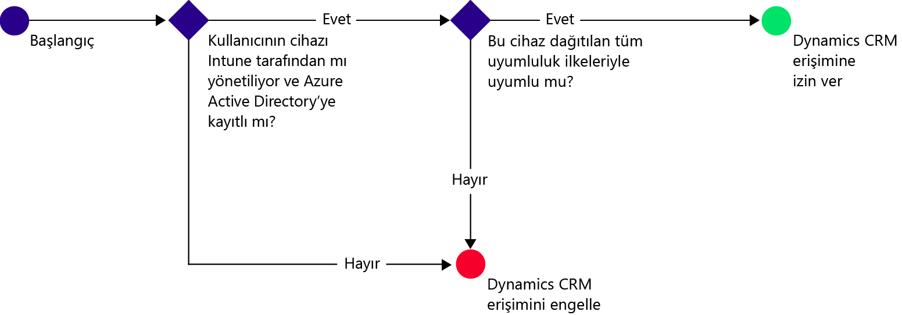
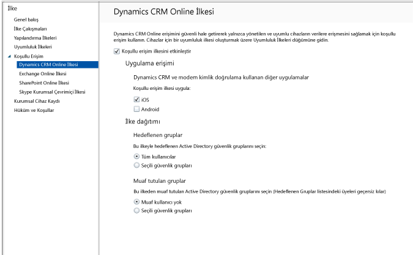

# Intune ile Dynamics CRM Online’a erişimi kısıtlama
Microsoft Dynamics CRM Online’a erişimi, iOS ve Android cihazlardan, Microsoft Intune koşullu erişim kullanarak denetleyebilirsiniz.  Intune koşullu erişimi iki bileşenden oluşur:
* Cihazın uyumlu kabul edilmesi için uyması gereken [cihaz uyumluluk ilkesi](introduction-to-device-compliance-policies-in-microsoft-intune.md).
* Cihazın hizmete erişebilmek için uyması gereken koşulları sizin belirlediğiniz bir [koşullu erişim ilkesi](restrict-access-to-email-and-o365-services-with-microsoft-intune.md).

Koşullu erişimin nasıl çalıştığı hakkında daha fazla bilgi edinmek için, [e-posta, 0365 hizmetlerine ve diğer hizmetlere erişimi kısıtlama](restrict-access-to-email-and-o365-services-with-microsoft-intune.md) makalesini okuyun.

> [!IMPORTANT]
> Koşullu erişim dağıtmak için Intune ve Azure Active Directory Premium abonelikleriniz olmalıdır ve kullanıcılar her iki ürünün de lisansına sahip olmalıdır. **Enterprise Mobility + Security (EMS) aboneliği** hem Intune hem de Azure Active Directory Premium abonelikleri içerir. Daha fazla ayrıntı için bkz. [Enterprise Mobility fiyatlandırma sayfası](https://www.microsoft.com/en-us/cloud-platform/enterprise-mobility-pricing). EMS aboneliğiniz yoksa Azure Active Directory Premium aboneliği alabilirsiniz. Bkz. [Azure Active Directory fiyatlandırma sayfası](https://azure.microsoft.com/en-us/pricing/details/active-directory/).

Hedeflenen bir kullanıcı kendi cihazında Dynamics CRM uygulamasını kullanmayı denerse, aşağıdaki değerlendirme yapılır:

Dynamics CRM Online’a erişmesi gereken cihaz:
* **Android** veya **iOS** cihazı olmalıdır.
* Intune’a **kaydedilmiş** olmalıdır.
* Dağıtılmış tüm Intune uyumluluk ilkeleriyle **uyumlu** olmalıdır.

Cihaz durumu, Azure Active Directory'de depolanır; bu durumda belirttiğiniz koşullara göre erişim izni verilir veya erişim engellenir.

Bir koşul karşılanmazsa, oturum açtığında kullanıcıya şu iletilerden biri sunulur:
* Cihaz Intune’a kaydedilmediyse veya Azure Active Directory'ye kayıtlı değilse, Şirket Portalı uygulamasının nasıl yükleneceğine ve nasıl kayıt yapılacağına ilişkin yönergeleri içeren bir ileti görüntülenir.
* Cihaz uyumlu değilse kullanıcıyı, sorun hakkında bilgi bulabileceği ve sorunu düzeltebileceği Microsoft Intune Şirket Portalı Web sitesine veya Şirket Portalı uygulamasına yönlendiren bir ileti görüntülenir.

## Dynamics CRM Online için koşullu erişim yapılandırma  
### Adım 1: Active Directory güvenlik gruplarını yapılandırma

Başlamadan önce koşullu erişim ilkesi için Azure Active Directory güvenlik gruplarını yapılandırın. Bu grupları **Office 365 yönetim merkezinde** yapılandırabilirsiniz. Bu grupları, ilkede kullanıcıları hedeflemek veya muaf tutmak için kullanırsınız. Bir kullanıcı bir ilke tarafından hedeflendiğinde, kaynaklara erişmek için kullandıkları her bir cihaz uyumlu olmalıdır.

Dynamics CRM ilkesinde kullanmak üzere iki grup türü belirtebilirsiniz:
* **Hedeflenen gruplar**. İlkenin uygulanacağı kullanıcı gruplarını içerir.
* **Muaf tutulan gruplar**. İlkeden muaf tutulan kullanıcı gruplarını içerir.

Bir kullanıcı her iki gruptaysa ilkeden muaf tutulur.

### Adım 2: Uyumluluk ilkesi yapılandırma ve dağıtma
Bir uyumluluk ilkesi [oluşturun](create-a-device-compliance-policy-in-microsoft-intune.md) ve ilkeden etkilenecek olan tüm cihazlara [dağıtın](deploy-and-monitor-a-device-compliance-policy-in-microsoft-intune.md). Bunlar, Hedeflenen gruplardaki kullanıcılar tarafından kullanılan tüm cihazlardır.

> [!NOTE]
> Uyumluluk ilkeleri Intune gruplarına dağıtılırken, koşullu erişim ilkeleri Azure Active Directory güvenlik gruplarına dağıtılır.

> [!IMPORTANT]
> Uyumluluk İlkesi dağıtmadıysanız, cihazlar uyumlu olarak kabul edilir.

Hazır olduğunuzda 3. Adım‘a ilerleyin.
### Adım 3: Dynamics CRM ilkesi yapılandırma
Ardından, ilkeyi yalnızca yönetilen ve uyumlu cihazların Dynamics CRM’ye erişebileceği şekilde yapılandırın. Bu ilke Azure Active Directory’de depolanır.

1.  Intune yönetim konsolunda, **İlke > Koşullu Erişim > Dynamics CRM Online İlkesi**’ni seçin.

  

2.  **Koşullu erişimi etkinleştir** ilkesini seçin.
3.  **Uygulama erişimi** altında aşağıdakilere koşullu erişim ilkesini uygulamayı seçebilirsiniz:
  * **iOS**
  * **Android**
4.  **Hedeflenen Gruplar**altında, ilkenin geçerli olacağı Azure Active Directory güvenlik gruplarını seçmek için **Değiştir**’i seçin. Bunu tüm kullanıcılara veya yalnızca seçilmiş bir kullanıcı grubuna hedefleyebilirsiniz.
5.  **Muaf Tutulan Gruplar** altında, bu ilkeden muaf tutulan Active Directory güvenlik gruplarını seçmek için isteğe bağlı olarak **Değiştir**’i seçin.
6.  İşiniz bittiğinde **Kaydet**’i seçin.

Artık Dynamics CRM için koşullu erişimi yapılandırdınız. Koşullu erişim ilkesini dağıtmanız gerekmez, hemen geçerli olur.
##  Uyumluluk ve koşullu erişim ilkeleri izleme

**Gruplar** çalışma alanında, cihazlarınızın koşullu erişim durumunu görüntüleyebilirsiniz.

Herhangi bir mobil cihaz grubunu seçin ve ardından **Cihazlar** sekmesinde aşağıdaki **Filtreler** arasından birini seçin:
* **AAD ile kaydedilmeyen cihazlar**. Bu cihazlar Dynamics CRM’den engellenir.
* **Uyumlu olmayan cihazlar**. Bu cihazlar Dynamics CRM’den engellenir.
* **AAD ile kaydedilen ve uyumlu olan cihazlar**. Bu cihazlar Dynamics CRM’ye erişebilir.

##  Sonraki adımlar
* [Exchange Online'a erişimi kısıtlama](restrict-access-to-exchange-online-with-microsoft-intune.md)

* [Şirket içi Exchange’e erişimi kısıtlama](restrict-access-to-exchange-onpremises-with-microsoft-intune.md)
* [SharePoint Online’a erişimi kısıtlama](restrict-access-to-sharepoint-online-with-microsoft-intune.md)

* [Skype Kurumsal Çevrimiçi Sürüm’e erişimi kısıtlama](restrict-access-to-skype-for-business-online-with-microsoft-intune.md)

<!--HONumber=Dec16_HO2-->

