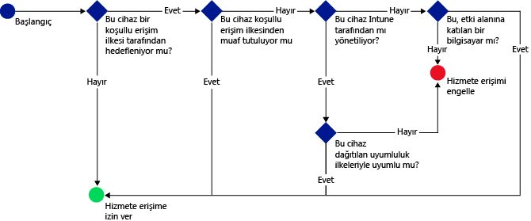

# Microsoft Intune ile e-posta, Office 365 ve diğer hizmetlere erişimi koruma

[!INCLUDE[classic-portal](../includes/classic-portal.md)]

Enterprise Mobility + Security (EMS) Koşullu Erişim kullanarak şirket e-postanıza, **Şirket İçi Exchange**, **Exchange Online**, **Adanmış Exchange Online**, **SharePoint Online**, **Skype Kurumsal Çevrimiçi Sürüm** gibi Office 365 hizmetlerine ve diğer hizmetlere erişimi koruyabilirsiniz. Bu özellik, şirketinizin e-postasına ve Office 365 hizmetlerine erişimin, Intune yönetim konsolunda veya Azure klasik portalında ayarladığınız koşullu erişim kurallarına uyan cihazlarla sınırlı olduğundan emin olmanızı sağlar.
## Koşullu erişim nasıl çalışır?
Uyumluluk ilkesi ayarları kullanarak cihazın uyumluluğunu değerlendirebilirsiniz. Koşullu erişim, belirli bir hizmete erişimi kısıtlamak veya erişim izni vermek için bu değerlendirmeyi kullanır. Koşullu erişim ilkesini bir cihaz uyumluluk ilkesiyle birlikte kullandığınızda, yalnızca uyumlu cihazların hizmete erişmesine izin verilir. Uyumluluk ilkesi ve koşullu erişim ilkesi kullanıcıya dağıtılır. Kullanıcının hizmetlere erişirken kullandığı her cihaz, ilkelerle uyumluluk açısından denetlenir.

Cihazın uyumluluğunun değerlendirilebilmesi için cihazı kullanan kullanıcıya dağıtılmış bir uyumluluk ilkesi olması gerektiğini unutmayın.
Kullanıcıya hiçbir uyumluluk ilkesi dağıtılmadıysa, cihaz uyumlu olarak kabul edilir ve hiçbir erişim kısıtlaması uygulanmaz.

Cihazlar ilkelerde ayarlanan koşulları karşılamadığında, kullanıcı cihazı kaydetme ve cihazın uyumlu olmasını önleyen sorunu düzeltme sürecinde yönlendirilir.

Tipik bir koşullu erişim akışı:

## Kurulumda dikkat edilecek noktalar

### Lisanslama

Microsoft Intune ve Azure Active Directory (Azure AD) Premium, EMS koşullu erişim aracılığıyla çok katmanlı denetim sağlamak için birlikte sorunsuz bir şekilde çalışır. Intune kullanarak koşullu erişim ilkeleri dağıtmak istiyorsanız her iki ürünün lisansına da sahip olmanız gerekir.

**Azure AD Premium lisansları**, tek başına bir hizmet veya Kurumsal anlaşmanın bir parçası olarak (Intune ile birlikte) satın alınabilir. Intune ile koşullu erişim ilkeleri dağıttıysanız uygun Azure AD Premium veya **EMS lisansları** edindiğinizden emin olun.

- [Enterprise Mobility fiyatlandırma sayfası](https://www.microsoft.com/en-us/cloud-platform/enterprise-mobility-pricing) veya [Azure Active Directory fiyatlandırma sayfası](https://azure.microsoft.com/en-us/pricing/details/active-directory/) hakkında daha fazla bilgi edinin.

Ayrıca, koşullu erişim ilkelerini uygulamayı planladığınız kullanıcılara [Azure AD Premium veya EMS lisansları atandığından](/Intune/get-started/start-with-a-paid-subscription-to-microsoft-intune-step-4.md) emin olun.

### Cihaz uyumluluk ayarları

Koşullu erişimi ayarlamak için bir cihaz uyumluluk ilkesi ve koşullu erişim ilkesi ayarlayın. Uyumluluk ilkesi geçiş kodu, şifreleme ve cihazın yazılım kilidinin kırılmış olup olmadığı gibi ayarları içerir. Cihazın uyumlu kabul edilmesi için bu kurallara uyması gerekir.

- [Cihaz uyumluluk ilkesi ve nasıl çalıştığı](introduction-to-device-compliance-policies-in-microsoft-intune.md) hakkında daha fazla bilgi edinin.

### Koşullu erişim ilkesi

Koşullu erişim ilkesini ayarlayarak, erişimi aşağıdakiler temelinde koruyabilirsiniz:
- Cihaz uyumluluğunu durumu.
- Cihazda çalışan platform.
- Hizmetlere erişmek için kullanılan uygulamaların türü.

Diğer Intune ilkelerinden farklı olarak, koşullu erişim ilkelerini dağıtmazsınız. Bunun yerine, ilkeyi yapılandırdıktan ve ilkenin uygulanacağı kullanıcıları seçtikten sonra, ilke tüm hedeflenen kullanıcılara uygulanır. Bir kullanıcı ilke tarafından hedeflendiğinde, kaynaklara erişmek için kullandıkları her bir cihaz uyumlu olmalıdır.

## Sonraki adımlar

2. [Cihaz uyumluluğu ilkesi oluşturma](create-a-device-compliance-policy-in-microsoft-intune.md).

2.  Aşağıdaki Microsoft bulut hizmetleri/ürünlerinden biri için koşullu erişim ilkesi oluşturun:
> [!div class="op_single_selector"]
  - [Exchange Online için koşullu erişim ilkesi oluşturma](restrict-access-to-exchange-online-with-microsoft-intune.md)
  - [Şirket İçi Exchange için koşullu erişim ilkesi oluşturma](restrict-access-to-exchange-onpremises-with-microsoft-intune.md)
  - [Yeni Ayrılmış Exchange Online için koşullu erişim ilkesi oluşturma](restrict-access-to-exchange-online-with-microsoft-intune.md)
  - [Eski Ayrılmış Exchange Online için koşullu erişim ilkesi oluşturma](restrict-access-to-exchange-onpremises-with-microsoft-intune.md)
  - [SharePoint Online için koşullu erişim ilkesi oluşturma](restrict-access-to-sharepoint-online-with-microsoft-intune.md)
  - [Skype Kurumsal Çevrimiçi Sürüm için koşullu erişim ilkesi oluşturma](restrict-access-to-skype-for-business-online-with-microsoft-intune.md)
  - [Dynamics CRM Online için koşullu erişim ilkesi oluşturma](restrict-access-to-dynamics-crm-online-with-microsoft-intune.md)

<!--HONumber=Feb17_HO1-->

