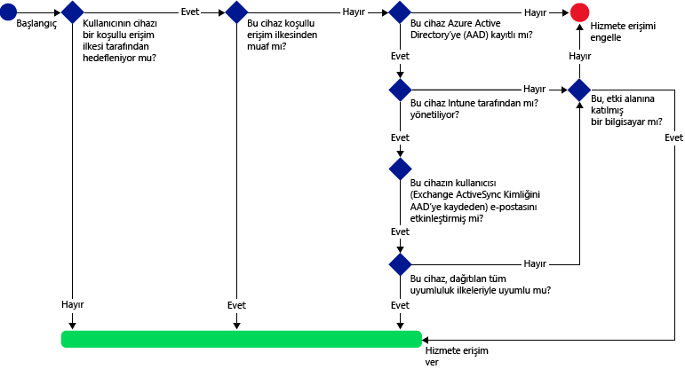
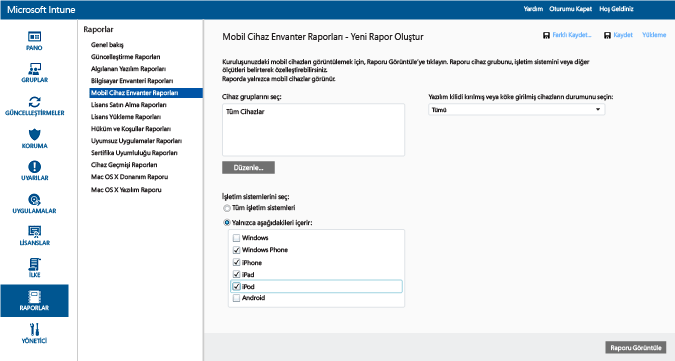
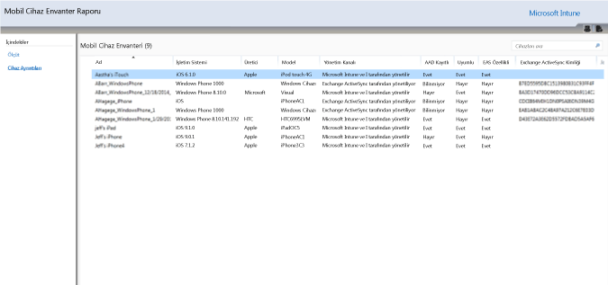
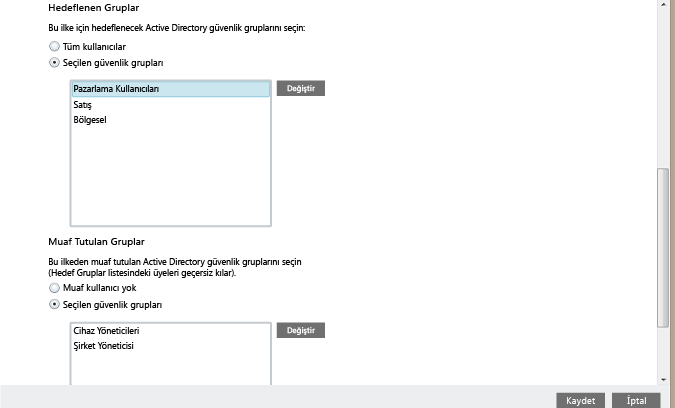
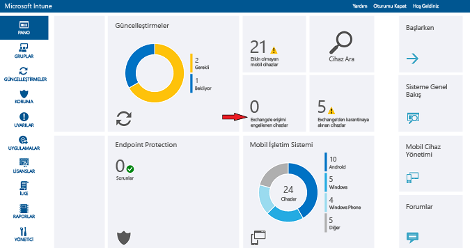

# Intune ile Exchange Online’a ve yeni Ayrılmış Exchange Online ortamına e-posta erişimini kısıtlama

> [!NOTE]
>Adanmış Exchange Online ortamınız varsa ve bunun yapılandırmasının yeni mi yoksa eski mi olduğunu bulmanız gerekiyorsa hesap yöneticinize başvurun.

Exchange Online’a veya yeni Adanmış Exchange Online ortamına e-posta erişimini denetlemek için Microsoft Intune kullanarak Exchange Online’a koşullu erişim yapılandırabilirsiniz. Koşullu erişimin nasıl çalıştığı hakkında daha fazla bilgi edinmek için [E-posta, O365 hizmetlerine ve diğer hizmetlere erişimi kısıtlama](restrict-access-to-email-and-o365-services-with-microsoft-intune.md) makalesini okuyun.

Koşullu erişimi yapılandırabilmeniz için **önce**:

-   **Exchange Online içeren bir Office 365 aboneliğiniz (örneğin E3)** olmalı ve kullanıcılar Exchange Online lisansına sahip olmalıdır.

- **Enterprise Mobility + Security (EMS) aboneliğiniz** veya bir **Azure Active Directory (Azure AD) Premium aboneliğiniz** olmalıdır ve kullanıcılar EMS veya Azure AD lisansına sahip olmalıdır. Daha fazla ayrıntı için bkz. [Enterprise Mobility fiyatlandırma sayfası](https://www.microsoft.com/en-us/cloud-platform/enterprise-mobility-pricing) veya [Azure Active Directory fiyatlandırma sayfası](https://azure.microsoft.com/en-us/pricing/details/active-directory/).

-  [!INCLUDE[wit_nextref](../includes/wit_nextref_md.md)] ile Exchange Online’ı bağlayan ve [!INCLUDE[wit_nextref](../includes/wit_nextref_md.md)] konsolu aracılığıyla cihaz bilgilerini yönetmenize yardımcı olan isteğe bağlı **Intune hizmetten hizmete bağlayıcısını** yapılandırmayı göz önünde bulundurmalısınız. Uyumluluk ilkeleri veya koşullu erişim ilkelerini kullanmak için bağlayıcıyı kullanmanıza gerek yoktur ancak koşullu erişimin etkisini değerlendirmeye yardımcı olan raporları çalıştırmak için bu gereklidir.

   > [!NOTE]
   > Koşullu erişimi hem Exchange Online hem de Şirket İçi Exchange için kullanmak istiyorsanız hizmetten hizmete bağlayıcısını yapılandırmayın.

   Bağlayıcıyı yapılandırma yönergeleri için bkz. [Intune hizmetten hizmete bağlayıcısı](intune-service-to-service-exchange-connector.md).

Koşullu biçimlendirme ilkeleri yapılandırdığınızda ve bunlarla bir kullanıcı hedeflediğinizde, kullanıcının e-postasına bağlanabilmesi için önce **cihazın** şu özellikleri taşıması gerekir:

-   Etki alanına katılmış bir bilgisayar veya [!INCLUDE[wit_nextref](../includes/wit_nextref_md.md)] ile **kaydedilmiş** olması gerekir.

-  **Azure Active Directory’de kayıtlı olmalıdır**. Cihaz [!INCLUDE[wit_nextref](../includes/wit_nextref_md.md)]’a kaydedildiğinde bu otomatik olarak gerçekleşir. Buna ek olarak, istemci Exchange ActiveSync kimliği Azure Active Directory’de kayıtlı olmalıdır.

  Azure Active Directory Cihaz Kayıt hizmeti, Intune ve Office 365 müşterileri için otomatik olarak etkinleştirilir. ADFS Cihaz Kayıt hizmetini zaten dağıtan müşteriler, kayıtlı cihazlarını şirket içi Active Directory'de görmez.

-   Söz konusu cihaza dağıtılmış tüm [!INCLUDE[wit_nextref](../includes/wit_nextref_md.md)] uyumluluk ilkeleriyle **uyumlu** olmalı veya şirket içi etki alanına katılmış olmalıdır.

Bir koşullu erişim ilkesi karşılanmazsa kullanıcı oturum açtığında şu iletilerden birini görür:

- Cihaz [!INCLUDE[wit_nextref](../includes/wit_nextref_md.md)] ile kaydedilmediyse veya Azure Active Directory’de kayıtlı değilse Şirket Portalı uygulamasını yükleme, cihazı kaydetme ve e-postayı etkinleştirme yönergelerinin bulunduğu bir ileti görüntülenir. Bu işlem cihazın Exchange ActiveSync kimliğini de Azure Active Directory’deki kayıtla ilişkilendirir.

-   Cihazın değerlendirmesinde uyumluluk ilkesi kurallarına uygun olmadığı bulunursa kullanıcı sorunla ve bu sorunu nasıl çözebileceğiyle ilgili bilgilere ulaşabileceği [!INCLUDE[wit_nextref](../includes/wit_nextref_md.md)] Şirket Portalı web sitesine veya Şirket Portalı uygulamasına yönlendirilir.

Aşağıdaki diyagramda, Exchange Online için koşullu erişim ilkeleri tarafından kullanılan akış çizilmiştir.

## Mobil cihaz desteği
**Outlook**’tan ve **modern kimlik doğrulamasının kullanıldığı diğer uygulamalardan** Exchange Online e-postasına erişimi kısıtlayabilirsiniz. Aşağıdakiler desteklenir:

- Android 4.0 ve üzeri, Samsung Knox Standard 4.0 ve üzeri ve Android for Work
- iOS 8.0 ve üzeri
- Windows Phone 8.1 ve üzeri

[!INCLUDE[wit_nextref](../includes/afw_rollout_disclaimer.md)]

**Modern kimlik doğrulaması**, Active Directory Authentication Library (ADAL) tabanlı oturum açmayı Microsoft Office istemcilerine getirir.

-   ADAL tabanlı kimlik doğrulaması, Office istemcilerinin tarayıcı tabanlı kimlik doğrulaması (pasif kimlik doğrulama olarak da bilinir) gerçekleştirmesine imkan sağlar. Bir kullanıcı, kimlik doğrulamak için bir oturum açma web sayfasına yönlendirilir.
-   Bu yeni oturum açma yöntemi, **çok faktörlü kimlik doğrulaması** ve **sertifika tabanlı kimlik doğrulaması** gibi daha iyi güvenlik önlemlerine olanak tanır. Daha ayrıntılı bilgiler için bkz. [Modern kimlik doğrulaması nasıl çalışır?](https://support.office.com/en-US/article/How-modern-authentication-works-for-Office-2013-and-Office-2016-client-apps-e4c45989-4b1a-462e-a81b-2a13191cf517). Modern olmayan kimlik doğrulama protokollerini engellemek için ADFS talep kuralları ayarlayabilirsiniz. [Senaryo 3: O365’e tarayıcı tabanlı uygulamalar dışındaki tüm erişimi engelleme](https://technet.microsoft.com/library/dn592182.aspx) bölümünde ayrıntılı yönergeler verilmiştir.

Bir kullanıcı Exchange Online’da **iOS** ve **Android** cihazlardaki bir tarayıcıdan eriştiğinde **Outlook Web Access (OWA)** erişimini kısıtlayabilirsiniz. Erişime yalnızca uyumlu cihazlarda, desteklenen tarayıcılardan izin verilir:

* Safari (iOS)
* Chrome (Android)
* Intune Managed Browser (iOS, Android 5.0 ve üzeri)

**Desteklenmeyen tarayıcılar engellenir**.

**iOS ve Android için OWA uygulaması, modern kimlik doğrulaması kullanmayacak şekilde değiştirilebilir ve desteklenmez. OWA uygulamasından erişimin, ADFS talep kuralları ile engellenmesi gerekir.**

Aşağıdaki platformlarda yerleşik **Exchange ActiveSync e-posta istemcisinden** Exchange e-postasına erişimi kısıtlayabilirsiniz:

- Android 4.0 ve üzeri, Samsung KNOX Standard 4.0 ve üzeri

- iOS 8.0 ve üzeri

- Windows Phone 8.1 ve üzeri

## Bilgisayarlar için destek

Aşağıdaki gereksinimleri karşılayan bilgisayarlar için **Exchange Online** ve **SharePoint Online** ’a erişmek amacıyla Office masaüstü uygulamalarını çalıştıran bilgisayarlara yönelik koşullu erişimi ayarlayabilirsiniz:

-   Bilgisayarın Windows 7.0, Windows 8.1 veya Windows 10 çalıştırıyor olması gerekir.

  >[!NOTE]
  > Windows 10 bilgisayarlar ile koşullu erişim kullanmak için bu bilgisayarları Windows 10 Yıldönümü Güncelleştirmesi ile güncelleştirmeniz gerekir.

  Bilgisayar etki alanına katılmalı veya uyumluluk ilkesi kurallarına uygun olmalıdır.

  Uyumlu olarak kabul edilmesi için, bilgisayarın [!INCLUDE[wit_nextref](../includes/wit_nextref_md.md)] ’da kayıtlı olması ve ilkelere uyması gerekir.

  Etki alanına katılmış bilgisayarlarda, Azure Active Directory ile [cihazı otomatik olarak kaydetmek](https://azure.microsoft.com/documentation/articles/active-directory-conditional-access-automatic-device-registration/) için koşullu erişim ayarlamanız gerekir.

  >[!NOTE]
    >Intune bilgisayar istemcisi çalıştıran bilgisayarlarda koşullu erişim desteklenmez.

-   [Office 365 modern kimlik doğrulamasının etkin olması](https://support.office.com/en-US/article/Using-Office-365-modern-authentication-with-Office-clients-776c0036-66fd-41cb-8928-5495c0f9168a) ve en son Office güncelleştirmelerine sahip olması gerekir.

    Modern kimlik doğrulaması, Active Directory Authentication Library (ADAL) tabanlı oturum açmayı Office 2013/Windows istemcilerine getirir. Bu, **çok faktörlü kimlik doğrulaması** ve **sertifika tabanlı kimlik doğrulaması** gibi daha iyi güvenlik önlemlerine olanak tanır.

-   Modern olmayan kimlik doğrulama protokollerini engellemek için ADFS talep kuralları ayarlanır. [Senaryo 3: O365’e tarayıcı tabanlı uygulamalar dışındaki tüm erişimi engelleme](https://technet.microsoft.com/library/dn592182.aspx) bölümünde ayrıntılı yönergeler verilmiştir.

## Koşullu erişimi yapılandırma
### 1. Adım: Uyumluluk ilkesi yapılandırma ve dağıtma
Koşullu erişim ilkesini alacak olan kullanıcı grupları için de uyumluluk ilkesi [oluşturduğunuzdan](create-a-device-compliance-policy-in-microsoft-intune.md) ve [dağıttığınızdan](deploy-and-monitor-a-device-compliance-policy-in-microsoft-intune.md) emin olun.

> [!IMPORTANT]
> Uyumluluk ilkesi dağıtmadıysanız cihazlar uyumlu kabul edilir ve Exchange’e erişim izni alırlar.

### 2 Adım: Koşullu erişim ilkesinin etkisini değerlendirme
Koşullu erişim ilkesini yapılandırdıktan sonra Exchange’e erişimi engellenebilecek cihazları belirlemek üzere **Mobil Cihaz Envanter Raporları**’nı kullanabilirsiniz.

Bunu yapmak için, [Microsoft Intune hizmetten hizmete bağlayıcısını](intune-service-to-service-exchange-connector.md) kullanarak [!INCLUDE[wit_nextref](../includes/wit_nextref_md.md)] ile Exchange arasında bir bağlantı yapılandırın.
1.  **Raporlar** > **Mobil Cihaz Envanter Raporları** öğesine gidin.

2.  Rapor parametrelerinde, değerlendirmek istediğiniz [!INCLUDE[wit_nextref](../includes/wit_nextref_md.md)] grubunu ve gerekirse ilkenin geçerli olacağı cihaz platformlarını seçin.
3.  Kuruluşunuzun gereksinimlerini karşılayan ölçütleri seçtikten sonra **Raporu Görüntüle**’yi seçin.
Rapor Görüntüleyicisi yeni bir pencerede açılır.

Raporu çalıştırdıktan sonra kullanıcının engellenip engellenmeyeceğini belirlemek için şu dört sütunu inceleyin:

-   **Yönetim Kanalı**: Cihazın Intune, Exchange ActiveSync veya her ikisi tarafından yönetilip yönetilmediğini belirtir.

-   **AAD Kayıtlı**: Cihazın Azure Active Directory’ye kayıtlı olup olmadığını belirtir (Workplace Join olarak bilinir).

-   **Uyumlu**: Cihazın dağıttığınız herhangi bir uyumluluk ilkesiyle uyumlu olup olmadığını belirtir.

-   **Exchange ActiveSync Kimliği**: iOS ve Android cihazların, Exchange ActiveSync kimliklerinin Azure Active Directory'deki cihaz kaydı ile ilişkilendirilmiş olması gerekir. Bir kullanıcı karantina e-postasında **E-postayı Etkinleştir** bağlantısını seçtiğinde bu durum ortaya çıkar.

    > [!NOTE]
    > Windows Phone cihazları her zaman bu sütunda bir değer görüntüler.

Sütun değerleri aşağıdaki tabloda listelenenlerle eşleşmiyorsa hedeflenen bir grubun parçası olan cihazların Exchange’e erişmesi engellenir:

--------------------------
|Yönetim Kanalı|AAD Kayıtlı|Uyumlu|Exchange ActiveSync Kimliği|Sonuçtaki eylem|
|----------------------|------------------|-------------|--------------------------|--------------------|
|**Microsoft Intune ve Exchange ActiveSync tarafından yönetilir**|Evet|Evet|Bir değer görüntülenir|E-posta erişimine izin verilir|
|Başka bir değer|Hayır|Hayır|Bir değer görüntülenmez|E-posta erişimi engellenir|
----------------------
Kullanıcılarınıza engelleneceklerini bildirmek için raporun içindekileri dışarı aktarabilir ve **E-posta Adresi** sütununu kullanabilirsiniz.

### 3. Adım: Koşullu erişim ilkesi için kullanıcı gruplarını yapılandırma
Koşullu erişim ilkeleri farklı Azure Active Directory güvenlik kullanıcı gruplarını hedefler. Ayrıca bazı kullanıcı gruplarını koşullu erişim ilkesinden muaf tutabilirsiniz. Bir kullanıcı bir ilke tarafından hedeflendiğinde, e-postaya erişmek için kullandıkları her bir cihaz uyumlu olmalıdır.

**Office 365 yönetici merkezi**’nde veya **Intune hesap portalı**’nda bu grupları yapılandırabilirsiniz.

Her bir ilkede iki grup türü belirtebilirsiniz:

-   **Hedeflenen gruplar**: İlkenin geçerli olduğu kullanıcı grupları.

-   **Muaf tutulan gruplar**: İlkeden muaf tutulan kullanıcı grupları (isteğe bağlı).

Bir kullanıcı her iki gruptaysa ilkeden muaf tutulur.

Yalnızca koşullu erişim ilkesi tarafından hedeflenen gruplar değerlendirmeye alınır.

### 4. Adım: Koşullu erişim ilkesini yapılandırma

>[!NOTE]
> Azure AD yönetim konsolunda da bir koşullu erişim ilkesi oluşturabilirsiniz. Azure AD yönetim konsolu, çok faktörlü kimlik doğrulaması gibi diğer koşullu erişim ilkelerine ek olarak, Intune cihaz koşullu erişim ilkeleri (Azure AD’de **cihaz tabanlı koşullu erişim ilkesi** olarak bilinir) oluşturmanıza olanak sağlar.

>Salesforce ve Box gibi Azure AD tarafından desteklenen kurumsal üçüncü taraf uygulamaları için de koşullu erişim ilkeleri ayarlayabilirsiniz. Daha fazla ayrıntı için bkz. [Azure Active Directory bağlı uygulamalarda erişim denetimi için Azure Active Directory cihaz tabanlı koşullu erişim ilkesini ayarlama](https://azure.microsoft.com/en-us/documentation/articles/active-directory-conditional-access-policy-connected-applications/).

1.  [Microsoft Intune yönetim konsolunda](https://manage.microsoft.com) **İlke** > **Koşullu Erişim** > **Exchange Online İlkesi**’ni seçin.

2.  **Exchange Online İlkesi** sayfasında, **Exchange Online için koşullu erişim ilkesini etkinleştir**’i seçin.

    > [!NOTE]
    > Uyumluluk ilkesi dağıtmadıysanız cihazlar uyumlu olarak kabul edilir.
    >
    > Uyumluluk durumuna bakılmaksızın, ilke tarafından hedeflenen tüm kullanıcıların cihazlarını [!INCLUDE[wit_nextref](../includes/wit_nextref_md.md)] hizmetine kaydetmeleri gerekir.

3.  **Uygulama erişimi**’nin altında, modern kimlik doğrulaması kullanan uygulamalar için ilkenin hangi platformlara uygulanacağını seçmenizin iki yolu vardır. Desteklenen platformlar Android, iOS, Windows ve Windows Phone’dur.

    -   **Tüm platformlar**

        Bu seçenek **Exchange Online**’a erişmek için kullanılan tüm cihazların Intune’a kaydedilmesini ve ilkelerle uyumlu olmasını gerektirir. **Modern kimlik doğrulaması** kullanan tüm istemci uygulamaları, koşullu erişim ilkesine bağlıdır. Platform şu anda Intune tarafından desteklenmiyorsa **Exchange Online**’a erişim engellenir.

        **Tüm platformlar** seçeneğinin belirlenmesi, Azure Active Directory’nin bu ilkeyi, istemci uygulaması tarafından bildirilen platformdan bağımsız olarak tüm kimlik doğrulama isteklerine uygulayacağı anlamına gelir. Aşağıdakiler dışında tüm platformların kaydedilmesi ve uyumlu hale gelmesi gerekir:
        *   Windows cihazların, kaydolması ve uyumlu hale gelmesi, şirket içi Active Directory ile etki alanının birleşik olması veya her ikisi gerekir.
        * Mac OS gibi desteklenmeyen platformlar. Ancak bu platformlardan gelen, modern kimlik doğrulaması kullanan uygulamalar yine de engellenir.

    -   **Belirli platformlar**

         Koşullu erişim ilkesi, belirttiğiniz cihaz platformlarında **modern kimlik doğrulaması** kullanan tüm istemci uygulamaları için geçerlidir.

4. **Outlook Web Access (OWA)** altında, yalnızca desteklenen tarayıcılar üzerinden Exchange Online'a erişime izin vermeyi seçebilirsiniz: Safari (iOS) ve Chrome (Android). Diğer tarayıcılardan erişim engellenir. Outlook için Uygulama erişiminde seçtiğiniz platform kısıtlamaları burada da geçerli olur.

  **Android** cihazlarda, kullanıcılar tarayıcı erişimini etkinleştirmelidir. Bunu yapmak için kullanıcı, kaydedilen cihazda **Tarayıcı Erişimini Etkinleştir** seçeneğini etkinleştirmelidir:
  1.    **Şirket Portalı uygulamasını** açın.
  2.    Üç nokta (...) veya donanım menüsü düğmesinden **Ayarlar** sayfasına gidin.
  3.    **Tarayıcı Erişimi Etkinleştir** düğmesine basın.
  4.    Chrome tarayıcıda, Office 365 oturumunu kapatın ve Chrome’u yeniden başlatın.

  **iOS** ve **Android** platformlarında, Azure Active Directory, cihazın hizmete erişmek amacıyla kullanıldığını belirlemek için cihaza bir Aktarım Katmanı Güvenliği (TLS) sertifikası yayımlar. Cihaz, sertifikayı aşağıdaki ekran görüntülerinde görüleceği gibi kullanıcıya sertifikayı seçmesi için bir istemle ekrana getirir. Kullanıcının tarayıcıyı kullanmaya devam etmek için bu sertifikayı seçmesi gerekir.

  **Android**

  

  **Android**

  

5.  **Exchange ActiveSync uygulamaları**’nın altında, uyumsuz cihazların Exchange Online’a erişmesini engellemeyi seçebilirsiniz. Cihaz desteklenen bir platformda çalıştırılmadığında e-posta erişimine izin vermeyi veya bu erişimi engellemeyi de seçebilirsiniz. Desteklenen platformlar Android, iOS, Windows ve Windows Phone’dur.

 **Android for Work** cihazlarındaki Exchange Active Sync uygulamaları:
 -  Android for Work cihazlar için yalnızca **iş profilindeki** **Gmail** ve **Nine Work** uygulamaları desteklenir. Android for Work cihazlarda koşullu erişimin çalışması için Gmail veya Nine Work uygulamasına yönelik bir e-posta profili dağıtmalı ve bunu ayrıca **zorunlu** bir yükleme olarak dağıtmanız gerekir.

6.  **Hedeflenen Gruplar** altında, ilkenin geçerli olacağı Active Directory güvenliği kullanıcı gruplarını seçin. Tüm kullanıcıları veya seçili bir kullanıcı grupları listesini hedeflemeyi seçebilirsiniz.

    > [!NOTE]
    > **Hedeflenen gruplar**’da bulunan kullanıcılar için Intune ilkeleri, Exchange kurallarının ve ilkelerinin yerini alır.
    >
    > Exchange, yalnızca şu durumlarda Exchange izin verme, engelleme ve karantinaya alma kurallarını ve Exchange ilkelerini uygular:
    >
    > -   Bir kullanıcı Intune için lisanslı değilse.
    > -   Bir kullanıcı Intune için lisanslıysa ancak koşullu erişim ilkesinde hedeflenen güvenlik gruplarından birinde değilse.

6.  **Muaf Tutulan Gruplar**altında, bu ilkeden muaf tutulan Active Directory güvenliği kullanıcı gruplarını seçin. Bir kullanıcı hem hedeflenen hem de muaf tutulan gruptaysa ilkeden muaf tutulur.

7.  İşiniz bittiğinde **Kaydet**’i seçin.

-   Koşullu erişim ilkesini dağıtmanız gerekmez, hemen geçerli olur.

-   Kullanıcı bir e-posta hesabı oluşturduktan sonra cihaz hemen engellenir.

-   Engellenen bir kullanıcı, cihazı [!INCLUDE[wit_nextref](../includes/wit_nextref_md.md)] ile kaydeder ve uyumsuzluk sorunlarını çözerse iki dakika içinde e-posta erişiminin engeli kaldırılır.

-   Kullanıcı cihazının kaydını kaldırırsa yaklaşık altı saat sonra e-posta engellenir.

**Cihaz erişimini kısıtlamak üzere bir koşullu erişim ilkesini nasıl yapılandırabileceğinizi gösteren bazı örnek senaryolar** görmek için bkz. [E-posta erişimini kısıtlama örnek senaryoları](restrict-email-access-example-scenarios.md).

## Uyumluluk ve koşullu erişim ilkeleri izleme

#### Exchange’e erişimi engellenmiş cihazları görüntülemek için

[!INCLUDE[wit_nextref](../includes/wit_nextref_md.md)] panosunda, engellenen cihazların sayısını ve daha fazla bilgiye ulaşmanızı sağlayan bağlantıları göstermek için **Exchange’e Erişimi Engellenmiş Cihazlar** kutucuğunu seçin.

## Sonraki adımlar
- [SharePoint Online’a erişimi kısıtlama](restrict-access-to-sharepoint-online-with-microsoft-intune.md)

- [Skype Kurumsal Çevrimiçi Sürüm’e erişimi kısıtlama](restrict-access-to-skype-for-business-online-with-microsoft-intune.md)

<!--HONumber=Dec16_HO2-->

