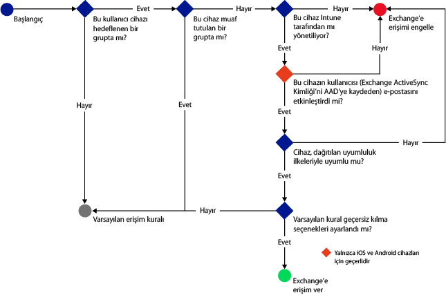
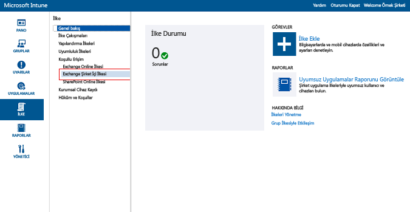
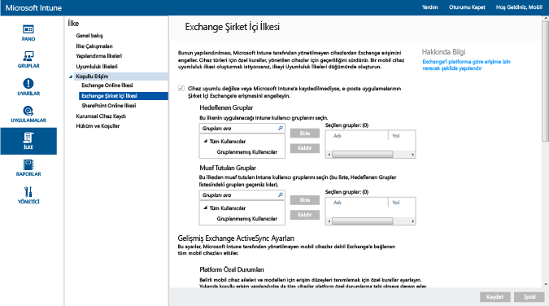

# Intune’la Şirket İçi Exchange’e ve eski Ayrılmış Exchange Online ortamına e-posta erişimini kısıtlama

Ayrılmış Exchange Online ortamınız varsa ve bunun yapılandırmasının yeni mi yoksa eski mi olduğunu bulmanız gerekiyorsa, lütfen hesap yöneticinize başvurun.

Şirket İçi Exchange’e veya eski Ayrılmış Exchange Online ortamına e-posta erişimini denetlemek için, Intune’da Şirket İçi Exchange’e koşullu erişim yapılandırın.
Koşullu erişimin nasıl çalıştığı hakkında daha fazla bilgi edinmek için, [E-posta ve O365 hizmetlerine erişimi kısıtlama]( restrict-access-to-email-and-o365-services-with-microsoft-intune.md) makalesini okuyun.

Koşullu erişimi yapılandırabilmeniz için **önce** aşağıdakileri doğrulayın:

-   Exchange sürümünüzün **Exchange 2010 veya üzeri** olması gerekir. Exchange Server İstemci Erişimi Sunucusu (CAS) dizisi desteklenir.

-   [!INCLUDE[wit_nextref](../includes/wit_nextref_md.md)] ile Şirket İçi Microsoft Exchange’i bağlayan **Şirket İçi Exchange bağlayıcısını** kullanmanız gerekir. Bu, cihazları [!INCLUDE[wit_nextref](../includes/wit_nextref_md.md)] konsolu üzerinden yönetmenizi sağlar. Bağlayıcıyla ilgili ayrıntılar için bkz. [Intune Şirket İçi Exchange bağlayıcısı](intune-on-premises-exchange-connector.md).

    -   Intune konsolunda size sağlanan Şirket İçi Exchange bağlayıcısı, Intune kiracınıza özgüdür ve başka hiçbir kiracıyla kullanılamaz. Ayrıca, kiracınızın Exchange bağlayıcısının **tek bir makineye** yüklendiğinden de emin olmalısınız.

        Bu bağlayıcı Intune yönetim konsolundan indirilmelidir.  Şirket İçi Exchange bağlayıcısını yapılandırma yönergeleri için bkz. [Şirket içi veya barındırılan Exchange için Şirket İçi Exchange bağlayıcısını yapılandırma](intune-on-premises-exchange-connector.md).

    -   Bu bağlayıcı, makine Exchange sunucusuyla iletişim kurabildiği sürece herhangi bir makineye yüklenebilir.

    -   Bağlayıcı **Exchange CAS ortamını** destekler. İsterseniz, teknik olarak bağlayıcıyı doğrudan Exchange CAS sunucusuna yükleyebilirsiniz, ancak sunucu üzerindeki yükü artıracağından bunun yapılması önerilmez.
    Bağlayıcıyı yapılandırırken Exchange CAS sunucularından biriyle iletişim kurabilecek şekilde yapılandırmanız gerekir.

-   **Exchange ActiveSync**, sertifika tabanlı kimlik doğrulaması veya kullanıcı kimlik bilgileri girişiyle yapılandırılmalıdır.

Koşullu biçimlendirme ilkeleri yapılandırıldığında ve hedef kullanıcı belirlendiğinde, kullanıcının e-postasına bağlanabilmesi için önce **cihazın** şu özellikleri taşıması gerekir:

-  [!INCLUDE[wit_nextref](../includes/wit_nextref_md.md)]’a **kaydolmalı** veya etki alanına katılmış bir bilgisayar olmalıdır.

-  **Azure Active Directory’de kayıtlı olmalıdır**. Buna ek olarak, istemci Exchange ActiveSync kimliği Azure Active Directory’de kayıtlı olmalıdır.

  AAD DRS, Intune ve Office 365 müşterileri için otomatik olarak etkinleştirilir. ADFS Cihaz Kayıt Hizmeti'ni zaten dağıtan müşteriler, kayıtlı cihazlarını şirket içi Active Directory'lerinde görmez. **Bu, Windows bilgisayarları ve Windows Phone cihazları için geçerli değildir**.

-   Söz konusu cihaza dağıtılan tüm [!INCLUDE[wit_nextref](../includes/wit_nextref_md.md)] uyumluluk ilkeleriyle **uyumlu** olmalıdır.

Aşağıdaki çizelgede, Şirket İçi Exchange’e yönelik koşullu erişim ilkeleri tarafından, cihazlara izin verme veya cihazları engelleme yönünde değerlendirme yapmak amacıyla kullanılan akış gösterilir.

 Koşullu erişim ilkesine uyulmazsa, kullanıcı oturum açtığında şu iletilerden birini görür:

- Cihaz [!INCLUDE[wit_nextref](../includes/wit_nextref_md.md)]’a kaydolmadıysa veya Azure Active Directory’de kayıtlı değilse, Şirket Portalı uygulamasını yükleme, cihazı kaydetme ve e-postayı etkinleştirme yönergelerinin bulunduğu bir ileti görüntülenir. Bu işlem cihazın Exchange ActiveSync kimliğini de Azure Active Directory’deki cihaz kaydıyla ilişkilendirir.

-   Cihaz uyumlu değilse, kullanıcıyı sorunla ve sorunun nasıl çözüleceğiyle ilgili bilgileri bulabileceği [!INCLUDE[wit_nextref](../includes/wit_nextref_md.md)] Şirket Portalı web sitesine veya Şirket Portalı uygulamasına yönlendiren bir ileti görüntülenir.

## Mobil cihaz desteği
-   Windows Phone 8.1 ve üzeri

-   iOS’ta yerel e-posta uygulaması.

-   Android 4 veya sonraki sürümlerdeki Gmail gibi EAS posta istemcileri.
- EAS posta istemcileri **Android for Work cihazlar:** Android for Work cihazlarda yalnızca **iş profilindeki** **Gmail** ve **Nine Work** uygulamaları desteklenir. Android for Work cihazlarda koşullu erişimin çalışması için Gmail veya Nine Work uygulamasına yönelik bir e-posta profili dağıtmalı ve bu uygulamaları ayrıca zorunlu bir yükleme olarak dağıtmanız gerekir. 

[!INCLUDE[wit_nextref](../includes/afw_rollout_disclaimer.md)]

> [!NOTE]
> Android ve iOS için Microsoft Outlook uygulaması desteklenmez.

## Bilgisayarlar için destek

Windows 8.1 ve üstündeki **Posta** uygulaması ([!INCLUDE[wit_nextref](../includes/wit_nextref_md.md)] ile kaydedildiğinde)

##  Koşullu erişim ilkesini yapılandırma

1.  [Microsoft Intune yönetim konsolunda](https://manage.microsoft.com) **İlke** > **Koşullu Erişim** > **Şirket İçi Exchange İlkesi**’ni seçin.

2.  İlkeyi size gereken ayarlarla yapılandırın: 

  - **Cihaz uyumsuzsa veya Microsoft Intune'a kayıtlı değilse e-posta uygulamalarının Şirket İçi Exchange'e erişimini engelle:** Bu seçeneği belirttiğinizde, [!INCLUDE[wit_nextref](../includes/wit_nextref_md.md)] tarafından yönetilmeyen veya bir uyumluluk ilkesiyle uyumlu olmayan cihazların Exchange hizmetlerine erişimi engellenir.

  - **Varsayılan kuralı geçersiz kıl - Intune'a kayıtlı ve uyumlu cihazların Exchange'e erişmesine her zaman izin ver:** Bu seçeneği işaretlediğinizde, Intune’a kaydedilen ve ilkelerle uyumlu olan cihazların Exchange’e erişmesine izin verilir.  
  Bu kural **Varsayılan Kural**’ı geçersiz kılar; diğer bir deyişle, **Varsayılan Kural**’ı erişimi karantinaya alacak veya engelleyecek şekilde ayarlasanız bile, kayıtlı ve uyumlu cihazların yine de Exchange’e erişebileceği anlamına gelir.

  - **Hedeflenen Gruplar:** Exchange’e erişebilmesi için cihazını [!INCLUDE[wit_nextref](../includes/wit_nextref_md.md)]’a kaydetmesi gereken [!INCLUDE[wit_nextref](../includes/wit_nextref_md.md)] kullanıcı gruplarını seçin.

  - **Muaf Tutulan Gruplar:** Koşullu erişim ilkesinden muaf tutulan [!INCLUDE[wit_nextref](../includes/wit_nextref_md.md)] kullanıcı gruplarını seçin. Bu listedeki kullanıcılar, aynı zamanda **Hedeflenen Gruplar** listesinde de olsalar bile muaf tutulurlar.

  - **Platform Özel Durumları:** Belirtilen mobil cihaz aileleri ve modellerinde erişim düzeylerini tanımlayan bir kural yapılandırmak için **Kural Ekle**’yi seçin. Bu cihazlar herhangi bir türde olabileceğinden, [!INCLUDE[wit_nextref](../includes/wit_nextref_md.md)] tarafından desteklenmeyen cihaz türlerini de yapılandırabilirsiniz.

  - **Varsayılan Kural:** Diğer kurallardan herhangi birinin kapsamında yer almayan bir cihaz söz konusu olduğunda cihazın Exchange’e erişmesine izin vermeyi, cihazı engellemeyi veya karantinaya almayı seçebilirsiniz. Kuralı, kayıtlı ve uyumlu cihazlarda erişime izin verecek şekilde ayarladığınızda, iOS, Windows ve Samsung KNOX cihazları için otomatik olarak e-posta erişimi verilir. Son kullanıcının e-postasını almak için herhangi bir işlem yapması gerekmez.  Samsung KNOX çalıştırmayan Android cihazlarında, e-postaya erişebilmeleri için son kullanıcılara kaydı ve uyumluluğu doğrulama işleminde yol gösteren bir karantina e-postası gönderilir. Erişimi engellemeye veya karantinaya almaya yönelik kuralı ayarlarsanız, Intune’a kaydedilmiş olup olmadıklarına bakılmaksızın tüm cihazların Exchange’e erişimi engellenir. Kayıtlı ve uyumlu cihazların bu kuraldan etkilenmesini önlemek için, **Varsayılan Kuralı Geçersiz Kılma** seçeneğini işaretleyin.
>[!TIP]
>Amacınız e-postaya erişim vermeden önce tüm cihazları engellemekse, Erişimi engelle’yi veya Karantina kuralı’nı seçin. Varsayılan kural tüm cihaz türleri için geçerli olacaktır, böylece platform özel durumları olarak yapılandırdığınız ve [!INCLUDE[wit_nextref](../includes/wit_nextref_md.md)] tarafından desteklenmeyen cihaz türleri de etkilenir.

  - **Kullanıcı Bildirimi:** Exchange’den gönderilen bildirim e-postasına ek olarak Intune, cihazın engelini kaldırma adımlarını içeren bir e-posta gönderir. Gereksinimlerinize göre özelleştirmek için, varsayılan iletiyi düzenleyebilirsiniz. Çözümleme yönergelerini içeren Intune bildirim e-postası kullanıcının Exchange posta kutusuna teslim edildiğinden, kullanıcı cihazının e-posta iletisini almadan önce engellenmesi durumunda kullanıcı, Exchange’e erişmek ve iletiyi görüntülemek için engellenmemiş bir cihaz ya da başka yöntemler kullanabilir. Bu özellikle, **Varsayılan Kural** engellemek veya karantinaya almak üzere ayarlandıysa geçerlidir.  Bu durumda, son kullanıcının uygulama mağazasına gitmesi, Microsoft Şirket Portalı uygulamasını indirmesi ve cihazını kaydetmesi gerekir. Bu iOS, Windows ve Samsung KNOX cihazları için geçerlidir.  Samsung KNOX çalıştırmayan cihazlarda, karantina e-postasını alternatif bir e-posta hesabına göndermeniz gerekir. Daha sonra son kullanıcı kayıt ve uyumluluk işlemini tamamlamak için bunu engellenen cihazına kopyalamalıdır.|
  > [!NOTE]
  > Exchange’in bildirim e-postası gönderebilmesi için, bildirim e-postasını göndermek için kullanılacak hesabı belirtmeniz gerekir.
  >
  > Ayrıntılar için bkz. [Şirket içi veya barındırılan Exchange için Şirket İçi Exchange bağlayıcısını yapılandırma](intune-on-premises-exchange-connector.md).

3.  İşiniz bittiğinde **Kaydet**’i seçin.

-   Koşullu erişim ilkesini dağıtmanız gerekmez, hemen geçerli olur.

-   Kullanıcı bir Exchange ActiveSync profili ayarladıktan sonra cihazın engellenmesi 1-3 saat arası sürebilir ([!INCLUDE[wit_nextref](../includes/wit_nextref_md.md)] tarafından yönetilmiyorsa).

-   Engellenen kullanıcı daha sonra cihazı [!INCLUDE[wit_nextref](../includes/wit_nextref_md.md)]’a kaydederse ve uyumsuzluğu çözerse, 2 dakika içinde e-posta erişiminin engeli kaldırılır.

-   Kullanıcı [!INCLUDE[wit_nextref](../includes/wit_nextref_md.md)] kaydını silerse cihazın engellenmesi 1-3 saat sürebilir.

**Cihaz erişimini kısıtlamak üzere koşullu erişim ilkesini nasıl yapılandırabileceğinizi gösteren bazı örnek senaryolar görmek için bkz. [E-posta erişimini kısıtlama örnek senaryoları](restrict-email-access-example-scenarios.md).**

## Sonraki adımlar
[SharePoint Online’a erişimi kısıtlama](restrict-access-to-sharepoint-online-with-microsoft-intune.md)

[Skype Kurumsal Çevrimiçi Sürüm’e erişimi kısıtlama](restrict-access-to-skype-for-business-online-with-microsoft-intune.md)

<!--HONumber=Dec16_HO2-->

