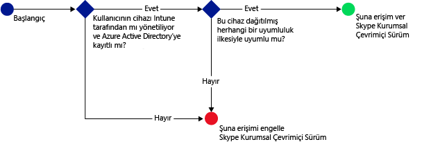
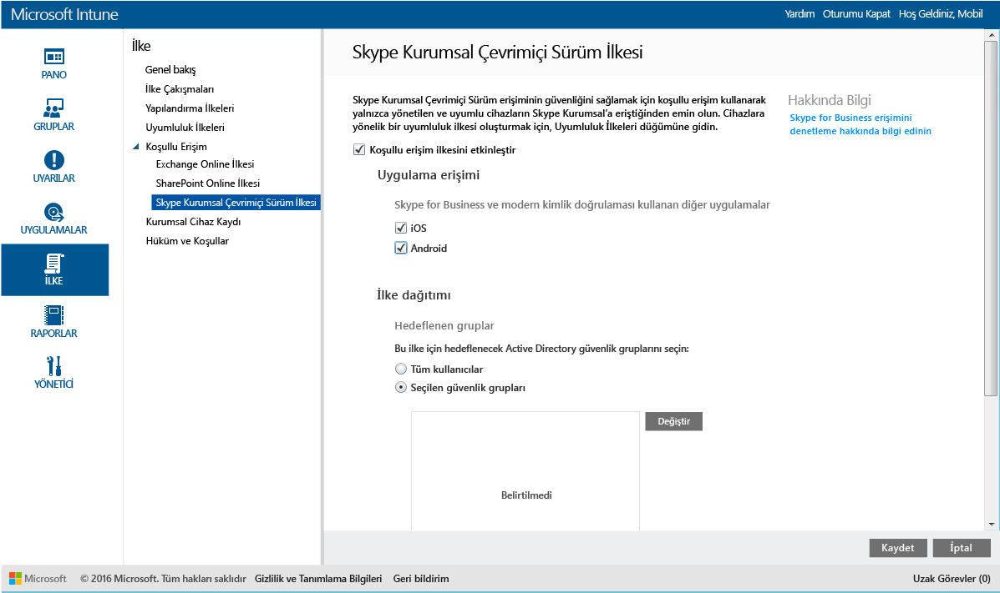

# Microsoft Intune ile Skype Kurumsal Çevrimiçi Sürüm’e erişimi koruma

[!INCLUDE[classic-portal](../includes/classic-portal.md)]

Skype Kurumsal Çevrimiçi Sürüm’e erişimi denetlemek için **Skype Kurumsal Çevrimiçi Sürüm** için bir koşullu erişim ilkesi kullanabilirsiniz.
Koşullu erişim iki bileşenden oluşur:
- Cihazın uyumlu kabul edilmesi için uyması gereken cihaz uyumluluk ilkesi.
- Hizmete erişebilmeniz için cihazın uyması gereken koşulları sizin belirlediğiniz bir koşullu erişim ilkesi.
Koşullu erişimin nasıl çalıştığı hakkında daha fazla bilgi edinmek için [E-posta ve O365 hizmetlerine erişimi koruma](restrict-access-to-email-and-o365-services-with-microsoft-intune.md) makalesini okuyun.

Hedeflenen bir kullanıcı kendi cihazında Skype Kurumsal Çevrimiçi’ni kullanmayı denerse, aşağıdaki değerlendirme yapılır:

Skype Kurumsal Çevrimiçi için koşullu erişim ilkesini yapılandırmadan **önce**:
- **Skype Kurumsal Çevrimiçi Sürüm aboneliğiniz** olmalı ve kullanıcılara Skype Kurumsal Çevrimiçi Sürüm lisansı atamalısınız.
- Bir **Enterprise Mobility + Security (EMS) aboneliğiniz** veya bir **Azure Active Directory (Azure AD) Premium aboneliğiniz** olmalıdır ve kullanıcılar EMS veya Azure AD lisansına sahip olmalıdır. Daha fazla ayrıntı için bkz. [Enterprise Mobility fiyatlandırma](https://www.microsoft.com/en-us/cloud-platform/enterprise-mobility-pricing) veya [Azure Active Directory fiyatlandırma](https://azure.microsoft.com/en-us/pricing/details/active-directory/).

-   Skype Kurumsal Çevrimiçi Sürüm için [modern kimlik doğrulamasını etkinleştirin](https://docs.microsoft.com/en-us/intune/deploy-use/restrict-access-to-skype-for-business-online-with-microsoft-intune).
-  Tüm kullanıcılarınızın **Skype Kurumsal Çevrimiçi Sürüm** kullanmasını sağlayın. Hem Skype Kurumsal Çevrimiçi Sürüm hem de Skype Kurumsal şirket içi kullanılan bir dağıtımınız varsa, kullanıcılara koşullu erişim ilkesi uygulanmaz.

Skype Kurumsal Çevrimiçi’ne erişmesi gereken cihaz:

-   **Android** veya **iOS** cihazı olmalıdır.

-   [!INCLUDE[wit_nextref](../includes/wit_nextref_md.md)] hizmetine **kayıtlı** olmalıdır.

-   Dağıtılan tüm [!INCLUDE[wit_nextref](../includes/wit_nextref_md.md)] uyumluluk ilkelerine **uymalıdır**.

Cihaz durumu, Azure Active Directory'de depolanır; bu durumda belirttiğiniz koşullara göre erişim izni verilir veya erişim engellenir.

Bir koşul karşılanmazsa, oturum açtığında kullanıcıya şu iletilerden biri sunulur:

-   Cihaz [!INCLUDE[wit_nextref](../includes/wit_nextref_md.md)]’a kaydedilmediyse veya Azure Active Directory'ye kayıtlı değilse, Şirket Portalı uygulamasının nasıl yükleneceğine ve nasıl kayıt yapılacağına ilişkin yönergeleri içeren bir ileti görüntülenir.

-   Cihaz uyumlu değilse, kullanıcıyı sorunla ve sorunun nasıl çözüleceğiyle ilgili bilgileri bulabileceği [!INCLUDE[wit_nextref](../includes/wit_nextref_md.md)] Şirket Portalı web sitesine veya Şirket Portalı uygulamasına yönlendiren bir ileti görüntülenir.

## Skype Kurumsal Çevrimiçi için koşullu erişimi yapılandırma

### 1. Adım: Azure Active Directory güvenlik gruplarını yapılandırma
Başlamadan önce koşullu erişim ilkesi için Azure Active Directory güvenlik gruplarını yapılandırın. Bu grupları **Office 365 yönetim merkezinde** yapılandırabilirsiniz. Bu gruplar, ilkede kullanıcıları hedeflemek veya muaf tutmak için kullanılır. Bir kullanıcı ilke tarafından hedeflendiğinde, kaynaklara erişmek için kullandıkları her bir cihaz uyumlu olmalıdır.

Skype Kurumsal ilkesinde kullanmak üzere iki grup türü belirtebilirsiniz:

-   **Hedeflenen gruplar**: İlkenin uygulanacağı kullanıcı gruplarını içerir.

-   **Muaf tutulan gruplar**: İlkeden muaf tutulan kullanıcı gruplarını içerir.

Bir kullanıcı her iki gruptaysa ilkeden muaf tutulur.

### 2. Adım: Uyumluluk ilkesi yapılandırma ve dağıtma
Bir uyumluluk ilkesi [oluşturun](create-a-device-compliance-policy-in-microsoft-intune.md) ve ilkeden etkilenecek olan tüm cihazlara [dağıtın](deploy-and-monitor-a-device-compliance-policy-in-microsoft-intune.md). Bunlar, **Hedeflenen gruplardaki** kullanıcılar tarafından kullanılan tüm cihazlar olacaktır.

> [!NOTE]
> Uyumluluk ilkeleri [!INCLUDE[wit_nextref](../includes/wit_nextref_md.md)] gruplarına dağıtılırken, koşullu erişim ilkeleri Azure Active Directory güvenlik gruplarına dağıtılır.

> [!IMPORTANT]
> Uyumluluk İlkesi dağıtmadıysanız, cihazlar uyumlu olarak kabul edilir.

Hazır olduğunuzda **3. Adım**’a geçin.

### 3. Adım: Skype Kurumsal Çevrimiçi ilkesini yapılandırma
İlkeyi yalnızca yönetilen ve uyumlu cihazların Skype Kurumsal Çevrimiçi’ne erişebileceği şekilde yapılandırın. Bu ilke Azure Active Directory’de depolanır.

1.  [Microsoft Intune yönetim konsolunda](https://manage.microsoft.com) **İlke** > **Koşullu Erişim** > **Skype Kurumsal Çevrimiçi Sürüm**’e tıklayın.

  

2.  **Koşullu erişimi etkinleştir ilkesini** seçin.

3.  **Uygulama erişimi** altında aşağıdakilere koşullu erişim ilkesini uygulamayı seçebilirsiniz:

    -   **iOS**

    -   **Android**

4.  **Hedeflenen Gruplar**altında, ilkenin geçerli olacağı Azure Active Directory güvenlik gruplarını seçmek için **Değiştir**’i seçin. Bunu tüm kullanıcılara veya yalnızca seçilmiş bir kullanıcı grubuna hedefleyebilirsiniz.

5.  **Muaf Tutulan Gruplar** altında, bu ilkeden muaf tutulan Active Directory güvenlik gruplarını seçmek için isteğe bağlı olarak **Değiştir**’i seçin.

6.  İşiniz bittiğinde **Kaydet**’i seçin.

Artık Skype Kurumsal Çevrimiçi için koşullu erişimi yapılandırdınız. Koşullu erişim ilkesini dağıtmanız gerekmez, hemen geçerli olur.

## Uyumluluk ve koşullu erişim ilkeleri izleme
**Gruplar** çalışma alanında, cihazlarınızın koşullu erişim durumunu görüntüleyebilirsiniz.

Herhangi bir mobil cihaz grubu seçin. Ardından, **Cihazlar** sekmesinde aşağıdaki **Filtreler** arasından birini seçin:

* **AAD ile kaydedilmeyen cihazlar**: Bu cihazların Skype Kurumsal Çevrimiçi Sürüm’e erişimi engellenir.

* **Uyumlu olmayan cihazlar**: Bu cihazların Skype Kurumsal Çevrimiçi Sürüm’e erişimi engellenir.

* **AAD ile kaydedilen ve uyumlu olan cihazlar**: Bu cihazlar Skype Kurumsal Çevrimiçi Sürüm’e erişebilir.

<!--HONumber=Jan17_HO4-->

