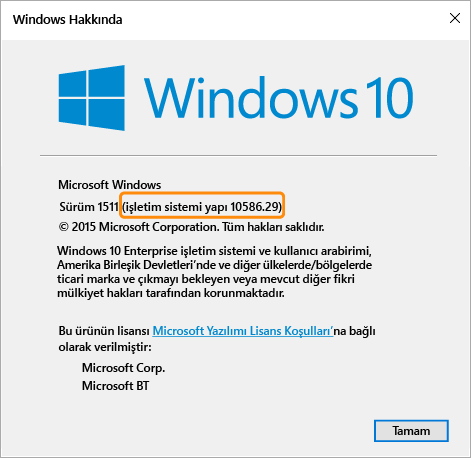

# Microsoft Intune’da Windows cihazları için uyumluluk ilkesi ayarları

Bu konu başlığı altında açıklanan ilke ayarları, Windows işletim sistemini çalıştıran cihazlar için geçerlidir. Aşağıdaki bölümlerde desteklenen Windows sürümleri açıklanmıştır.

Diğer platformlar hakkında bilgi arıyorsanız, aşağıdakilerden birini seçin:
> [!div class="op_single_selector"]
- [iOS cihazları için uyumluluk ilkesi ayarları](ios-compliance-policy-settings-in-microsoft-intune.md)
- [Android cihazları için uyumluluk ilkesi ayarları](android-compliance-policy-settings-in-microsoft-intune.md)
- [Android for Work için uyumluluk ilkesi ayarları](afw-compliance-policy-settings-in-microsoft-intune.md)

## Windows Phone cihazları için uyumluluk ilkesi ayarları
Bu bölümde listelenen ayarlar Windows Phone 8.1 ve üstünde desteklenir.

### Sistem güvenliği ayarları
#### Parola
- **Mobil cihazların kilidini açmak için parola gerektir:** Kullanıcıların cihazlarına erişebilmek üzere bir parola girmelerini gerektirmek için bunu **Evet** olarak ayarlayın.

- **Basit parolalara izin ver:** Kullanıcıların **1234** veya **1111** gibi basit parolalar oluşturmalarına izin vermek için bunu **Evet** olarak ayarlayın.

-  **En düşük parola uzunluğu:** Kullanıcı parolasının içermesi gereken en düşük rakam veya karakter sayısını belirtin.
- **Gerekli parola türü:** Kullanıcıların oluşturacağı parolanın **Alfasayısal** mı, yoksa **Sayısal** mı olacağını belirtin.

  Windows çalıştıran ve Microsoft Hesabı ile erişilen cihazlarda, minimum parola uzunluğu sekiz karakterden fazlaysa veya minimum karakter kümesi sayısı ikiden büyükse, uyumluluk ilkesi düzgün değerlendirme yapamaz.

- **Karakter kümesi sayısı alt sınırı:** **Gerekli parola türü** **Alfasayısal** olarak ayarlandıysa, bu ayar parolanın sahip olması gereken karakter kümesi sayısı alt sınırını belirtir. Dört karakter kümesi şunlardır:
  -   Küçük harfler
  -   Büyük harfler
  -   Simgeler
  -   Sayılar

  Bu ayar için daha yüksek bir sayı belirlenirse kullanıcının daha karmaşık bir parola oluşturması gerekir. Windows çalıştıran ve Microsoft Hesabı ile erişilen cihazlarda, minimum parola uzunluğu sekiz karakterden fazlaysa veya minimum karakter kümesi sayısı ikiden büyükse, uyumluluk ilkesi düzgün değerlendirme yapamaz.

- **Parola istenmeden önce geçen işlem yapılmayan dakika sayısı:** Bu ayar, kullanıcı parolasını yeniden girmeden önce boşta geçen süreyi belirtir.

- **Parola kullanım süresi (gün):** Kullanıcı parolasının süresi dolup yeni bir parola oluşturulması gerekmeden önce geçmesi gereken gün sayısını seçin.

- **Parola geçmişini anımsa:** Kullanıcının önceden kullanılan parolaları oluşturmasını engellemek için bu ayarı **Önceki parolaların yeniden kullanılmasını önle** ile birlikte kullanın.

- **Önceki parolaların yeniden kullanılmasını önle:** **Parola geçmişini anımsa** seçeneği belirlenirse, önceden kullanılmış ve yeniden kullanılamayacak olan parola sayısını belirtin.
- **Cihaz boşta durumundan çıkarken parola iste:** Bu ayarı, **Parola istenmeden önce herhangi bir işlem yapılmadan geçecek dakika cinsinden süre** ayarıyla birlikte kullanın. **Parola istenmeden önce herhangi bir işlem yapılmadan geçecek dakika cinsinden süre** ayarında belirtilen süre boyunca etkin olmayan bir cihaza erişmek için kullanıcıdan bir parola girmesi istenir.

  > [!NOTE]
  > Bu ayar yalnızca Windows 10 Mobile cihazları için geçerlidir.

#### Şifreleme
- **Mobil cihazda şifreleme gerektir:** Cihazın kaynaklara bağlanmak için şifrelenmesini gerektirmek için bunu **Evet** olarak ayarlayın.

### Cihaz durumu ayarları
- **Cihazların sağlam olarak bildirilmesini gerektir:** **Windows 10 Mobile** cihazlarının yeni veya var olan uyumluluk ilkelerinde sağlıklı olarak bildirilmesini gerektiren bir kural ayarlayabilirsiniz.  Bu ayar etkinse, Windows 10 cihazları şu veri noktaları için Durum Kanıtlama Hizmeti (HAS) aracılığıyla değerlendirilir:
  -  **BitLocker etkin:** BitLocker açık olduğunda, sistemin kapalı olduğu veya hazırda beklemeye girdiği durumlarda cihaz sürücüye depolanmış verileri yetkisiz erişimden koruyabilir. Windows BitLocker Sürücü Şifrelemesi, Windows işletim sistemi birimine depolanan tüm verileri şifreler. BitLocker, Windows işletim sistemini ve kullanıcı verilerini korumaya yardımcı olmak için TPM'yi kullanır. BitLocker ayrıca boşta bırakılan, kaybolan veya çalınan bilgisayarlara müdahale edilmemesine yardımcı olur. Bilgisayarda uyumlu bir TPM varsa, BitLocker verileri korumaya yardımcı olan şifreleme anahtarlarını kilitlemek için TPM kullanır. Sonuç olarak, TPM bilgisayarın durumunu doğrulayana kadar anahtarlara erişilemez.
  -  **Kod bütünlüğü etkin:** Kod bütünlüğü bir sürücünün veya sistem dosyasının belleğe yüklendiği her durumda bütünlüğünü doğrulayan bir özelliktir. Kod bütünlüğü, imzalanmamış bir sürücünün veya sistem dosyasının çekirdeğe yüklenip yüklenmediğini tespit eder. Aynı zamanda yönetici ayrıcalıklarına sahip bir kullanıcı hesabı tarafından çalıştırılan sistem dosyalarının kötü amaçlı yazılım tarafından değiştirilip değiştirilmediğini belirler.
  - **Güvenli Önyükleme etkin:** Güvenli Önyükleme etkinleştirildiğinde sistem güvenilen fabrika durumuna önyüklenmeye zorlanır. Ayrıca, Güvenli Önyükleme etkinleştirildiğinde makineyi önyüklemek için kullanılan çekirdek bileşenleri cihazı üreten kuruluş tarafından güvenilen doğru şifreleme imzalarına sahip olmalıdır. UEFI üretici yazılımı makinenin başlatılmasına izin vermeden önce bunu doğrular. Herhangi dosya ile imzalarını bozacak şekilde oynanmışsa sistem önyüklemesi gerçekleşmez.

  HAS hizmetinin nasıl çalıştığı hakkında daha fazla bilgi için bkz. [Durum Kanıtlama CSP](https://msdn.microsoft.com/library/dn934876.aspx).
###  Cihaz özelliği ayarları
- **Gerekli en düşük işletim sistemi:** Cihaz en düşük işletim sistemi sürümü gereksinimini karşılamadığında uyumlu değil olarak bildirilir.
    Yükseltme hakkında bilgi içeren bir bağlantı görüntülenir. Kullanıcı, cihazını yükselttikten sonra şirket kaynaklarına erişebilir.

- **İzin verilen en yüksek işletim sistemi sürümü:** Cihaz kuralda belirtilenden sonraki bir işletim sistemi sürümünü kullandığında, şirket kaynaklarına erişim engellenir ve kullanıcıdan BT yöneticisine başvurması istenir. Kuralda işletim sistemine izin veren bir değişiklik oluncaya kadar bu cihaz şirket kaynaklarına erişmek için kullanılamaz.

## Windows bilgisayarları için uyumluluk ilkesi ayarları
Bu bölümde listelenen ayarlar Windows bilgisayarlarında desteklenir.
### Sistem güvenliği ayarları
#### Parola
- **Minimum parola uzunluğu:** Windows 8.1'de desteklenir.

  Kullanıcı parolasının sahip olması gereken minimum rakam veya karakter sayısını belirtin.

  Microsoft hesabı ile güvenliği sağlanan cihazlar için, **Minimum parola uzunluğu** sekiz karakterden fazlaysa veya **Minimum karakter kümesi sayısı** iki karakterden büyükse, uyumluluk ilkesi düzgün değerlendirme yapamaz.

- **Gerekli parola türü:** Windows RT, Windows RT 8.1 ve Windows 8.1'de desteklenir.

  Kullanıcıların oluşturacağı parolanın **Alfasayısal** mı, yoksa **Sayısal** mı olacağını belirtin.

- **Minimum karakter kümesi sayısı:** Windows RT, Windows RT 8.1 ve Windows 8.1'de desteklenir.

  **Gerekli parola türü** **Alfasayısal** olarak ayarlanırsa bu ayar parolanın sahip olması gereken en az karakter kümesi sayısını belirtir. Dört karakter kümesi şunlardır:
  -   Küçük harfler
  -   Büyük harfler
  -   Simgeler
  -   Sayılar     

  Bu ayar için daha yüksek bir sayı belirlenirse kullanıcının daha karmaşık bir parola oluşturması gerekir. Microsoft hesabı ile güvenliği sağlanan cihazlar için, **Minimum parola uzunluğu** sekiz karakterden fazlaysa veya **Minimum karakter kümesi sayısı** iki karakterden büyükse, uyumluluk ilkesi düzgün değerlendirme yapamaz.

- **Parola istenmeden önceki bekleme süresi (dakika olarak):** Windows RT, Windows RT 8.1 ve Windows 8.1'de desteklenir.

  Kullanıcı parolasını yeniden girmeden önce boşta geçen süreyi belirtin.

- **Parola kullanım süresi (gün):** Windows RT, Windows RT 8.1 ve Windows 8.1'de desteklenir.

  Kullanıcının parolasının süresi dolup yeni bir parola oluşturmaları gerekmeden önce geçmesi gereken gün sayısını seçin.

- **Parola geçmişini anımsa:** Windows RT, Windows RT 8.1 ve Windows 8.1'de desteklenir.

  Kullanıcının önceden kullanılan parolaları oluşturmasını sınırlamak için bu ayarı **Önceki parolaların yeniden kullanılmasını engelle** ile birlikte kullanın.

- **Önceki parolaların yeniden kullanılmasını engelle:** Windows RT, Windows RT 8.1 ve Windows 8.1'de desteklenir.

  **Parola geçmişini anımsa** ayarı seçilirse, önceden kullanılmış ve yeniden kullanılamayacak olan parola sayısını belirtin.

### Cihaz durumu ayarları
- **Cihazların sağlam olarak bildirilmesini gerektir:** Windows 10 cihazlarında desteklenir.
Windows 10 cihazlarının yeni veya var olan uyumluluk ilkelerinde sağlıklı olarak bildirilmesini gerektiren bir kural ayarlayabilirsiniz. Bu ayar etkinse, Windows 10 cihazları şu veri noktaları için Durum Kanıtlama Hizmeti (HAS) aracılığıyla değerlendirilir:
  -  **BitLocker etkin:** BitLocker açık olduğunda, sistemin kapalı olduğu veya hazırda beklemeye girdiği durumlarda cihaz sürücüye depolanmış verileri yetkisiz erişimden koruyabilir. Windows BitLocker Sürücü Şifrelemesi, Windows işletim sistemi birimine depolanan tüm verileri şifreler. BitLocker, Windows işletim sistemini ve kullanıcı verilerini korumaya yardımcı olmak için TPM'yi kullanır. BitLocker ayrıca boşta bırakılan, kaybolan veya çalınan bilgisayarlara müdahale edilmemesine yardımcı olur. Bilgisayarda uyumlu bir TPM varsa, BitLocker verileri korumaya yardımcı olan şifreleme anahtarlarını kilitlemek için TPM kullanır. Sonuç olarak, TPM bilgisayarın durumunu doğrulayana kadar anahtarlara erişilemez.
  -  **Kod bütünlüğü etkin:** Kod bütünlüğü bir sürücünün veya sistem dosyasının belleğe yüklendiği her durumda bütünlüğünü doğrulayan bir özelliktir. Kod bütünlüğü, imzalanmamış bir sürücünün veya sistem dosyasının çekirdeğe yüklenip yüklenmediğini tespit eder. Aynı zamanda yönetici ayrıcalıklarına sahip bir kullanıcı hesabı tarafından çalıştırılan sistem dosyalarının kötü amaçlı yazılım tarafından değiştirilip değiştirilmediğini belirler.
  - **Güvenli Önyükleme etkin:** Güvenli Önyükleme etkinleştirildiğinde sistem güvenilen fabrika durumuna önyüklenmeye zorlanır. Ayrıca, Güvenli Önyükleme etkinleştirildiğinde makineyi önyüklemek için kullanılan çekirdek bileşenleri cihazı üreten kuruluş tarafından güvenilen doğru şifreleme imzalarına sahip olmalıdır. UEFI üretici yazılımı makinenin başlatılmasına izin vermeden önce bunu doğrular. Herhangi dosya ile imzalarını bozacak şekilde oynanmışsa sistem önyüklemesi gerçekleşmez.
  - **Erken başlatılan kötü amaçlı yazılımdan koruma etkin:** Erken başlatılan kötü amaçlı yazılımdan koruma (ELAM), ağınızdaki bilgisayarlar başlatıldığında ve üçüncü taraf sürücüler başlatılmadan önce koruma sağlar.

  HAS hizmetinin nasıl çalıştığı hakkında daha fazla bilgi için bkz. [Durum Kanıtlama CSP](https://msdn.microsoft.com/library/dn934876.aspx).

### Cihaz özelliği ayarları
- **Gereken en düşük işletim sistemi:** Windows 8.1 ve Windows 10'da desteklenir.

  Burada birincilsürüm.ikincilsürüm.yapı numarasını belirtin. Sürüm numarası, **winver** komutu tarafından döndürülen sürüme karşılık gelmelidir.

  Cihazdaki işletim sistemi belirtilen sürümden önceki bir sürümdeyse, cihazın uyumsuz olduğu bildirilir. Yükseltme hakkında bilgi içeren bir bağlantı görüntülenir. Kullanıcı, cihazını yükselttikten sonra şirket kaynaklarına erişebilir.

- **İzin verilen en yüksek işletim sistemi sürümü:** Windows 8.1 ve Windows 10'da desteklenir.

  Bir cihaz kuralda belirtilenden sonraki bir işletim sistemi sürümünü kullandığında, şirket kaynaklarına erişimi engellenir ve kullanıcıdan BT yöneticisi ile iletişim kurması istenir. Kuralda işletim sistemine izin veren bir değişiklik oluncaya kadar bu cihaz şirket kaynaklarına erişmek için kullanılamaz.

**Gereken en düşük işletim sistemi sürümü** ve **İzin verilen en yüksek işletim sistemi sürümü** ayarlarında kullanılacak işletim sistemi sürümünü bulmak için, komut isteminde **winver** komutunu çalıştırın. Bu **winver** komutu, işletim sisteminin bildirilen sürümünü döndürür.

- Windows 8.1 bilgisayarları **6.3** sürümünü döndürür. Windows için işletim sistemi sürüm kuralı Windows 8.1’e ayarlanırsa, cihaz Windows 8.1’e sahip olsa bile uyumsuz olarak bildirilir.

- Windows 10 çalıştıran bilgisayarlarda, sürüm **10.0** artı **winver** komutuyla döndürülen OS Yapı numarasına ayarlanmalıdır. Örneğin, 10.0.10586 gibi bir numara olabilir.
> 

<!--HONumber=Dec16_HO2-->

