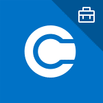

# Microsoft Intune Uygulama SDK’sını kullanmaya başlayın

Bu kılavuz, mobil uygulamanızı Microsoft Intune ile uygulama koruma ilkeleri için hızlıca etkinleştirmenize yardımcı olur. İlk olarak [Intune Uygulama SDK’sına genel bakış](intune-app-sdk.md) bölümünde açıklanan Intune Uygulama SDK’sı avantajlarını öğrenmeniz yararlı olabilir.

Intune Uygulama SDK'sı, iOS ve Android’de benzer senaryoları destekler ve BT yöneticilerine platformlar genelinde tutarlı bir deneyim sağlamak amacıyla tasarlanmıştır. Ancak, platform sınırlamaları nedeniyle bazı özelliklerin desteklenmesinde küçük farklılıklar vardır.

## Mağaza uygulamanızı Microsoft’a kaydetme

### Uygulamanız kuruluşunuz içinde kullanılıyorsa ve herkese açık olmayacaksa:

Uygulamanızı kaydetmeniz *gerekmez*. BT yöneticisi, uygulamayı dahili iş kolu uygulamaları için içeriden dağıtır. Intune, uygulamanın SDK ile oluşturulduğunu algılar ve BT yöneticisinin buna uygulama koruma ilkesi uygulamasına izin verir. [iOS veya Android uygulamanızı uygulama koruma ilkesi için etkinleştirme](#enable-your-iOS-or-Android-app-for-app-protection-policy) bölümüne geçebilirsiniz.

### Uygulamanız Apple App Store veya Google Play gibi bir genel uygulama mağazasında yayınlanacaksa:

Öncelikle uygulamanızı Microsoft Intune’a kaydetmeniz ve kayıt koşullarını kabul etmeniz _**gerekir**_. Bundan sonra BT yöneticileri, uygulama koruma ilkesini bir Intune uygulama iş ortağı olarak listelenen uygulamaya uygulayabilir.

Kayıt tamamlanıp Microsoft Intune ekibi tarafından onaylanana kadar, Intune yöneticilerinin uygulamanızın ayrıntılı bağlantısına uygulama koruma ilkesi uygulama seçeneği olmaz. Microsoft ayrıca uygulamanızı kendi [Microsoft Intune İş Ortakları sayfasına](https://www.microsoft.com/en-us/cloud-platform/microsoft-intune-apps) ekler. Sayfada Intune uygulama koruma ilkelerini desteklediğini göstermek üzere uygulamanın simgesi görüntülenir.

Kayıt işlemine başlamak için [Microsoft Intune İş Ortağı Anketi](https://forms.office.com/Pages/ResponsePage.aspx?id=v4j5cvGGr0GRqy180BHbR6oOVGFZ3pxJmwSN1N_eXwJUQUc5Mkw2UVU0VzI5WkhQOEYyMENWNDBWRS4u)’ni doldurun.

Size ulaşmak ve kayıt işlemine devam etmek için anket yanıtlarınızda listelenen e-posta adresini (veya adreslerini) kullanacağız. Ayrıca, herhangi bir sorumuz olursa sizinle iletişim kurmak için kayıt e-posta adresinizi kullanırız.

> [!NOTE]
> Ankette ve Microsoft Intune ekibi ile yapılan e-posta yazışmaları aracılığıyla toplanan tüm bilgiler için [Microsoft Gizlilik Bildirimi](https://www.microsoft.com/en-us/privacystatement/default.aspx) geçerli olacaktır.

**Kayıt işleminde beklenmesi gerekenler**:

1. Siz anketi gönderdikten sonra, talebin başarıyla alındığını onaylamak veya kaydı tamamlamak amacıyla ek bilgi istemek için kayıt e-posta adresiniz üzerinden sizinle iletişim kurarız.

2. Gerekli tüm bilgileri sizden aldıktan sonra, imzalamanız için Microsoft Intune Uygulama İş Ortağı Sözleşmesi’ni size göndeririz. Bu sözleşmede, şirketinizin bir Microsoft Intune uygulama iş ortağı olmadan önce kabul etmesi gereken koşullar açıklanır.

3. Uygulamanız Microsoft Intune hizmetine başarıyla kaydedildiğinde ve [Microsoft Intune iş ortakları](https://www.microsoft.com/en-us/cloud-platform/microsoft-intune-apps) sitesinde gösterildiğinde size bildirilir.

4. Son olarak, uygulamanızın ayrıntılı bağlantısı bir sonraki aylık Intune Hizmeti güncelleştirmesine eklenir. Örneğin kayıt bilgileri Temmuz'da tamamlanmışsa ayrıntılı bağlantı Ağustos ayının ortalarında desteklenecektir.

Uygulamanızın ayrıntılı bağlantısı gelecekte değişirse, uygulamanızı yeniden kaydetmeniz gerekir.

> [!NOTE]
> Uygulamanızı Intune Uygulama SDK'sının yeni bir sürümüyle güncelleştirirseniz bunu lütfen bize bildirin.

## SDK dosyalarını indirme

Yerel iOS ve Android için Intune Uygulama SDK'ları bir Microsoft GitHub hesabında barındırılır. Bu genel depolar sırasıyla yerel iOS ve Android için SDK dosyalarını içerir:

* [iOS için Intune Uygulama SDK'sı](https://github.com/msintuneappsdk/ms-intune-app-sdk-ios)
* [Android için Intune Uygulama SDK'sı](https://github.com/msintuneappsdk/ms-intune-app-sdk-android)

Uygulamanız bir Xamarin veya Cordova uygulaması ise lütfen şu SDK çeşitlerini kullanın:

* [Intune Uygulama SDK’sı Xamarin Bileşeni](https://github.com/msintuneappsdk/intune-app-sdk-xamarin)
* [Intune Uygulama SDK’sı Cordova Eklentisi](https://github.com/msintuneappsdk/cordova-plugin-ms-intune-mam)

Depolarımızdan çatallama ve çekme işlemleri yaparken kullanabileceğiniz bir GitHub hesabı oluşturmanız iyi olabilir. GitHub, geliştiricilerin ürün ekibimizle iletişim kurmasına, soru sorup hızlı yanıtlar almasına, sürüm notlarını görüntülemesine ve Microsoft'a geri bildirim sağlamasına olanak tanır. Intune Uygulama SDK’sı Github'ındaki sorular için şuraya başvurun: msintuneappsdk@microsoft.com.

## iOS veya Android uygulamanızı uygulama koruma ilkesi için etkinleştirme

Intune Uygulama SDK'sı ile uygulamanızı tümleştirmenize yardımcı olması için aşağıdaki geliştirici kılavuzlarından biri gerekir:

* **[iOS için Intune Uygulama SDK’sı Geliştirici Kılavuzu](intune-app-sdk-ios.md)**: Bu belgede, yerel iOS uygulamanızı Intune Uygulama SDK’sı ile etkinleştirme işleminde size adım adım yol gösterilir.

* **[Android için Intune Uygulama SDK’sı Geliştirici Kılavuzu](intune-app-sdk-android.md)**: Bu belgede, yerel Android uygulamanızı Intune Uygulama SDK’sı ile etkinleştirme işleminde size adım adım yol gösterilir.

* **[Intune Uygulama SDK’sı Cordova Eklentisi kılavuzu](intune-app-sdk-cordova.md)**: Bu belge, Intune uygulama koruma ilkeleri için Cordova kullanarak iOS ve Android uygulamaları oluşturmanıza yardımcı olur.

* **[Intune Uygulama SDK’sı Xamarin Bileşeni kılavuzu](intune-app-sdk-xamarin.md)**: Bu belge, Intune uygulama koruma ilkeleri için Cordova kullanarak iOS ve Android uygulamaları oluşturmanıza yardımcı olur.

## Uygulamanızda Telemetriyi yapılandırma

Microsoft Intune, uygulamanızdaki kullanım istatistikleri hakkında veri toplar.

* **iOS için Intune Uygulama SDK’sı**: SDK, kullanım etkinliklerine ilişkin SDK telemetri verilerini varsayılan olarak günlüğe kaydeder. Bu veriler Microsoft Intune’a gönderilir.

    * Uygulamanızdan Microsoft Intune’a SDK telemetri verileri göndermek istemiyorsanız IntuneMAMSettings sözlüğündeki `MAMTelemetryDisabled` özelliğini “EVET” olarak ayarlayarak telemetri iletimini devre dışı bırakmanız gerekir.

* **Android için Intune Uygulama SDK’sı**: Telemetri verileri SDK aracılığıyla günlüğe kaydedilmez.

## Tümleştirmeden sonraki adımlar

### Uygulamanızı test etme
iOS veya Android uygulamanızı Intune Uygulama SDK’sıyla tümleştirmek için gerekli adımları bitirdikten sonra, kullanıcı ile BT yöneticisi için tüm uygulama koruma ilkelerinin etkinleştirildiğinden ve çalıştığından emin olmanız gerekir. Tümleşik uygulamanızı sınamak için aşağıdakiler gerekir:

* **Microsoft Intune sınama hesabı**: Intune özelliğinin tanıtıldığı uygulamanızı Intune uygulama koruma özelliklerine karşı sınamak için bir Microsoft Intune hesabınız olması gerekir.

    * iOS veya Android mağazası uygulamalarınızı Intune uygulama koruma ilkesi için etkinleştiren bir ISV iseniz Microsoft Intune kaydını, kayıt adımında belirtilen şekilde bitirdikten sonra bir promosyon kodu alırsınız. Promosyon kodu, bir yıllık uzatılmış kullanım sağlayan Microsoft Intune denemesine kaydolmanıza olanak tanır.

    * Mağazaya gönderilmeyecek bir iş kolu uygulaması geliştiriyorsanız kuruluşunuz aracılığıyla Microsoft Intune’a erişiminizin olması beklenir. [Microsoft Intune](https://portal.office.com/Signup/Signup.aspx?OfferId=40BE278A-DFD1-470a-9EF7-9F2596EA7FF9&dl=INTUNE_A&ali=1#0) ile bir aylık ücretsiz deneme için de kaydolabilirsiniz.

* **Intune uygulama koruma ilkeleri**: Uygulamanızı tüm Intune uygulama koruma ilkelerine karşı sınamak amacıyla her ilke ayarı için beklenen davranışı bilmeniz gerekir. Açıklamalar için bkz. [iOS uygulama koruma ilkeleri](../deploy-use/ios-mam-policy-settings.md) ve [Android uygulama koruma ilkeleri](../deploy-use/android-mam-policy-settings.md).

* **Sorun giderme**: Uygulamanızın kullanıcı deneyimini el ile sınarken herhangi bir sorunla karşılaşırsanız bkz. [MAM Sorun Giderme](../troubleshoot/troubleshoot-mam.md). Bu makalede Intune özelliğinin tanıtıldığı uygulamalarda yaşanabilen yaygın sorunlar, iletişim kutuları ve hata iletileri için yardım sağlanır. 

### Uygulamanıza rozet ekleyin (isteğe bağlı)

Intune uygulama koruma ilkelerinin uygulamanızda çalıştığını doğruladıktan sonra, uygulamanızın simgesine Intune uygulama koruma logosu ile rozet ekleyebilirsiniz.

Bu rozet BT yöneticilerine, son kullanıcılara ve potansiyel Intune müşterilerine uygulamanızın Intune uygulama koruma ilkeleriyle çalıştığını gösterir. Uygulamanızın Intune müşterileri tarafından kullanılmasını ve benimsenmesini teşvik eder.

Rozet bir evrak çantası simgesidir ve aşağıdaki örneklerde görülebilir:

 

**Uygulamanıza rozet eklemek için gerekenler**:

* **.eps** dosyalarını okuyabilen bir görüntü işleme uygulaması veya **.ai** dosyalarını okuyabilen bir Adobe uygulaması.

* Microsoft Intune GitHub’da [Intune uygulama rozet varlıkları ve yönergelerini](https://github.com/msintuneappsdk/intune-app-partner-badge) bulabilirsiniz.

<!--HONumber=Dec16_HO5-->

