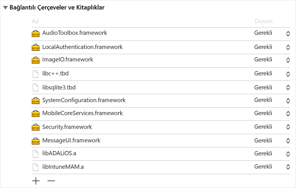
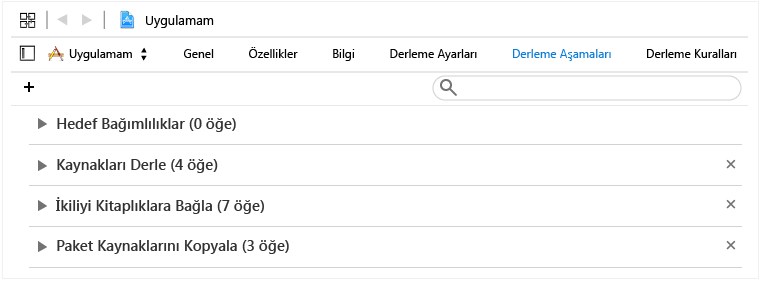
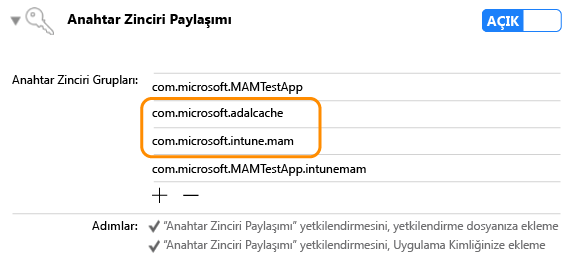

# <a name="microsoft-intune-app-sdk-for-ios-developer-guide"></a>iOS için Microsoft Intune Uygulama SDK’sı geliştirici kılavuzu

> [!NOTE]
> Öncelikle, desteklenen platformlarda tümleştirme için hazırlığın nasıl yapıldığını açıklayan [Intune Uygulama SDK’sı Kılavuzunu Kullanmaya Başlama](intune-app-sdk-get-started.md) makalesini okumanız önerilir.

iOS için Microsoft Intune Uygulama SDK’sı, Intune uygulama koruma ilkelerini mobil uygulama yönetimi (MAM) biçiminde iOS uygulamanıza eklemenizi sağlar. MAM özellikli uygulamalar Intune Uygulama SDK’sı ile tümleşiktir. Böylece, Intune uygulamayı etkin bir şekilde yönetirken BT yöneticilerinin mobil uygulamanıza ilke dağıtması mümkün olur.

## <a name="prerequisites"></a>Önkoşullar

* Xcode araç takımının sürüm 5 veya üzeri yüklü olan ve OS X 10.8.5 ya da üzerini çalıştıran bir Mac OS bilgisayara ihtiyaç duyacaksınız.

* [iOS için Intune Uygulama SDK'sı Lisans Koşulları](https://github.com/msintuneappsdk/ms-intune-app-sdk-ios/blob/master/Microsoft%20License%20Terms%20Intune%20App%20SDK%20for%20iOS%20.pdf)'nı gözden geçirmelisiniz. Kendi kayıtlarınız için lisans koşullarının bir kopyasını yazdırmalı ve saklamalısınız. iOS için Intune Uygulama SDK'sını indirip kullandığınızda bu lisans koşullarını kabul etmiş olursunuz.  Kabul etmiyorsanız, yazılımı kullanmayın.

* iOS için Intune Uygulama SDK'sı dosyalarını [GitHub](https://github.com/msintuneappsdk/ms-intune-app-sdk-ios)’dan indirin.

## <a name="whats-in-the-sdk"></a>SDK’nın kapsamı

iOS için Intune Uygulama SDK’sı statik bir kitaplık, kaynak dosyaları, API üst bilgileri, hata ayıklama ayarları .plist dosyası ve bir yapılandırıcı aracı içerir. Mobil uygulamalar yalnızca kaynak dosyaları içerebilir ve çoğu ilke zorlaması için kitaplıklarla statik bağlantılar oluşturabilir. Gelişmiş Intune MAM özellikleri API'ler aracılığıyla zorunlu kılınır.

Bu kılavuz, iOS için Intune Uygulama SDK'sının aşağıdaki bileşenlerinin kullanımını açıklar:

* **libIntuneMAM.a**: Intune Uygulama SDK’sının statik kitaplığı. Uygulamanızda uzantılar kullanılmıyorsa, uygulamanızı Intune mobil uygulama yönetimi için etkinleştirmek üzere bu kitaplığı projenize bağlayın.

* **IntuneMAM.framework**: Intune Uygulama SDK’sı çerçevesi. Uygulamanızı Intune mobil uygulama yönetimi için etkinleştirmek üzere bu çerçeveyi projenize bağlayın. Uygulamanızda uzantılar kullanılıyorsa, projenizin birden çok statik kitaplık kopyası oluşturmasını önlemek için statik kitaplık yerine bu çerçeveyi kullanın.

* **IntuneMAMResources.bundle**: SDK’nın bağımlı olduğu kaynakları içeren bir kaynak paketi.

* **Üst bilgiler**: Intune Uygulama SDK'sı API'lerini gösterir. API kullanırsanız, API’yi içeren üst bilgi dosyasını dahil etmeniz gerekir. Aşağıdaki üst bilgi dosyaları, Intune Uygulama SDK'sının işlevselliğini etkinleştirmek için gereken API işlev çağrılarını içerir:

    * IntuneMAMAsyncResult.h
    * IntuneMAMDataProtectionInfo.h
    * IntuneMAMDataProtectionManager.h
    * IntuneMAMFileProtectionInfo.h
    * IntuneMAMFileProtectionManager.h
    * IntuneMAMPolicyDelegate.h
    * IntuneMAMLogger.h


## <a name="how-the-intune-app-sdk-works"></a>Intune Uygulama SDK’sı nasıl çalışır?

iOS için Intune Uygulama SDK'sının amacı, kodda minimum düzeyde değişiklik yaparak iOS uygulamalarına yönetim özellikleri eklemeyi sağlamaktır. Daha az kod değişikliği vardır ve pazarlama süresi daha kısadır ancak mobil uygulamanızın tutarlılığı ve kararlılığı yine de etkilenmez.

Uygulamanın statik kitaplığa bağlanması ve kaynak paketini içermesi gerekir. The MAMDebugSettings.plist dosyası isteğe bağlıdır. Bu dosya, uygulamayı Microsoft Intune aracılığıyla dağıtmanıza gerek kalmadan geçerli MAM ilkelerinin benzetimini gerçekleştirmek amacıyla pakete eklenebilir. Ayrıca hata ayıklama derlemelerinde, MAMDebugSettings.plist dosyasını iTunes dosya paylaşımı aracılığıyla uygulamanın Belgeler dizinine aktararak, dosyadaki ilkeleri uygulayabilirsiniz.

## <a name="build-the-sdk-into-your-mobile-app"></a>Mobil uygulamanızda SDK oluşturma

Intune Uygulama SDK'sını etkinleştirmek için aşağıdaki adımları izleyin:

1. **1. Seçenek**: `libIntuneMAM.a` kitaplığını bağlayın. `libIntuneMAM.a` kitaplığını proje hedefinin **Bağlantılı Çerçeveler ve Kitaplıklar** listesine sürükleyin.
    

    > [!NOTE]
    > Uygulamanızı App Store’da yayınlamayı planlıyorsanız, lütfen yayın için oluşturulan ve hata ayıklama sürümü olmayan `libIntuneMAM.a` sürümünü kullanın. Yayın sürümü, **sürüm** klasöründe olacaktır. Hata ayıklama sürümü, Intune Uygulama SDK'sı ile sorun giderme konuları için yararlı olan ayrıntılı çıktıyı içerir.

    **2. Seçenek**: `IntuneMAM.framework` öğesini projenize bağlayın. `IntuneMAM.framework` öğesini proje hedefinin **Bağlantılı Çerçeveler ve Kitaplıklar** listesine sürükleyin.

    > [!NOTE]
    > Çerçeveyi kullanırsanız, uygulamanızı App Store’a göndermeden önce evrensel çerçeveden benzetici mimarilerini elle çıkarmanız gerekir. "Uygulamanızı App Store’a gönderme" bölümüne bakın.

2. Aşağıdaki iOS çerçevelerini projeye ekleyin:
    * MessageUI.framework
    * Security.framework
    * MobileCoreServices.framework
    * SystemConfiguration.framework
    * libsqlite3.dylib
    * libc++.dylib
    * ImageIO.framework
    * LocalAuthentication.framework
    * AudioToolbox.framework

    > [!NOTE]
    > Uygulama iOS 7’yi hedefliyorsa, `LocalAuthentication.framework` öğesinin `Status` özniteliğini İsteğe Bağlı olarak ayarlayın. `Status` ayarlanmazsa uygulama iOS 7’de başlatılamaz.
    >
    > Ayrıca Xcode 7, `.dylib` uzantılarını `.tbd` tarafına geçirmiştir.

3. `IntuneMAMResources.bundle` kaynak paketini **Derleme Aşamaları** içindeki **Paket Kaynaklarını Kopyala** altına sürükleyerek kaynak paketini projeye ekleyin.


4. `{PATH_TO_LIB}` öğesini Intune Uygulama SDK'sı konumu ile değiştirerek `-force_load {PATH_TO_LIB}/libIntuneMAM.a` öğesini aşağıdakilerden birine ekleyin:
    * Projenin `OTHER_LDFLAGS` derlemesi yapılandırma ayarı
    * UI’nin **Diğer Bağlayıcı Bayrakları**<br>

    > [!NOTE]
    > `PATH_TO_LIB` öğesini bulmak için `libIntuneMAM.a` dosyasını seçin ve **Dosya** menüsünden **Bilgi Al** öğesini belirleyin. **Nerede** bilgisini (yol) **Bilgi** penceresinin **Genel** bölümünden kopyalayıp yapıştırın.

5. Mobil uygulamanız, Info.plist dosyası içinde bir ana nib veya görsel taslak dosyası tanımlıyorsa **Ana Görsel Taslak** veya **Ana Nib** alanlarını kaldırın. Daha önce kaldırdığınız görsel taslak veya nib değerlerini IntuneMAMSettings adlı yeni bir sözlük altına aşağıdaki anahtar adlarından uygun olanıyla birlikte ekleyin:
    * MainStoryboardFile
    * MainStoryboardFile~ipad
    * MainNibFile
    * MainNibFile~ipad

    > [!NOTE]
    > Mobil uygulamanız, Info.plist dosyasında bir ana nib veya görsel taslak dosyası tanımlamıyorsa bu ayarlar gerekli değildir.

    Dosya gövdesinin herhangi bir yerine sağ tıklayıp, görünüm türünü **Ham Anahtarları/Değerleri Göster** olarak değiştirerek Info.plist dosyasını ham biçimde görüntüleyebilirsiniz (anahtar adlarını görmek için).

6. Her bir proje hedefinde **Özellikler**’i seçip **Anahtar Zinciri Paylaşımı** anahtarını etkinleştirerek anahtar zinciri paylaşımını etkinleştirin (önceden etkinleştirilmemişse). Anahtarlık paylaşımı, sonraki adıma devam edebilmeniz için gereklidir.

    > [!NOTE]
    > Sağlama profilinizin, yeni anahtarlık paylaşımı değerlerini desteklemesi gerekir. Anahtarlık erişim grupları bir joker karakteri desteklemelidir. Bunu denetlemek için .mobileprovision dosyasını bir metin düzenleyicide açıp **keychain-access-groups** araması yapın ve bir joker karakter kullandığınızdan emin olun. Örneğin:
    ```xml
    <key>keychain-access-groups</key>
    <array>
    <string>YOURBUNDLESEEDID.*</string>
    </array>
    ```

7. Anahtarlık paylaşımını etkinleştirdikten sonra Intune Uygulama SDK'sı verilerinin depolanacağı ayrı bir erişim grubu oluşturmak için aşağıdaki adımları izleyin. UI veya yetkilendirmeler dosyasını kullanarak bir anahtarlık erişim grubu oluşturabilirsiniz.

    UI kullanarak anahtarlık erişim grubu oluşturmak için:

    a. Mobil uygulamanızda tanımlanmış bir anahtarlık erişim grubu yoksa, uygulamanın paket kimliğini ilk grup olarak ekleyin.

    b. `com.microsoft.intune.mam` paylaşılan anahtar zinciri grubunu ekleyin. Intune Uygulama SDK'sı verileri depolamak için bu erişim grubunu kullanır.

    c. `com.microsoft.adalcache` öğesini var olan erişim gruplarınıza ekleyin.

    

    Anahtarlık paylaşımı erişim grubunu oluşturmak için yetkilendirme dosyasını kullanıyorsanız, yetkilendirme dosyasında anahtarlık erişim grubunun başına `$(AppIdentifierPrefix)` ekleyin. Örneğin:  

    * `$(AppIdentifierPrefix)com.microsoft.intune.mam`
    * `$(AppIdentifierPrefix)com.microsoft.adalcache`

    > [!NOTE]
    > Yetkilendirme dosyası mobil uygulamanıza özel, benzersiz bir XML dosyasıdır. iOS uygulamanızda özel izinler ve özellikler belirtmek için kullanılır.

8. Uygulama URL şemalarını Info.plist dosyasında tanımlıyorsa, her URL şeması için `-intunemam` sonekiyle başka bir şema ekleyin.

9. iOS 9+ için geliştirilen mobil uygulamalarda, uygulamanızın geçtiği her protokolü, uygulamanızın Info.plist dosyasının `LSApplicationQueriesSchemes` dizisinde bulunan `UIApplication canOpenURL` öğesine dahil edin. Ayrıca, listelenen her protokol için yeni bir protokol ekleyin ve bu protokole `-intunemam` ekleyin. Diziye ayrıca `http-intunemam`, `https-intunemam`ve `ms-outlook-intunemam` öğelerini dahil etmeniz gerekir.

10. Uygulamanın yetkilendirmelerinde tanımlanan uygulama grupları varsa, bu grupları `AppGroupIdentifiers` anahtarı altındaki IntuneMAMSettings sözlüğüne bir dize dizisi olarak ekleyin.

11. Mobil uygulamanızı Azure Directory Kimlik Doğrulaması Kitaplığı’na (ADAL) bağlayın. Objective C için ADAL kitaplığı [GitHub'dan alınabilir](https://github.com/AzureAD/azure-activedirectory-library-for-objc).

    > [!NOTE]
    > Intune Uygulama SDK’sı, 19 Haziran 2015’ten itibaren ADAL aracısı dal kodunda test edilmiştir. ADAL kitaplığının en son/çalışan sürümü ile bağlantı oluşturduğunuzdan emin olun.

12. `ADALiOSBundle.bundle` kaynak paketini **Derleme Aşamaları** içindeki **Paket Kaynaklarını Kopyala** altına sürükleyerek kaynak paketini projeye ekleyin.

13. Kitaplığa bağlantı oluştururken `-force_load PATH_TO_ADAL_LIBRARY` bağlayıcı seçeneğini kullanın.

    `-force_load {PATH_TO_LIB}/libADALiOS.a` seçeneğini projenin `OTHER_LDFLAGS` derleme yapılandırma ayarına veya UI’daki **Diğer Bağlayıcı Bayraklar** seçeneğine ekleyin. `PATH_TO_LIB`, ADAL ikili dosyalarının konumuyla değiştirilmelidir.

## <a name="set-up-azure-directory-authentication-library"></a>Azure Directory Kimlik Doğrulama Kitaplığı’nı Ayarlama

Intune Uygulama SDK'sı, kimlik doğrulama ve koşullu başlatma senaryoları için ADAL kullanır. Cihaz kayıt senaryoları olmadan yönetim için MAM hizmetinde kullanıcı kimliğini kaydetmek için de ADAL kullanır.

ADAL genellikle, uygulamaya verilen belirteçlerin güvenliğini sağlamak için uygulamaların (clientID olarak bilinen) benzersiz kimliği ve diğer tanımlayıcıları Azure Active Directory (Azure AD) ile kaydetmesini ve almasını gerektirir. Intune Uygulama SDK’sı, Azure AD ile iletişim kurarken varsayılan kayıt değerlerini kullanır.  

Uygulama, kimlik doğrulama senaryosu için ADAL kullanıyorsa, uygulamanın mevcut kayıt değerlerini kullanması ve Intune Uygulama SDK'sının varsayılan değerlerini geçersiz kılması gerekir. Bu, kullanıcılardan iki kez kimlik doğrulaması (Intune Uygulama SDK'sı ve uygulama tarafından) istenmemesini sağlar.

### <a name="adal-faqs"></a>ADAL SSS

**Hangi ADAL ikili dosyalarını kullanmalıyım?**

Intune Uygulama SDK'sı şu anda koşullu erişim gerektiren uygulamaları desteklemek için [GitHub'da ADAL](https://github.com/AzureAD/azure-activedirectory-library-for-objc)’ın aracı dalını kullanır. (Dolayısıyla bu uygulamalar Microsoft Authenticator uygulamasına bağlıdır.) Ancak, SDK hala ADAL’ın ana dalı ile uyumludur. Uygulamanıza uygun olan dalı kullanın.

**ADAL ikili dosyalarına nasıl bağlantı kurarım?**

`-force_load {PATH_TO_LIB}/libADALiOS.a` seçeneğini projenin `OTHER_LDFLAGS` derleme yapılandırma ayarına veya UI’daki **Diğer Bağlayıcı Bayraklar** seçeneğine ekleyin. `PATH_TO_LIB`, ADAL ikili dosyalarının konumuyla değiştirilmelidir. Ayrıca, ADAL paketini uygulamanıza kopyaladığınızdan emin olun.  

Daha fazla ayrıntı için [GitHub'da ADAL](https://github.com/AzureAD/azure-activedirectory-library-for-objc) yönergelerine bakın.

**Aynı sağlama profiliyle imzalanan diğer uygulamalarla ADAL önbelleğini nasıl paylaşırım?**

Uygulamanızda tanımlanmış bir anahtar zinciri erişim grubu yoksa, uygulamanın paket kimliğini ilk grup olarak ekleyin.

Anahtar zinciri yetkilendirmelerine `com.microsoft.adalcache` ve `com.microsoft.workplacejoin` erişim gruplarını ekleyerek ADAL çoklu oturum açma (SSO) ayarını etkinleştirin.

ADAL paylaşımlı önbellek anahtar zinciri grubunu açıkça ayarlıyorsanız, ayarın `<app_id_prefix>.com.microsoft.adalcache` olduğundan emin olun. Bu ayarı geçersiz kılmadığınız sürece ADAL bunu sizin için ayarlar. `com.microsoft.adalcache` öğesini değiştirmek için özel bir anahtar zinciri grubu belirtmek isterseniz, bunu IntuneMAMSettings altındaki Info.plist dosyası içinde `ADALCacheKeychainGroupOverride` anahtarını kullanarak belirtin.

**Intune Uygulama SDK’sını uygulamamda zaten kullanılan ADAL ayarlarını kullanmaya nasıl zorlarım?**

Uygulamanız zaten ADAL kullanıyorsa, aşağıdaki ayarları doldurma hakkında bilgi edinmek için IntuneMAMSettings bölümüne göz atın:  

* ADALClientId
* ADALRedirectUri
* ADALRedirectScheme
* ADALCacheKeychainGroupOverride

**Azure AD üretim ve iç sınama ortamları arasında nasıl geçiş yapabilirim?**

ADAL çağrıları için kullanılan Azure AD ortamını belirtmek için MAMPolicies.plist içindeki `AadAuthorityURI` ayarını kullanabilirsiniz. Bu ayar, geçersiz kılınmadığı takdirde şu anda Azure AD üretim öncesi ortamını (PPE) kullanmaya ayarlanmıştır.

PPE’ye karşı sınamak için bir derleme zamanı veya çalışma zamanı anahtarı kullanabilirsiniz.

MAM hizmeti URL'leri ve Azure AD’nin derleme zamanı ortam anahtarı için `UsePPE` Boole bayrağını MAMEnvironment.plist içinde true olarak ayarlayın. (Bunu Info.plist aracılığıyla yapmak için destek sunulmadığını unutmayın.)

Bir çalışma zamanı ortam anahtarı için PPE kullanmak amacıyla standart kullanıcı varsayılanlarındaki `com.microsoft.intune.mam.useppe` öğesini "1" olarak ayarlayın. Bu, varolan `com.microsoft.intune.mam.AADAuthorityEnvironment` ayarının yerine geçer.

**Çalışma zamanında sağlanan bir kiracıya özgü URL ile Azure AD yetkilisi URL’sini nasıl geçersiz kılarım?**

IntuneMAMPolicyManager örneğinde `aadAuthorityUriOverride` özelliğini belirleyin.

> [!NOTE]
> SDK’nın uygulama tarafından alınan ADAL yenileme belirtecini yeniden kullanmasına izin vermek için cihaz kaydı içermeyen MAM senaryosunda buna gerek duyacaksınız.

SDK, değerin temizlenmemesi veya değiştirilmemesi durumunda ilke yenileme ve bunu takip eden kayıt istekleri için bu yetkilendirme URL’sini kullanmaya devam eder.  Bu nedenle, bir şirket kullanıcısı uygulamadaki oturumunu kapattığında değeri temizlemek ve yeni bir şirket kullanıcısı oturum açtığında sıfırlamak önemlidir.

**Uygulamam kimlik doğrulaması için ADAL kullanıyorsa ne yapmalıyım?**

Uygulama kimlik doğrulaması için zaten ADAL kullanıyorsa aşağıdaki eylemler gereklidir:

* Projenin Info.plist dosyasında, `ADALClientId` anahtar adlı IntuneMAMSettings sözlüğü altında, ADAL çağrıları için kullanılacak istemci kimliği değerini belirtin.

* Projenin Info.plist dosyasında, `ADALRedirectUri` anahtar adlı IntuneMAMSettings sözlüğü altında, ADAL çağrıları için kullanılacak yeniden yönlendirme URI’si değerini belirtin. Ayrıca, uygulamanızın yeniden yönlendirme URI’sinin biçimine bağlı olarak `ADALRedirectScheme` belirtmeniz gerekebilir.

**Uygulamam kimlik doğrulaması için zaten ADAL kullanmıyorsa ne olur?**

Uygulamanız ADAL kullanmıyorsa, Intune Uygulama SDK'sı ADAL parametrelerinin varsayılan değerlerini sağlar ve Azure AD kimlik doğrulamasını gerçekleştirir.

## <a name="register-your-app-with-the-intune-mam-service"></a>Uygulamanızı Intune MAM hizmeti ile kaydetme

### <a name="use-the-apis"></a>API'leri kullanma
Intune Uygulama SDK’sı artık iOS uygulamalarının mobil cihaz yönetimi (MDM) ile Intune’a kaydedilmesine gerek kalmadan Intune’dan MAM ilkelerini alma özelliği sunuyor. Bu yeni işlevselliği desteklemek için SDK, uygulamanın MAM ilkelerini almasına izin veren yeni API'ler sağlar. Yeni API'leri kullanmak için şu adımları izleyin:

1. Cihaz kaydı ile veya cihaz kaydı olmadan uygulamaların yönetilmesini destekleyen son Intune Uygulama SDK’sı sürümünü kullanın. Uygulamanızda bu özelliğe sahip olmayan daha eski bir SDK sürümü kullanıldıysa, Intune MAM kitaplığını ve son SDK’nın üst bilgilerini içeren Üst Bilgiler klasörünü güncelleştirmeniz gerekir.

2. API’leri çağıran tüm dosyalara IntuneMAMEnrollment.h ekleyin.

3. PPE’ye karşı sınamak için bir derleme zamanı veya çalışma zamanı anahtarı kullanabilirsiniz.

    MAM hizmeti URL'leri ve Azure AD’nin derleme zamanı ortam anahtarı için `UsePPE` Boole bayrağını MAMEnvironment.plist içinde true olarak ayarlayın. (Bunu Info.plist aracılığıyla yapmak için destek sunulmadığını unutmayın.)

    Bir çalışma zamanı ortam anahtarı için PPE kullanmak amacıyla standart kullanıcı varsayılanlarındaki `com.microsoft.intune.mam.useppe` öğesini "1" olarak ayarlayın. Bu, varolan `com.microsoft.intune.mam.AADAuthorityEnvironment` ayarının yerine geçer.


### <a name="register-accounts"></a>Hesapları kaydetme

Bir uygulama belirli bir kullanıcı hesabı adına kaydedildiyse, Intune hizmetinden MAM ilkeleri alabilir. Yeni oturum açan tüm kullanıcıları Intune Uygulama SDK'sına kaydetmek uygulamanın görevidir. Yeni kullanıcı hesabının kimliği doğrulandıktan sonra uygulama, Headers/IntuneMAMEnrollment.h içindeki `registerAndEnrollAccount` yöntemini çağırmalıdır:

```objc
/**


 *  This method will add the account to the list of registered accounts.
 *  An enrollment request will immediately be started.
 *  @param identity The UPN of the account to be registered with the SDK
 */

(void)registerAndEnrollAccount:(NSString *)identity;

```
SDK, `registerAndEnrollAccount` yöntemini çağırarak kullanıcı hesabını kaydeder ve uygulamayı bu hesap adına kaydetmeyi dener. Kayıt işlemi herhangi bir nedenle başarısız olursa SDK, kayıt işlemini 24 saat sonra otomatik olarak yeniden dener. Uygulama, hata ayıklama için bir temsilci yoluyla herhangi bir kayıt isteğinin sonuçlarıyla ilgili bildirim alabilir.

Bu API çağrıldıktan sonra, uygulama normal çalışmasına devam edebilir. Kayıt başarılı olursa, SDK kullanıcıya uygulamanın yeniden başlatılması gerektiğini bildirir. Bu sırada, kullanıcı uygulamayı hemen yeniden başlatabilir.

### <a name="deregister-accounts"></a>Hesapların kaydını kaldırma

Kullanıcı bir uygulamanın oturumunu kapatmadan önce, uygulamanın kullanıcı SDK kaydını kaldırması gerekir. Bu şunları sağlar:

1. Yeniden kayıt denemeleri kullanıcının hesabında artık gerçekleşmez.

2. Kullanıcı uygulamayı başarıyla kaydettiyse, kullanıcı ve uygulamanın Intune MAM hizmetindeki kayıtları silinir ve MAM ilkeleri kaldırılır.

3. Bir uygulama seçmeli silme işlemi (isteğe bağlı) başlatırsa, tüm iş veya okul verileri silinir.

Kullanıcı oturumunu kapatmadan önce, uygulamanın Headers/IntuneMAMEnrollment.h içindeki aşağıdaki API’yi çağırması gerekir:

```objc
/*
 *  This method will remove the provided account from the list of
 *  registered accounts.  Once removed, if the account has enrolled
 *  the application, the account will be un-enrolled.
 *  @note In the case where an un-enroll is required, this method will block
 *  until the Intune MAM AAD token is acquired, then return.  This method must be called before  
 *  the user is removed from the application (so that required AAD tokens are not purged
 *  before this method is called).
 *  @param identity The UPN of the account to be removed.
 *  @param doWipe   If YES, a selective wipe if the account is un-enrolled
 */

(void)deRegisterAndUnenrollAccount:(NSString *)identity withWipe:(BOOL)doWipe;
```

Bu yöntem, kullanıcı hesabının Azure AD belirteçleri silinmeden önce çağrılmalıdır. SDK, kullanıcının uygulama belirtecinin kullanıcı adına Intune MAM hizmetinde belirli isteklerde bulunmasını gerektirir.

Uygulama kullanıcının iş veya okulla ilgili verilerini kendi kendine silerse, `doWipe` bayrağı false olarak ayarlanabilir. Aksi takdirde uygulama, seçmeli silme işlemini SDK’nın başlatmasını sağlayabilir. Bu, uygulamanın seçmeli silme temsilcisine çağrı yapılmasına neden olur.

```objc
[[IntuneMAMEnrollmentManager instance] deRegisterAndUnenrollAccount:@”user@foo.com” withWipe:YES];
```

## <a name="enroll-without-prior-sign-in"></a>Önceden oturum açmadan kaydetme

Kullanıcının Azure Active Directory’de oturum açmasını sağlamayan bir uygulama, API’yi çağırıp SDK’nın söz konusu kimlik doğrulamasını gerçekleştirmesini sağlayarak Intune hizmetinden MAM ilkeleri alabilir. Azure AD ile bir kullanıcının kimlik doğrulamasını gerçekleştirmeyip, yine de verilerin korunmasına yardımcı olmak için MAM ilkeleri alması gereken uygulamaların bu tekniği kullanması gerekir. Örneğin uygulamada oturum açmak için başka bir kimlik doğrulaması hizmeti kullanılıyor veya uygulama oturum açmayı hiç desteklemiyorsa. Bunu yapmak için uygulama Headers/IntuneMAMEnrollment.h içindeki `loginAndEnrollAccount` yöntemini çağırmalıdır:

```objc
/**
 *  Creates an enrollment request which is started immediately.
 *  If no token can be retrieved for the identity, the user will be prompted
 *  to enter their credentials, after which enrollment will be retried.
 *  @param identity The UPN of the account to be logged in and enrolled.
 */
 (void)loginAndEnrollAccount: (NSString *)identity;

```

Mevcut herhangi bir belirteç bulunamazsa, SDK bu yöntemi çağırarak kullanıcıdan kimlik bilgilerini ister. Sonra SDK, bu hesap adına uygulamayı kaydetmeyi dener. Yöntem, "nil" kimliği ile çağrılabilir. Bu durumda SDK cihazdaki mevcut MAM kullanıcısını kaydeder veya mevcut kullanıcı bulunamazsa kullanıcıdan kullanıcı adı girmesini ister.

Kayıt başarısız olursa, uygulama hatanın ayrıntılarına bağlı olarak bu API’yi gelecekte yeniden çağırmayı göz önünde bulundurmalıdır. Uygulama, bir temsilci yoluyla herhangi bir kayıt isteğinin sonuçlarıyla ilgili bildirim alabilir.

Bu API çağrıldıktan sonra, uygulama normal çalışmasına devam edebilir. Kayıt başarılı olursa, SDK kullanıcıya uygulamanın yeniden başlatılması gerektiğini bildirir.

## <a name="status-result-and-debug-notifications"></a>Durum, sonuç ve hata ayıklama bildirimleri

Uygulama, Intune MAM hizmetine yapılan aşağıdaki istekler hakkında durum, sonuç ve hata ayıklama bildirimleri alabilir:

 - Kayıt istekleri
 - İlke güncelleştirme istekleri
 - Kayıt kaldırma istekleri

Bildirimler, Headers/IntuneMAMEnrollmentDelegate.h içindeki temsilci yöntemleri aracılığıyla sunulur:

```objc
/**
 *  Called when an enrollment request operation is completed.
 * @param status status object containing debug information
 */

(void)enrollmentRequestWithStatus:(IntuneMAMEnrollmentStatus *)status;

/**
 *  Called when a MAM policy request operation is completed.
 *  @param status status object containing debug information
 */
(void)policyRequestWithStatus:(IntuneMAMEnrollmentStatus *)status;

/**
 *  Called when a un-enroll request operation is completed.
 *  @Note: when a user is un-enrolled, the user is also de-registered with the SDK
 *  @param status status object containing debug information
 */

(void)unenrollRequestWithStatus:(IntuneMAMEnrollmentStatus *)status;

```

Bu temsilci yöntemleri aşağıdaki bilgileri içeren bir `IntuneMAMEnrollmentStatus` nesnesi getirir:

- İstekle ilişkili hesabın kimliği
- İstek sonucunu gösteren bir durum kodu
- Durum kodunun açıklamasını içeren bir hata dizesi
- Bir `NSError` nesnesi

Bu nesne, getirilebilecek belirli durum kodlarıyla birlikte Headers/IntuneMAMEnrollmentStatus.h içinde tanımlanır.


## <a name="sample-code"></a>Örnek kod

Aşağıdakiler temsilci yöntemlerine örnek uygulamalardır:

```objc
- (void)enrollmentRequestWithStatus:(IntuneMAMEnrollmentStatus *)status


{


    NSLog(@"enrollment result for identity %@ with status code %ld", status.identity, (unsigned long)status.statusCode);


    NSLog(@"Debug Message: %@", status.errorString);


}


- (void)policyRequestWithStatus:(IntuneMAMEnrollmentStatus *)status


{


    NSLog(@"policy check-in result for identity %@ with status code %ld", status.identity, (unsigned long)status.statusCode);


    NSLog(@"Debug Message: %@", status.errorString);


}


- (void)unenrollRequestWithStatus:(IntuneMAMEnrollmentStatus *)status


{


    NSLog(@"un-enroll result for identity %@ with status code %ld", status.identity, (unsigned long)status.statusCode);


    NSLog(@"Debug Message: %@", status.errorString);


}

```

## <a name="app-restart"></a>Uygulamayı yeniden başlatma

Bir uygulama MAM ilkelerini ilk kez aldığında, gerekli kancaları uygulamak için yeniden başlatılması gerekir. Bir uygulamaya yeniden başlatma gerekliliğini bildirmek için SDK, Headers/IntuneMAMPolicyDelegate.h içinde bir temsilci yöntemi sağlar.

```objc
 - (BOOL) restartApplication
```
Bu yöntemin dönüş değeri, uygulamanın gerekli yeniden başlatma işlemini uygulayıp uygulayamayacağını SDK’ya bildirir:   

 - Dönüş değeri true olursa, uygulama yeniden başlatma işlemini kendi yapar.   
 - Dönüş değeri false olursa, SDK uygulamayı bu yöntemin dönüşünün ardından yeniden başlatır. SDK kullanıcıya uygulamayı hemen yeniden başlatmasını belirten bir iletişim kutusu gösterir.

## <a name="implement-save-as-controls"></a>Farklı kaydet denetimlerini uygulama

Intune, BT yöneticilerinin yönetilen bir uygulamanın verilerini hangi depolama konumlarına kaydedebileceğini seçmesine olanak tanır. Uygulamalar izin verilen depolama konumları için **isSaveToAllowedForLocation** API’sini kullanarak Intune’u sorgulayabilir.

Yönetilen verileri bulut depolama alanı veya yerel konumlara kaydetmeden önce, BT yöneticisinin o konuma veri kaydedilmesine izin verip vermediğini öğrenmek için uygulamaların **isSaveToAllowedForLocation** API’sini sorgulaması gerekir.

Uygulamalar **isSaveToAllowedForLocation** API'sini kullanırken, depolama konumu için kullanılan UPN’den (varsa) geçmeleri gerekir.

### <a name="supported-save-locations"></a>Desteklenen kaydetme konumları

**isSaveToAllowedForLocation** API’si, BT yöneticisinin aşağıdaki konumlara veri kaydetme izni verip vermediğinin denetlenmesini sağlayan sabitler sunar:

* IntuneMAMSaveLocationOther
* IntuneMAMSaveLocationOneDriveForBusiness
* IntuneMAMSaveLocationSharePoint
* IntuneMAMSaveLocationBox
* IntuneMAMSaveLocationDropbox
* IntuneMAMSaveLocationGoogleDrive
* IntuneMAMSaveLocationLocalDrive

Uygulamalar, OneDrive İş gibi “yönetilen” veya “kişisel” olarak kabul edilen konumlara veri kaydedilip kaydedilemeyeceğini denetlemek için **isSaveToAllowedForLocation** API’sindeki sabitleri kullanmalıdır. Ayrıca uygulama bir konumun “yönetilen” veya “kişisel” olup olmadığını denetleyemiyorsa API kullanılmalıdır.

Bir konumun "kişisel" olduğu biliniyorsa uygulamalar, **IntuneMAMSaveLocationOther** değerini kullanmalıdır.

Uygulama yerel cihazdaki herhangi bir konuma veri kaydediyorsa **IntuneMAMSaveLocationLocalDrive** sabiti kullanılmalıdır.

## <a name="set-up-the-intune-app-sdk"></a>Intune Uygulama SDK’sını ayarlama

Uygulamanın Info.plist dosyasında yer alan IntuneMAMSettings sözlüğünü kullanarak Intune Uygulama SDK’sını ayarlarsınız. Aşağıdaki tabloda desteklenen tüm ayarlar listelenmiştir.

Bu ayarlardan bazıları önceki bölümlerde ele alınmış olabilir ve bazıları tüm uygulamalar için geçerli değildir.

Ayar  | Tür  | Tanım | Gerekli mi?
--       |  --   |   --       |  --
ADALClientId  | Dize  | Uygulamanın Azure AD istemci tanımlayıcısı. | Uygulama ADAL kullanıyorsa gereklidir.
ADALRedirectUri  | Dize  | Uygulamanın Azure AD yeniden yönlendirme URI'si. | Uygulama ADAL kullanıyorsa ADALRedirectUri veya ADALRedirectScheme gereklidir.
ADALRedirectScheme  | Dize  | Uygulamanın Azure AD yeniden yönlendirme şeması. Bu, uygulamanın yeniden yönlendirme URI'si `scheme://bundle_id` biçimindeyse ADALRedirectUri yerine kullanılabilir. | Uygulama ADAL kullanıyorsa ADALRedirectUri veya ADALRedirectScheme gereklidir.
ADALLogOverrideDisabled | Boole değeri  | SDK’nın tüm ADAL günlüklerini (varsa, uygulamadan gelen ADAL çağrıları dahil) kendi günlük dosyasına yönlendirip yönlendirmeyeceğini belirtir. Varsayılan ayar HAYIR’dır. Uygulama kendi ADAL günlüğünü geri çağırma işlevini ayarlayacaksa EVET olarak ayarlayın. | İsteğe bağlı.
ADALCacheKeychainGroupOverride | Dize  | ADAL önbelleğinde "com.microsoft.adalcache" yerine kullanılacak anahtar zinciri grubunu belirtir. Bunun uygulama kimliği öneki içermediğini unutmayın. Bu, çalışma zamanında sağlanan dizeye önek olarak eklenir. | İsteğe bağlı.
AppGroupIdentifiers | Dize dizisi  | Uygulamanın yetkilendirme dosyasının com.apple.security.application bölümündeki uygulama grupları dizisi. | Uygulama, uygulama grupları kullanıyorsa gereklidir.
ContainingAppBundleId | Dize | Uzantıyı içeren uygulamanın paket kimliğini belirtir. | iOS uzantıları için gereklidir.
DebugSettingsEnabled| Boole değeri | EVET olarak ayarlanırsa, Ayarlar paketindeki sınama ilkeleri uygulanabilir. Uygulamalar bu ayar etkin olarak *gönderilmemelidir*. | İsteğe bağlı.
MainNibFile<br>MainNibFile~ipad  | Dize  | Bu ayar, uygulamanın ana nib dosya adını içerir.  | Uygulama, Info.plist dosyasında MainNibFile tanımlıyorsa gereklidir.
MainStoryboardFile<br>MainStoryboardFile~ipad  | Dize  | Bu ayar, uygulamanın ana görsel taslak dosya adını içerir. | Uygulama, Info.plist dosyasında UIMainStoryboardFile tanımlıyorsa gereklidir.
MAMPolicyRequired| Boole değeri| Uygulama bir Intune MAM ilkesine sahip değilse, uygulamanın başlatılmasının engellenip engellenmeyeceğini belirtir. Varsayılan ayar HAYIR’dır. | İsteğe bağlı.
MAMPolicyWarnAbsent | Boole değeri| Uygulama bir Intune MAM ilkesine sahip değilse, uygulamanın başlatıldığı sırada kullanıcıyı uyarıp uyarmayacağını belirtir. Bu ayar EVET olarak belirlenmişse uygulamaların mağazaya gönderilemeyeceğini unutmayın. | İsteğe bağlı.
MultiIdentity | Boole değeri| Uygulamanın çoklu kimliği fark edip edemediğini belirtir. | İsteğe bağlı.
SplashIconFile <br>SplashIconFile~ipad | Dize  | Intune giriş (başlangıç) simge dosyasını belirtir. | İsteğe bağlı.
SplashDuration | Sayı | Intune başlangıç ekranının uygulama başlatılırken gösterileceği en kısa süre miktarı (saniye cinsinden). Varsayılan olarak 1,5’tir. | İsteğe bağlı.
BackgroundColor| Dize| Başlangıç ve PIN ekranlarının arka plan rengini belirtir. #XXXXXX biçiminde bir onaltılık RGB dizesini kabul eder; burada X, 0-9 veya A-F aralığındadır. Diyez işareti atlanabilir.   | İsteğe bağlı. Varsayılan olarak açık gridir.
ForegroundColor| Dize| Metin rengi gibi, başlangıç ve PIN ekranlarının ön plan rengini belirtir. #XXXXXX biçiminde bir onaltılık RGB dizesini kabul eder; burada X, 0-9 veya A-F aralığındadır. Diyez işareti atlanabilir.  | İsteğe bağlı. Varsayılan olarak siyahtır.
AccentColor | Dize| PIN ekranının düğme metni rengi ve kutu vurgu rengi gibi tema rengini belirtir. #XXXXXX biçiminde bir onaltılık RGB dizesini kabul eder; burada X, 0-9 veya A-F aralığındadır. Diyez işareti atlanabilir.| İsteğe bağlı. Varsayılan olarak sistem mavisidir.
MAMTelemetryDisabled| Boole değeri| SDK’nın arka ucuna herhangi bir telemetri verisi gönderip göndermeyeceğini belirtir.| İsteğe bağlı.
MAMTelemetryUsePPE | Boole değeri | SDK’nın PPE’nin arka ucuna veri gönderip göndermeyeceğini belirtir. Sınama telemetri verilerinin müşteri verileriyle karışmaması için uygulamalarınızı bir Intune ilkesiyle sınarken bunu kullanın. | İsteğe bağlı.

## <a name="telemetry"></a>Telemetri

Varsayılan olarak iOS için Intune Uygulama SDK'sı, aşağıdaki kullanım olaylarına ilişkin telemetri verilerini günlüğe kaydeder. Bu veriler Microsoft Intune’a gönderilir.

* **Uygulama başlatma**: Microsoft Intune’un yönetim türüne göre MAM özellikli uygulama kullanımı hakkında bilgi almasına yardımcı olmak amaçlıdır (MDM ile MAM, MDM kaydı olmadan MAM vb.).
* **EnrollApplication API çağrısı**: Microsoft Intune’un başarı oranı hakkında ve istemci tarafından yapılan `enrollApplication` çağrısının çeşitli diğer performans ölçümleriyle ilgili bilgi edinmesine yardımcı olmak amaçlıdır.

> [!NOTE]
> Intune Uygulama SDK’sı telemetri verilerini mobil uygulamanızdan Microsoft Intune’a göndermemeyi seçerseniz, Intune Uygulama SDK’sının telemetre yakalama özelliğini devre dışı bırakmanız gerekir. IntuneMAMSettings sözlüğünde `MAMTelemetryDisabled` özelliğini EVET olarak ayarlayın.

## <a name="enable-multi-identity-optional"></a>Çoklu kimliği etkinleştirme (isteğe bağlı)

SDK varsayılan olarak, ilkeyi uygulamaya bir bütün olarak uygular. Çoklu kimlik, bir ilkeyi her bir kimlik düzeyinde uygulamak için etkinleştirebileceğiniz bir MAM özelliğidir. Bu, diğer MAM özelliklerine kıyasla daha fazla uygulama katılımı gerektirir.

Uygulama etkin kimliği değiştirmeyi amaçladığında, bunu uygulama SDK’sına bildirmesi gerekir. Ayrıca bir kimlik değişikliği gerektiğinde SDK bunu uygulamaya bildirir. Şu anda yalnızca tek bir yönetilen kimlik desteklenir. Kullanıcı cihaz veya uygulamayı kaydettikten sonra, SDK bu kimliği kullanır ve bunu birincil yönetilen kimlik olarak kabul eder. Uygulamadaki diğer kullanıcılar kısıtlanmamış ilke ayarlarıyla yönetilmeyen olarak kabul edilirler.

Bir kimliğin yalnızca dizi olarak tanımlandığını aklınızda bulundurun. Kimlikler büyük/küçük harfe duyarlıdır. SDK’ya kimlik için yapılan istekler, kimlik ayarlandığı sırada kullanılan özgün büyük/küçük harf dizimiyle aynı olmadığı sürece sonuç getirmeyebilir.

### <a name="identity-overview"></a>Kimliğe genel bakış

Kimlik, bir hesabın kullanıcı adıdır (örneğin,user@contoso.com). Geliştiriciler uygulamanın kimliğini aşağıdaki düzeylerde ayarlayabilir:

* **İşlem kimliği**: İşlem genelindeki kimliği ayarlar ve genellikle tek kimlikli uygulamalar için kullanılır. Bu kimlik tüm görevleri, dosyaları ve UI’yi etkiler.
* **UI Kimliği**: Ana iş parçacığında UI görevlerine kes/kopyala/yapıştır, PIN, kimlik doğrulaması ve veri paylaşımı gibi ilkelerden hangilerinin uygulanacağını belirler. UI kimliği, şifreleme ve yedekleme gibi dosya görevlerini etkilemez.
* **İş parçacığı kimliği**: Geçerli iş parçacığında hangi ilkelerin uygulanacağını etkiler. Bu kimlik tüm görevleri, dosyaları ve UI’yi etkiler.

Kullanıcı yönetilse de yönetilmese de kimlikleri uygun olarak ayarlamak uygulamanın sorumluluğudur.

Herhangi bir zamanda, her iş parçacığı UI görevleri ve dosya görevleri için etkili bir kimliğe sahiptir. Bu, varsa hangi ilkelerin uygulanması gerektiğini denetlemek için kullanılan kimliktir. Kimlik, “kimliksiz” ise veya kullanıcı yönetilmiyorsa hiçbir ilke uygulanmaz.

### <a name="thread-queues"></a>İş parçacığı kuyrukları

Uygulamalar, iş parçacığı kuyruklarına genellikle zaman uyumsuz ve zaman uyumlu görevler gönderir. SDK, Genel Gönderme Merkezi (GCD) çağrılarını yakalar ve geçerli iş parçacığı kimliğini gönderilen görev ile ilişkilendirir. Görevler bittiğinde, SDK iş parçacığı kimliğini geçici olarak görev ile ilişkili kimlik olarak değiştirir, görevleri bitirir ve sonra özgün iş parçacığı kimliğini geri yükler.


`NSOperationQueue` GCD üzerinde oluşturulduğu için `NSOperations`, iş parçacığı kimliğinde görevler, `NSOperationQueue` öğesine eklendiği zaman çalışır. `NSOperations` veya doğrudan GCD üzerinde gönderilen işlevler ayrıca, geçerli iş parçacığı kimliğini çalıştıkları sırada değiştirebilirler. Bu kimlik, gönderen iş parçacığından devralınan kimliği geçersiz kılar.

### <a name="file-owner"></a>Dosya sahibi

SDK, yerel dosya sahiplerinin kimliklerini izler ve ilkeleri buna göre uygular. Dosya sahibi, bir dosya oluşturulduğunda veya bir dosya kesme modunda açıldığında belirlenir. Sahip, görevi gerçekleştiren iş parçacığının etkin dosya görevi kimliğine ayarlanır.

Alternatif olarak, uygulamalar `IntuneMAMFilePolicyManager` kullanarak sahip kimliğini açıkça ayarlayabilir. Uygulamalar, dosya sahibini almak ve UI kimliğini dosya içeriğini görüntülemeden önce ayarlamak için `IntuneMAMFilePolicyManager` kullanabilir.

### <a name="shared-data"></a>Paylaşılan veriler

Uygulama hem yönetilen hem de yönetilmeyen kullanıcı verilerini içeren dosyalar oluşturursa, yönetilen kullanıcının verilerini şifrelemek uygulamanın sorumluluğundadır. `IntuneMAMDataProtectionManager` içindeki `protect` ve `unprotect` API'lerini kullanarak veri şifreleyebilirsiniz.

`protect` yöntemi, bir kimliği yönetilen veya yönetilmeyen kullanıcı olarak kabul eder. Kullanıcı yönetiliyorsa, veriler şifrelenir. Kullanıcı yönetilmiyorsa, kimliği kodlayan verilere bir üst bilgi eklenir ancak veriler şifrelenmez. Verilerin sahibini almak için `protectionInfo` yöntemini kullanabilirsiniz.

### <a name="share-extensions"></a>Paylaşım uzantıları

Uygulama bir paylaşım uzantısı içeriyorsa, paylaşılan öğenin sahibi `IntuneMAMDataProtectionManager` içindeki `protectionInfoForItemProvider` yöntemiyle alınabilir. Paylaşılan öğe bir dosya ise, dosya sahibi ayarı SDK tarafından yapılır. Paylaşılan öğenin veri olması durumunda; bu veri bir dosyaya sabitlenmişse dosya sahibini ayarlamak ve bu veriyi UI’da göstermeden önce `setUIPolicyIdentity` API’sini çağırmak uygulamanın görevidir.

### <a name="turning-on-multi-identity"></a>Çoklu kimliği açma

Varsayılan olarak, uygulamalar tek kimlikli olarak değerlendirilir. SDK, kayıtlı kullanıcı için işlem kimliğini ayarlar. Çoklu kimlik desteğini etkinleştirmek için uygulamanın Info.plist dosyası içindeki IntuneMAMSettings sözlüğüne EVET değeri ve `MultiIdentity` adıyla bir Boole ayarı ekleyin.

> [!NOTE]
> Çoklu kimlik etkinleştirildiğinde işlem kimliği, UI kimliği ve iş parçacığı kimlikleri nil olarak ayarlanır. Uygulama, bunları uygun şekilde ayarlamaktan sorumludur.

### <a name="switching-identities"></a>Kimlikleri değiştirme

* **Uygulama tarafından başlatılan kimlik değişimi**:

    Başlatma sırasında, çoklu kimlik uygulamaları bilinmeyen, yönetilmeyen bir hesap altında çalışıyor gibi kabul edilir. Koşullu başlatma UI’si çalışmaz ve uygulamada hiçbir ilke uygulanmaz. Kimliğin değiştirilmesi gerektiğinde bunu SDK’ya bildirmek uygulamanın sorumluluğudur. Genellikle, bu durum uygulamanın belirli bir kullanıcı hesabına ait verileri göstermek üzere olduğu sırada gerçekleşir.

    Kullanıcının bir dizüstü bilgisayarda bir belge, posta kutusu veya sekme açmayı denemesi örnek olarak gösterilebilir. Dosya, posta kutusu veya sekme gerçekten açılmadan uygulamanın SDK’ya bildirimde bulunması gerekir. Bu `IntuneMAMPolicyManager` içindeki `setUIPolicyIdentity` API’si üzerinden yapılır. Bu API, kullanıcı yönetilse de yönetilmese de çağrılmalıdır. Kullanıcı yönetiliyorsa, SDK koşullu başlatma denetimleri gerçekleştirir (jailbreak algılama, PIN ve kimlik doğrulama gibi).

    Kimlik değişiminin sonucu, uygulamaya bir tamamlama işleyicisi üzerinden zaman uyumsuz olarak döndürülür. Uygulama; belge, posta kutusu veya sekmeyi açmayı başarılı sonuç kodu döndürülünceye kadar ertelemelidir. Kimlik değişimi başarısız olursa, uygulamanın görevi iptal etmesi gerekir.

* **SDK tarafından başlatılan kimlik değişimi**:

    SDK’nın uygulamadan belirli bir kimliğe değiştirilmesini istemesini gerektiren durumlar vardır. Çoklu kimlik uygulamalarının bu isteği işlemek için `IntuneMAMPolicyDelegate` içindeki `identitySwitchRequired` yöntemini uygulaması gerekir.

    Bu yöntem çağrıldığı zaman, uygulama belirli kimliğe değiştirilme isteğini yerine getirebiliyorsa, `IntuneMAMAddIdentityResultSuccess` öğesini tamamlama işleyicisine geçirmesi gerekir. Kimliği değiştirme işlemini yerine getiremiyorsa, uygulamanın `IntuneMAMAddIdentityResultFailed` öğesini tamamlama işleyicisine geçirmesi gerekir.

    Bu çağrıya yanıt olarak uygulamanın `setUIPolicyIdentity` öğesini çağırması gerekmez. SDK, uygulamanın yönetilmeyen bir kullanıcı hesabıyla değiştirilmesini gerektirirse, boş dize `identitySwitchRequired` çağrısına geçirilir.

* **Seçmeli silme**:

    Uygulama seçmeli silme ile temizlendiğinde, SDK `IntuneMAMPolicyDelegate` içindeki `wipeDataForAccount` yönetimini çağırır. Belirtilen kullanıcı hesabını ve onunla ilişkili tüm verileri kaldırmak uygulamanın sorumluluğudur. SDK, kullanıcının sahip olduğu tüm dosyaları kaldırma özelliğine sahiptir ve uygulamanın `wipeDataForAccount` çağrısından FALSE sonucu getirmesi durumunda bunu uygular.

    Bu yöntemin bir arka plan iş parçacığından çağrıldığını unutmayın. Kullanıcıya yönelik tüm veriler kaldırılana kadar uygulama bir değer döndürmemelidir (uygulama FALSE döndürürse dosyalar hariç olmak üzere).

## <a name="debug-the-intune-app-sdk-in-xcode"></a>Xcode'da Intune Uygulama SDK'sı hatalarını ayıklama

MAM özellikli uygulamanızı Microsoft Intune ile elle sınamadan önce, Xcode’da bir Settings.bundle dosyası kullanabilirsiniz. Böylece, Intune bağlantısına gerek olmadan sınama ilkelerini ayarlayabilirsiniz. Etkinleştirmek için:

1. Projenizdeki en üst düzey klasöre sağ tıklayarak bir Settings.bundle dosyası ekleyin. Menüden **Ekle** > **Yeni Dosya** seçimini yapın. **Kaynaklar** altında, eklemek için **Ayarlar Paketi** şablonunu seçin.

2. Yalnızca hata ayıklama derlemelerinde, MAMDebugSettings.plist öğesini Settings.bundle dosyasına kopyalayın.

3. Root.plist içinde (Settings.bundle içinde bulunur), `Type` = `Child Pane` ve `FileName` = `MAMDebugSettings` ile bir tercih ekleyin.

4. **Ayarlar** > **Uygulamanızın-Adı** altında **Sınama İlkelerini Etkinleştir** seçeneğini açın.

5. Uygulamayı başlatın (Xcode içinde veya dışında).

6. **Ayarlar** > **Uygulamanızın-Adı** > **Sınama İlkelerini Etkinleştir** altında bir ilkeyi açın; ör. **PIN**.

7. Uygulamayı başlatın (Xcode içinde veya dışında). PIN kodunun beklendiği gibi çalışıp çalışmadığını denetleyin.

> [!NOTE]
> Ayarları etkinleştirmek ve değiştirmek için **Ayarlar** > **Uygulamanızın-Adı** > **Sınama İlkelerini Etkinleştir** seçeneğini kullanabilirsiniz.

## <a name="ios-best-practices"></a>iOS en iyi uygulamalar

iOS için geliştirmeye yönelik önerilen en iyi uygulamalar aşağıda verilmiştir:

* iOS dosya sistemi büyük/küçük harfe duyarlıdır. Büyük/küçük harf kullanımının `libIntuneMAM.a` ve `IntuneMAMResources.bundle` gibi adlar için doğru olduğundan emin olun.

* Xcode `libIntuneMAM.a` dosyasını bulamıyorsa, bu kitaplığın yolunu bağlayıcı arama yollarına ekleyerek sorunu düzeltebilirsiniz.

## <a name="faq"></a>SSS


**Tüm API’ler yerel Swift veya Objective-C ile Swift birlikte çalışabilirliği aracılığıyla adreslenebilir mi?**

Intune Uygulama SDK’sı API’leri yalnızca Objective-C içinde bulunur ve yerel Swift’i desteklemez.  


**Uygulamamın tüm kullanıcılarının MAM hizmetine kayıtlı olması gerekiyor mu?**

Hayır. Aslında, yalnızca iş veya okul hesaplarının Intune uygulama SDK'sına kayıtlı olması gerekir. Bir hesabın iş veya okul bağlamında kullanıldığını belirlemek uygulamaların sorumluluğudur.   

**Uygulamada zaten oturum açmış kullanıcılar ne olacak? Kayıtlı olmaları gerekli mi?**

Kullanıcıların kimliği başarıyla doğrulandıktan sonra kullanıcıları kaydetmek uygulamanın görevidir. Uygulama MDM bulunmayan MAM işlevselliğine sahip olmadan önce var olan hesapları kaydetmek de uygulamanın görevidir.   

Bunu yapmak için uygulamanın `registeredAccounts:` yöntemini kullanması gerekir. Bu yöntem, Intune MAM hizmetine kayıtlı tüm hesapları içeren bir NSDictionary döndürür. Uygulamadaki herhangi bir mevcut hesap listede yoksa, uygulama bu hesapları `registerAndEnrollAccount:` aracılığıyla kaydetmelidir.

**SDK, kayıtları ne sıklıkta yeniden dener?**

SDK daha önce başarısız olan tüm kayıtları otomatik olarak 24 saatte bir yeniden dener. SDK, bu işlemi bir kullanıcının kuruluşunun kullanıcı uygulamada oturum açtıktan sonra MAM’ı etkinleştirildiğinden emin olmak için yapıyorsa kullanıcı başarıyla kaydedilir ve ilkeleri alır.

SDK, bir kullanıcının uygulamayı başarıyla kaydettiğini algıladığında yeniden denemeyi durdurur. Bunun nedeni, bir uygulamayı belirli bir zamanda yalnızca bir kullanıcının kaydedebilmesidir. Kullanıcının kaydı silinirse, yeniden denemeler aynı 24 saatlik zaman aralığında yeniden başlar.

**Kullanıcının kaydının neden kaldırılması gerekir?**

SDK şu eylemleri arka planda düzenli aralıklarla gerçekleştirir:

 - Uygulama henüz kaydedilmemişse, tüm kayıtlı hesapları 24 saatte bir kaydetmeyi dener.
 - Uygulama kaydedildiyse, SDK her 8 saatte bir MAM ilkesi güncelleştirmelerini denetler.

Bir kullanıcının kaydını kaldırmak SDK’ya kullanıcının uygulamayı artık kullanmayacağını bildirir ve söz konusu kullanıcı hesabına ait periyodik olayların tümünü durdurabilir. Ayrıca bir uygulama kaydı silme işlemi ve gerekirse seçmeli silme işlemi tetikler.

**Kaydı kaldırma yönteminde doWipe bayrağını true olarak ayarlamalı mıyım?**

Bu yöntem, kullanıcının uygulamadaki oturumunu kapatmasından önce çağrılmalıdır.  Oturum kapatma işleminin bir parçası olarak kullanıcı verileri uygulamadan silinirse, `doWipe` false olarak ayarlanabilir. Ancak uygulama kullanıcı verilerini kaldırmazsa, SDK’nın verileri silebilmesi için `doWipe` true olarak ayarlanmalıdır.

**Bir uygulama kaydının kaldırılmasının başka yolları var mı?**

Evet, BT yöneticisi uygulamaya bir seçmeli silme komutu gönderebilir. Bu, kullanıcının kaydını kaldırır, siler ve kullanıcı verilerini temizler. SDK bu senaryoyu otomatik olarak işler ve kayıt silme temsilci yöntemiyle bir bildirim gönderir.


## <a name="submit-your-app-to-the-app-store"></a>Uygulamanızı App Store’a gönderme

Intune Uygulama SDK’sının hem statik kitaplığı hem de çerçeve derlemesi evrensel ikili dosyalardır. Yani tüm cihaz ve benzetici mimarilerine yönelik kodları içerirler. Apple, App Store’a gönderilen uygulamaları benzetici kodu içermeleri durumunda reddeder. Yalnızca cihaz derlemeleri için statik kitaplığa karşı derleme yapıldığında, bağlayıcı, benzetici kodunu otomatik olarak çıkartır. Uygulamanızı App Store’a yüklemeden önce tüm benzetici kodunun kaldırıldığından emin olmak için aşağıdaki adımları uygulayın.

1. `IntuneMAM.framework` öğesinin masaüstünüzde olduğundan emin olun.

2. Aşağıdaki komutları çalıştırın:

    ```bash
    lipo ~/Desktop/IntuneMAM.framework/IntuneMAM -remove i386 -remove x86_64 -output ~/Desktop/IntuneMAM.device_only
    ```

    ```bash
    cp ~/Desktop/IntuneMAM.device_only ~/Desktop/IntuneMAM.framework/IntuneMAM
    ```
    İlk komut, benzetici mimarilerini çerçevenin DYLIB dosyasından kaldırır. İkinci komut, yalnızca cihaz DYLIB dosyasını çerçeve klasörüne kopyalar.


<!--HONumber=Jan17_HO3-->


