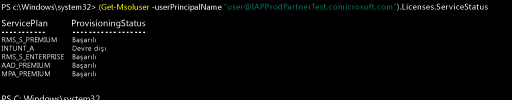

# Kullanıcı hesaplarınıza Intune lisansları atama

[!INCLUDE[classic-portal](../includes/classic-portal.md)]

El ile kullanıcı eklediğinizde veya şirket içi Active Directory'nizden eşitlediğinizde, kullanıcıların cihazlarını Intune'a kaydedebilmesi için önce her kullanıcıya bir Intune lisansı atamanız gerekir.

## Office 365 Yönetim merkezinden bir Intune lisansı atama

Bulut tabanlı kullanıcılar eklemek ve hem bulut tabanlı kullanıcı hesaplarına hem de şirket içi Active Directory’nizden Azure AD’ye eşitlenen hesaplara lisans atamak için [Office 365 portalını](http://go.microsoft.com/fwlink/p/?LinkId=698854) kullanabilirsiniz.

1.  [Office 365 portalında](http://go.microsoft.com/fwlink/p/?LinkId=698854) kiracı yöneticisi kimlik bilgilerinizi kullanarak oturum açın, sonra **Kullanıcılar** > **Etkin Kullanıcılar**’ı seçin.

2.  Intune kullanıcı lisansı atamak istediğiniz kullanıcı hesabını seçin ve **Ürün lisansları** > **Düzenle**’yi seçin.

3.  **Intune** veya **Enterprise Mobility + Security**’i **Açık** konuma getirin ve **Kaydet**’i seçin.

4. Kullanıcı hesabı artık hizmeti kullanmak ve yönetime cihaz kaydetmek için gereken izinlere sahiptir.

> [!NOTE]
> Kullanıcılar, sadece cihazlarını kaydettikten sonra Yönetim konsolunda görünür. Ayrıca, seçili tüm kullanıcılar için lisans ekleme veya değiştirmeyi seçerek bir grup kullanıcıyı aynı anda düzenlemek üzere seçebilirsiniz.

## EMS kullanıcı lisanslarını seçmeli yönetmek için PowerShell kullanma
Microsoft Enterprise Mobility + Security (eskiden Enterprise Mobility Suite) kullanan kuruluşların, yalnızca EMS paketinde Azure Active Directory Premium veya Intune hizmetleri gerektiren kullanıcıları olabilir. [Azure Active Directory PowerShell cmdlet’lerini](https://msdn.microsoft.com/library/jj151815.aspx) kullanarak hizmetlerin birini veya bir alt kümesini atayabilirsiniz.

EMS hizmetlerinin kullanıcı lisanslarını seçmeli atamak için, [Windows PowerShell için Azure Active Directory Modülü](https://msdn.microsoft.com/library/jj151815.aspx#bkmk_installmodule)’nün yüklü olduğu bilgisayarda bir yönetici olarak PowerShell’i açın. PowerShell’i yerel bilgisayara veya ADFS sunucusuna yükleyebilirsiniz.

Yalnızca istenen hizmet planları için geçerli olan yeni bir lisans SKU tanımı oluşturmalısınız. Bunu yapmak için, uygulamak istemediğiniz planları devre dışı bırakın. Örneğin, Intune lisansı atamayan bir lisans SKU tanımı oluşturabilirsiniz. Kullanılabilen hizmetlerin listesini görmek için şunu yazın:

    (Get-MsolAccountSku | Where {$_.SkuPartNumber -eq "EMS"}).ServiceStatus

Intune hizmet planını hariç tutmak için aşağıdaki komutu çalıştırabilirsiniz. Güvenlik grubunun tamamına yayılmak için aynı yöntemi kullanabileceğiniz gibi, daha ayrıntılı filtreler de kullanabilirsiniz.

**Örnek 1** 
Komut satırında yeni kullanıcı oluşturun ve lisansın Intune bölümünü etkinleştirmeden bir EMS lisansı atayın:

    Connect-MsolService

    New-MsolUser -DisplayName “Test User” -FirstName FName -LastName LName -UserPrincipalName user@<TenantName>.onmicrosoft.com –Department DName -UsageLocation US

    $CustomEMS = New-MsolLicenseOptions -AccountSkuId "<TenantName>:EMS" -DisabledPlans INTUNE_A
    Set-MsolUserLicense -UserPrincipalName user@<TenantName>.onmicrosoft.com -AddLicenses <TenantName>:EMS -LicenseOptions $CustomEMS

Şununla doğrulayın:

    (Get-MsolUser -UserPrincipalName "user@<TenantName>.onmicrosoft.com").Licenses.ServiceStatus

**Örnek 2** 
Zaten lisans atanmış bir kullanıcı için EMS lisansının Intune bölümünü devre dışı bırakın:

    Connect-MsolService

    $CustomEMS = New-MsolLicenseOptions -AccountSkuId "<TenantName>:EMS" -DisabledPlans INTUNE_A
    Set-MsolUserLicense -UserPrincipalName user@<TenantName>.onmicrosoft.com -LicenseOptions $CustomEMS

Şununla doğrulayın:

    (Get-MsolUser -UserPrincipalName "user@<TenantName>.onmicrosoft.com").Licenses.ServiceStatus

>[!div class="step-by-step"]

>[&larr;**Kullanıcıları Intune ile eşitleme**](.\start-with-a-paid-subscription-to-microsoft-intune-step-2.md) [**Kullanıcıları ve cihazları düzenleme**&rarr;](.\start-with-a-paid-subscription-to-microsoft-intune-step-5.md)  

