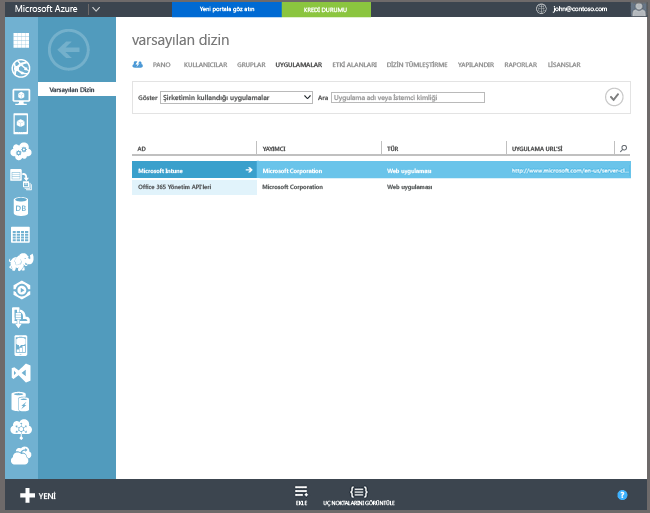

## Azure Active Directory kaydı

Otomatik kayıt, kullanıcıların şirkete ait ya da kişisel Windows 10 bilgisayarlarını veya Windows 10 Mobile cihazlarını, bir iş veya okul hesabı ekleyip yönetilmeyi kabul ederek Intune’a kaydetmelerine izin verir. Bu kadar basit. Arka planda, kullanıcının cihazı kaydolur ve Azure Active Directory’ye katılır. Kaydedildikten sonra cihaz, Intune ile yönetilir.

**Önkoşullar**
- Azure Active Directory Premium aboneliği ([deneme aboneliği](http://go.microsoft.com/fwlink/?LinkID=816845))
- Microsoft Intune aboneliği

### Otomatik MDM kaydını yapılandırma

1. [Azure yönetim portalında](https://manage.windowsazure.com) (https://manage.windowsazure.com), **Active Directory** düğümüne gidin ve dizininizi seçin.

2. **Uygulamalar** sekmesine tıklarsanız uygulamalar listesinde **Microsoft Intune**’u görmeniz gerekir.

    

3. **Microsoft Intune** okuna tıklarsanız, Microsoft Intune’u yapılandırmanızı sağlayan bir sayfa görmeniz gerekir.

4. Microsoft Intune ile otomatik MDM kaydını yapılandırmaya başlamak için **Yapılandır**’a tıklayın.

5. Intune için URL'leri belirtin:

  - **MDM Kayıt URL’si** – Varsayılan değeri kullanın.
  - **MDM Kullanım Koşulları URL’si** – Varsayılan değeri kullanın. Bu URL, kullanıcılara cihazlarını kaydederken kullanım koşullarını gösterilir.
  - **MDM Uyumluluk URL’si** – Varsayılan değeri kullanın. Bir cihazın uyumsuz olduğunu bulunursa, bu URL ile bir **Erişim reddedildi** iletisi gösterilir. URL, kullanıcıların cihazlarının ilke ile neden uyumsuz olduğunu ve nasıl yeniden uyumlu hale getirebileceklerini anlamalarına yardımcı olan bir sayfayı işaret eder.

6.  Cihazları Microsoft Intune tarafından yönetilecek kullanıcıları belirtin. Bu kullanıcıların Windows 10 cihazları, Microsoft Intune ile yönetim için otomatik olarak kaydedilir.

  - **Tümü**
  - **GRUPLAR**
  - **Yok.**

7. **Kaydet**’i seçin.

<!--HONumber=Jan17_HO1-->

