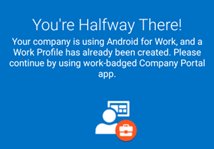
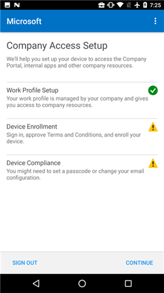
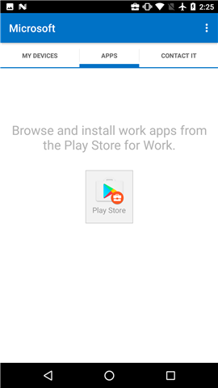

# Bir iş profili oluşturma ve cihazınızı Intune’a kaydetme

Android cihazınızı kaydetmek şirket e-postası, uygulamaları ve diğer iş verilerine erişmenizi sağlar. Kayıt işleminin bir parçası olarak, cihazınızdaki kişisel verileri iş verilerinizden ayıran bir iş profili ayarlarsınız. BT yöneticiniz, yalnızca iş verilerinizi içeren iş profilinizi yönetebilir. BT yöneticiniz cihazınızdaki kişisel verileri yönetemez. [İş profili oluşturduğunuzda ne olacağı](what-happens-when-you-create-a-work-profile-android.md) hakkında daha fazla bilgi edinin.

Bir iş profili oluşturmak için:

1.  Android Şirket Portalı’ndaki **Hoş Geldiniz** ekranında **Oturum aç**’a dokunun ve ardından iş veya okul hesabınızla oturum açın. Ücretsiz uygulamayı henüz yüklemediyseniz, [Google Play](http://play.google.com/store/apps/details?id=com.microsoft.windowsintune.companyportal)’den indirin ve yükleyin.

    

2. **Şirket Erişimi Kurulumu** ekranında **BAŞLA**’ya dokunun.

    

3.  **Neden iş profili oluşturmalıyım?** ekranında, iş profili oluşturmanın size sağlayacaklarını okuyun ve ardından **DEVAM**’a dokunun.

    

4.  BT yöneticinizin cihazınızda neleri görebileceğini ve neleri göremeyeceğini içeren listeyi gözden geçirin ve **DEVAM**’a dokunun.

    

5.  **Sıradaki** ekranında sonraki adımda neler olacağı hakkında okuyun ve **DEVAM**’a dokunun.

    

6. **İş profili ayarlama** ekranında, **SONRAKİ**’ye dokunarak Şirket Portalı uygulamasının iş profiline erişmesine izin verin.

    

7. Bir iş profili oluşturduğunuzda ve BT yöneticinizin neler yapabileceğinizi açıklayan Google ekranını gözden geçirin ve ardından **Tamam**’a dokunun.

    

    "İş profilinizi ayarlama" ve "Cihazınızı kaydetme" içerikli birkaç ileti görürsünüz.

8. **Yolu Yarıladınız!** ekranında, Şirket Portalı uygulaması açılana kadar birkaç saniye bekleyin.

    

9. Android Şirket Portalı’ndaki **Hoş Geldiniz** ekranında **Oturum aç**’a dokunun ve bu işlemde daha önce oturum açmak için kullandığınız iş veya okul hesabınızla oturum açın.

10. **Şirket Erişimi Kurulumu** ekranında, İş Profili Kurulumunuzun tamamlandığını gördükten sonra **DEVAM**’a dokunun.

    

    "Cihazınız kaydediliyor" iletisini görürsünüz.

11. **Şirket Erişimi Kurulumu** ekranı her şeyin doğru şekilde ayarlandığını gösterdiğinde **DEVAM**’a dokunun.

    

12. **Şirket Erişimi Kurulumu tamamlandı** ekranında **BİTTİ**’ye dokunun. BT yöneticiniz, başka gereksinimler eklediyse ek adımlar gerçekleştirmeniz gerekebilir.

    

    Bundan sonra şirket uygulamalarını Play Store for Work’ten alabilirsiniz.

    

Bu bilgiler yardımcı olmadı mı? BT yöneticinize başvurun. Kişi bilgileri için [Şirket Portalı Web sitesine](http://portal.manage.microsoft.com) bakın.
