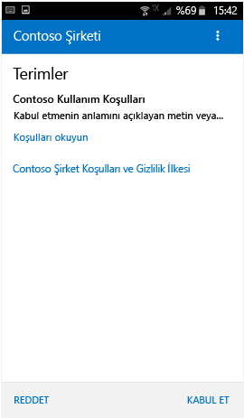
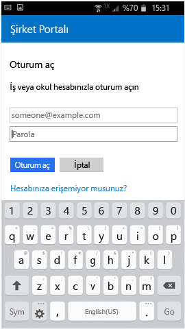
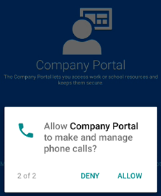

# Cihazınızı Şirket portalı ile kaydetme  
Şirket e-posta, uygulamalar ve veriler güvenli erişim elde etmek için kişisel veya şirkete ait Android Cihazınızı kaydetme. Şirket portalı Android cihazlarında Samsung Knox dahil olmak üzere Android 4.4 ve üzeri çalıştıran destekler.  

> [!NOTE]
> Samsung Knox, bazı Samsung cihazlarının yerel Android tarafından sağlanan korumanın dışında ek koruma için kullandığı bir güvenlik türüdür. Bir Samsung Knox cihazınız olup olmadığını denetlemek için > Git **ayarları** > **cihaz hakkında**. Görmüyorsanız **Knox sürümü** listelenip, yerel bir Android cihazına sahipsinizdir.    

## Cihaz kaydetme  
Emin olun [ücretsiz Intune Şirket portalı uygulamasını Google Play'den yükleyin](https://play.google.com/store/apps/details?id=com.microsoft.windowsintune.companyportal). 

Kayıt sırasında Cihazınızı kullanma şeklinizi en iyi şekilde açıklayan bir kategoriyi seçmeniz istenebilir. Şirketinizin destek birimi, erişiminiz olan uygulamaları denetlemek için yanıtınız kullanır.  

1. Şirket Portalı uygulamasını açın.  

3. Şirket Portalı’ndaki **Hoş Geldiniz** ekranında **Oturum aç**’a dokunun ve ardından iş veya okul hesabınızla oturum açın.

      

4. Kuruluşunuzun hüküm ve koşullarını kabul etmeniz istenirse, dokunun **kabul**. Bu ekran aşağıdaki örnek ekran görüntüsünden biraz farklı olabilir. 

   

5. İş veya okul hesabınızla parolanızı kullanarak Şirket Portalı uygulamasına oturum açıp **Oturum aç**’a dokunun.

   

6. **Şirket Erişimi Kurulumu** ekranında, **DEVAM**’a dokunun.

   

   > [!NOTE]
   > Sarı üçgenler herhangi bir hata olduğu anlamına gelmez. Bu simgeler, kayıt işleminde hala tamamlanması gereken adımlar olduğunu gösterir.

7. Şirketinizin destek biriminin cihazınızda neleri görüp göremeyeceğini içeren listeyi gözden geçirin ve ardından **DEVAM**’a dokunun.

   

8. **Sırada ne var?** ekranında, kayıt sırasında ne olduğunu okuyun ve **KAYDET**’e dokunun.

   

9. Android 6.0 veya üzeri kullanıyorsanız, bu adımı uygulayın. Aksi halde, sonraki adıma geçin.

   Şirketinizin destek birimi belirli ilkeler ayarladıysa, aşağıdaki iletileri görebilirsiniz:
   - **Şirket Portalı’nın telefon çağrıları yapmasına ve çağrıları yönetmesine izin verilsin mi?**

     

   Bu iletiyi görürseniz, **İZİN VER**’e dokunun. İZİN VER’e dokunmak güvenlidir, çünkü **Microsoft hiçbir zaman telefon çağrısı yapmaz veya telefon çağrılarınızı yönetmez**! İleti metni Google’ın kontrolündedir ve Microsoft bunu değiştiremez. Erişime izin verdiğinizde, tüm yaptığınız cihazınızın uluslararası mobil cihaz kodunu (IMEI) Intune'a göndermesine izin vermektir. IMEI, seri numarası gibi, bir mobil cihazı benzersiz şekilde tanımlayan bir numaradır.

   Erişimi reddederseniz, tekrar şirket portalında oturum açın sonraki durumda ileti görünür. Gelecekteki iletileri kapatabilirsiniz için seçin **daha sorma**. Erişim izni tersine çevirmek için Git **ayarları** > **uygulamaları** > **Şirket portalı** > **izinleri**   >  **Telefon**ve ardından izni etkinleştirebilirler.  

   - **Şirket Portalı’nın, kişilerinize erişmesine izin verilsin mi?**

     

     Bu iletiyi görürseniz, **İZİN VER**’e dokunun. İZİN VER’e dokunmak güvenlidir, çünkü **Microsoft kişilerinize hiçbir zaman erişmez!** İleti metni Google’ın kontrolündedir ve Microsoft bunu değiştiremez. Erişim izni verdiğinizde Şirket Portalı uygulamasının yalnızca iş hesabınızı oluşturmasına, kullanmasına ve yönetmesine izin verilir.

     Erişimi reddederseniz Şirket Portalı’nda oturum açtığınız sonraki durumda ileti yeniden görünür, ancak **Bir daha sorma** kutusuna dokunarak gelecekteki iletileri kapatabilirsiniz. Daha sonra erişime izin vermeye karar verirseniz, **Ayarlar** &gt; **Uygulamalar** &gt; **Şirket Portalı** &gt; **İzinler** &gt; **Telefon** giderek izni açın.

10. **Cihaz yöneticisini etkinleştir** ekranında **Etkinleştir**’e dokunun.

    

    Cihaz yöneticisi rolü, Şirket Portalı’na cihazınızı yönetmesi için gereken roldür. Yöneticinizin bazı öğeleri (ekranınızın kilidini açmayı kaç kez denediğiniz gibi) görmesine ve bazı önlemler almasına olanak tanır.    

    Bu ileti Microsoft’un denetiminde değildir ve iletide kullanılan ifadenin biraz sert göründüğünün farkındayız. Şirket Portalı’nın yalnızca kuruluşunuzla ilgili olan kısıtlamaları ve erişimi göstermesinin bir yolu yoktur. Bunların tümü, bu ekranda aynı anda verilir. Kendi kuruluşunuzun kullanımına özgü sorularınız varsa, daha fazla bilgi edinmek için [Şirket Portalı web sitesindeki](https://go.microsoft.com/fwlink/?linkid=2010980) iletişim bilgilerini kullanarak şirketinizin destek birimiyle bağlantı kurun.  

11. Yönergeleri izleyerek PIN’i veya parolayı girin. Bu cihazda zaten bir PIN veya parola ayarladıysanız, bu ekranı görmezsiniz ya da yeni bir PIN veya parola girmeniz gerekmez.  

    

12. Bir Samsung Knox cihazı kullanıyorsanız **Onayla**’ya dokunduğunuzda cihazınızın kaydedildiğini belirten bir ileti görürsünüz. Yerel bir Android cihaz kullanıyorsanız cihazınızın kaydedildiğini gösteren alttaki ekranı fark etmeniz yeterlidir.

    

    Bu ekran, cihazınızın kaydedilmekte olduğunu gösterir.

    

13. **Şirket Erişimi Kurulumu** ekranı görüntülendiğinde **DEVAM**’a dokunun. Cihazınızın uyumsuz olduğunu belirten bir ileti görürseniz sorunu düzeltmek için yönergeleri izleyin ve sonra **DEVAM**’a dokunun.

    

    

    Sorunlara dokunarak bunlar hakkında daha fazla bilgi edinebilirsiniz.

    

      

14. **Şirket Erişimi Kurulumu tamamlandı** ekranında **BİTTİ**’ye dokunun. Cihazınız artık kaydedilmiştir.

    

## Sonraki adımlar  

Şirket uygulamalarını yüklemeyi denemeden önce Git **ayarları** > **güvenlik**ve açma **bilinmeyen kaynaklar**. Uygulamaları yüklemeyi denemeden önce bu seçeneği açmazsanız aşağıdaki iletiyi görürsünüz: "Yükleme engellendi. Güvenlik nedeniyle cihazınız bilinmeyen kaynaklardan gelen uygulamaların yüklenmesini engelleyecek şekilde ayarlanmış." iletisini görürsünüz. Hata iletişim kutusunda **Ayarlar** öğesine dokunarak **Bilinmeyen kaynaklar** seçeneğine gidin.  

> [!Note]
> Kuruluşunuzda telekomünikasyon gider yönetimi yazılımı kullanılıyorsa, cihazınız tam olarak kaydedilmeden önce tamamlamanız gereken ek birkaç adım vardır. Daha fazla bilgiyi [burada](enroll-your-device-with-telecom-expense-management-android.md) bulabilirsiniz.

Cihazınızı ıntune'a kaydetmeye çalışırken hata alırsanız, yapabilecekleriniz [şirketinizin Destek e-posta](send-logs-to-your-it-admin-by-email-android.md).  

Bu bilgiler yardımcı olmadı mı? Şirketinizin destek birimine başvurun (iletişim bilgileri için [Şirket Portalı web sitesine](https://go.microsoft.com/fwlink/?linkid=2010980) bakın) veya <a href="mailto:wintunedroidfbk@microsoft.com?subject=I'm having trouble with enrolling my Android device&body=Describe the issue you're experiencing here.">Microsoft Android ekibine</a> yazın.
