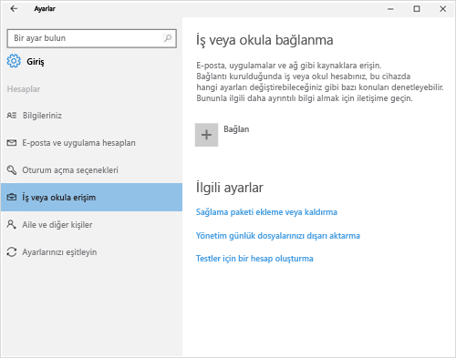
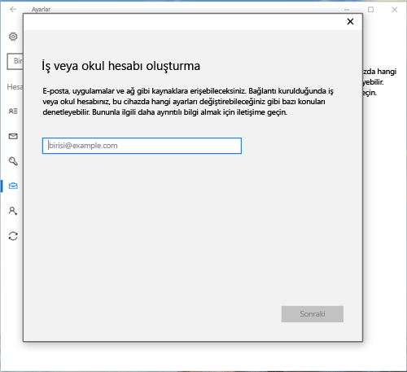
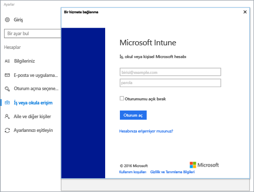
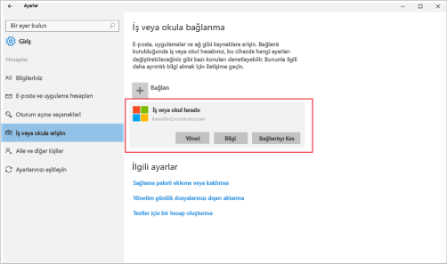
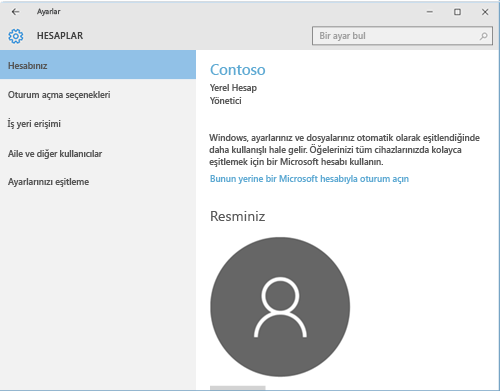
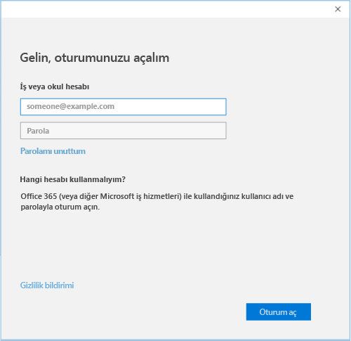

# Intune Şirket portalı ile Windows 10 cihazlarını kaydetme

Windows 10 Cihazınızı kuruluşunuzun yönetim altında kaydetmek için Intune şirket Portalı'nı kullanın. Bu makalede, Windows 10 sürüm 1607 ve üzeri ve Windows 10 sürüm 1511 ve öncesi ile cihazları ıntune'a nasıl kaydedildiği açıklanır. Başlamadan önce emin olun [cihazınızdaki sürümünü doğrulayın](windows-enrollment-company-portal.md#find-windows-10-version-number) doğru adımları izleyebilirsiniz.  

Windows 10 Masaüstü, telefon ve tablet gibi çeşitli cihaz türleri arasında desteklenir. Kayıt adımları, kullanmakta olduğunuz cihazı üzerinde aynıdır. Ancak, ekranınızın bu makalede gösterilen resimlerden biraz farklı görünebilir.  

> [!VIDEO https://channel9.msdn.com/Series/IntuneEnrollment/Windows-Enrollment/player]  

## Windows 10 sürüm 1607 ve üzeri cihaz kaydetme 
Bu adımlar Windows 10, sürüm 1607 ve üzeri çalıştıran bir cihazın nasıl kaydedileceği açıklanmaktadır.  

1. **Başlat**'a gidin. Bir Windows 10 Mobile cihazda varsa, devam **tüm uygulamalar** listesi.

2. Açık **ayarları** uygulama. Uygulama, uygulamalar listesinde kullanılabilir değilse, arama çubuğu ve türü "ayarlar" gidin

3. **Hesaplar** > **İş veya okula erişim** > **Bağlan**’ı seçin.  

      

4. İş veya okul e-posta adresinizi girin ve sonra **İleri**’yi seçin.  

     

5. İş veya okul hesabınız ile Intune’da oturum açın.  

      

    Sonuçta, şirketiniz veya okulunuz, cihazınız kaydediliyor bir ileti görürsünüz.

6. Kuruluşunuzda bir PIN için Windows Hello'yu ayarlama gerekiyorsa, bir doğrulama kodu girmeniz istenir. Kodu girin ve aracılığıyla devam ekrandaki bir PIN oluşturmak için adımlar.  

7. Üzerinde **tamamen hazırsınız!** ekranını görünce **Bitti**’yi seçin. Cihazınız artık kaydedilmiştir.  

8. Bağlantınızı denetleyin geri gidin **ayarları** > **hesapları** > **işe veya okula erişim**.  Hesabınız artık listelenmelidir.  

      

İş veya okul e-postalarınıza, dosyalarınıza veya diğer verilerinize hâlâ erişemiyor musunuz? Bilgi edinmek için nasıl [hesabı sorunlarını giderme](troubleshoot-your-windows-10-device-windows.md#troubleshooting-steps-to-follow-if-you-see-access-work-or-school).  

## Windows 10 sürüm 1511 ve önceki cihaz kaydetme  
Bu adımlar Windows 10 sürüm 1511 ve öncesi çalışan bir cihazın nasıl kaydedileceği açıklanmaktadır.  

1. **Başlat**'a gidin. Bir Windows 10 Mobile cihazda varsa, devam **tüm uygulamalar** listesi.

2. Açık **ayarları** uygulama. Uygulama, uygulamalar listesinde kullanılabilir değilse, arama çubuğu ve türü "ayarlar" gidin

3. Seçin **hesapları** > **hesabınızı**.  

      

5. **İş veya okul hesabı ekle**’yi seçin.  

      

6. İş veya okul kimlik bilgilerinizle oturum açın.  

      

İş veya okul e-postalarınıza, dosyalarınıza veya diğer verilerinize hâlâ erişemiyor musunuz? Bilgi edinmek için nasıl [hesabı sorunlarını giderme](troubleshoot-your-windows-10-device-windows.md#troubleshooting-steps-to-follow-if-you-see-your-account).   

## Sonraki adımlar  

Yardım almak için şirketinizin destek birimi ile iletişime geçin. Kuruluşunuzun bulabilirsiniz BT bilgi [Şirket portalı Web sitesine](https://go.microsoft.com/fwlink/?linkid=2010980). Site iş veya Okul hesabınızla oturum açın.  

 

