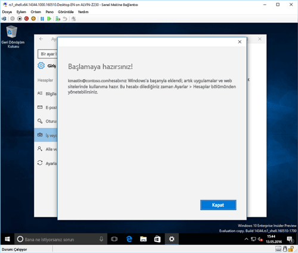

# Windows 10 cihazınızı Intune'a kaydetme

> [!NOTE]
> Windows 10 tüm cihaz türlerinde çalışır. Masaüstü, telefon veya tablet kullandığınızda izleyeceğiniz adımlar, bu sayfadaki resimlerden biraz farklı görünse de aynıdır.

> [!VIDEO https://channel9.msdn.com/Series/IntuneEnrollment/Windows-Enrollment/player]

1. **Başlat**'a gidin.

   - **Windows 10 masaüstü** cihaz kullanıyorsanız **Başlat menüsüne** gidin.
   - **Windows 10 Mobil** cihaz kullanıyorsanız **Başlangıç ekranına** gidin ve **Tüm Uygulamalar** listesine doğru kaydırın.

2. Arama çubuğuna “ayarlar” yazarak Windows **Ayarlar** uygulamasını bulun ve açın.

3. **Hesaplar** > **İş veya okula erişim** > **Bağlan**’ı seçin.

    

4. İş veya okul e-posta adresinizi girin ve sonra **İleri**’yi seçin.

   

5. İş veya okul hesabınız ile Intune’da oturum açın.

    

    Şirketinizin veya okulunuzun cihazını kaydettiğini belirten bir mesaj görürsünüz.

6. **Tamamen hazırsınız!** ekranını görünce, **Kapat**’ı seçin. İşlem tamamlandı.

   

7. Bağlantınızın doğru olup olmadığını bir kez daha kontrol etmek isterseniz, artık iş veya okul hesabınızın listelenmesi gereken **Ayarlar**’a geri dönün.

    

Önceki adımları uygulamanıza rağmen iş veya okul e-posta hesabınıza ve dosyalarınıza erişemiyorsanız, [İşe veya okula erişim görüyorsanız izlenecek sorun giderme adımları](troubleshoot-your-windows-10-device-windows.md#troubleshooting-steps-to-follow-if-you-see-access-work-or-school) bölümündeki adımları uygulayın.
