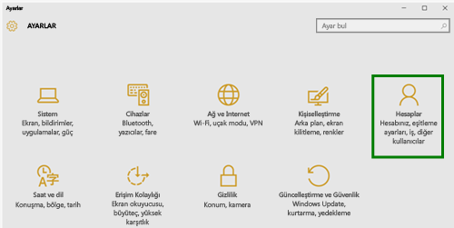

# Windows 10 cihazınızı Intune'a kaydetme

> [!NOTE]
> Windows 10 tüm cihaz türlerinde çalışır. Masaüstü, telefon veya tablet kullandığınızda izleyeceğiniz adımlar, bu sayfadaki resimlerden biraz farklı görünse de aynıdır.

1.  **Başlat**'a gidin.

  - **Windows 10 masaüstü** cihaz kullanıyorsanız **Başlat menüsüne** gidin.
  - **Windows 10 Mobil** cihaz kullanıyorsanız **Başlangıç ekranına** gidin ve **Tüm Uygulamalar** listesine doğru kaydırın.

2. Arama çubuğuna “ayarlar” yazarak Windows **Ayarlar** uygulamasını bulun ve açın.

3. **Hesaplar**’ı seçin.

    

4. **Hesabınız**’ı seçin.

    

5. **İş veya okul hesabı ekle**’yi seçin.

    

6. İş veya okul kimlik bilgilerinizle oturum açın.

    

İş veya okul e-postalarınıza, dosyalarınıza veya diğer verilerinize hâlâ erişemiyor musunuz? Erişim sağlamak için [hesabınızla ilgili sorun giderme adımlarını](troubleshoot-your-windows-10-device-windows.md#troubleshooting-steps-to-follow-if-you-see-your-account) uygulayın. Bu adımlar da işe yaramazsa, ek yardım için BT yöneticinizle iletişime geçmeniz gerekir.

BT yöneticinizden yardım almanın kolay yollarından biri, Şirket Portalı uygulamasındaki iletişim bilgilerini kullanmaktır. Bu uygulama sayesinde günlük işleriniz için önerilen uygulamaları da bulabilir ve indirebilirsiniz. Şirket Portalı uygulaması cihazınıza önceden yüklenmiş olabilir. Kontrol etmek için __Şirket Portalı__ uygulamasını __Tüm uygulamalar__ listesinde arayın.

Uygulama listenizde Şirket Portalı’nı görmüyorsanız, yüklemek için aşağıdaki adımları izleyin.

1. **Başlat** > **Mağaza**’yı seçin.

2. **Ara**’yı seçin ve sonra **şirket portalı** yazın.

3. Sonuçlar listesinde **Şirket Portalı** > **Yükle**’yi seçin.

4. **Yükle** veya **Ücretsiz**’i seçin. Bu iki seçeneğin sizin açınızdan farkı yoktur. Gösterilen seçenek, kuruluşunuzun Şirket Portalı uygulamasını ayarlama şekline göre değişir.

