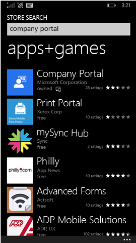
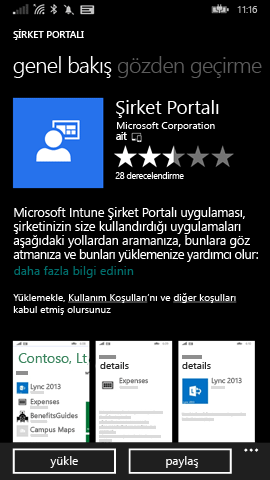
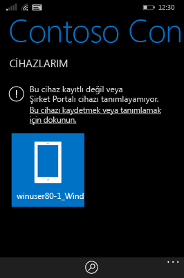
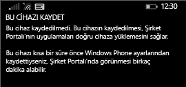
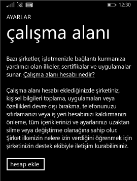

# Windows Phone 8.1 cihazınızı Intune'a kaydetme

Şirketinizde veya okulunuzda Microsoft Intune kullanılıyorsa, şirket e-postasına, dosyalarına ve diğer kaynaklarına erişmek için cihazlarınızı kaydedebilirsiniz. Cihazlarınızı kaydettiğinizde, kuruluşunuz şirket verilerini güvenli tutabilir. Kayıt hakkında daha fazla bilgi edinmek için bkz. [Şirket Portalı uygulamasını yükler ve cihazınızı Intune’a kaydederseniz ne olur?](what-happens-if-you-install-the-company-portal-app-and-enroll-your-device-in-intune-windows.md) ve [Şirketinizin destek biriminin cihazınızda görebilecekleri ve göremeyecekleri](what-info-can-your-company-see-when-you-enroll-your-device-in-intune.md).  

Cihazınızı ıntune'a kaydetmek için belirlenen izinler veya geçerli hesap durumu eşleşen yönergeleri izleyin.

## Şirketiniz Microsoft Mağazası'ndan Şirket Portalı’nı kullanmanıza izin veriyorsa  
Cihazınıza Şirket Portalı uygulamasını yükleyin:

1.  **Başlat** &gt; **Mağaza**’ya dokunun.

2.  **Ara**’ya dokunun, sonra **şirket portalı** yazın.

3.  Sonuçlar listesinde **Şirket Portalı**’na dokunun.

    

4.  **Şirket Portalı**  &gt; **Yükle**’ye dokunun.

    

Cihazınızı kaydedin:

1.  Cihazda **Microsoft Intune Şirket Portalı** uygulamasını açın.

2.  Kimlik bilgilerinizi sağlayın. Varsa, şirketinizin Hüküm ve Koşullarını kabul etmeniz istenebilir.

3.  **Cihazlarım**’a doğru çekin.

4.  **Bu cihazı kaydetmek veya tanımlamak için dokunun**’a dokunun.

    

5.  **Bu cihazı kaydet**’e dokunun.

    

6.  **Hesap ekle**’ye dokunun.

    

7.  İstenen ek bilgileri girin ve ardından kaydı tamamlamak için **oturum aç**’a dokunun. Şimdi **Ayarlar** &gt; **İş Yeri** sayfasında iş yeri hesabınızı görmeniz gerekir.

    

## Windows Phone’unuzdan Microsoft Mağazası’na erişmenize izin verilmiyorsa veya bir Microsoft Hesabınız yoksa

1.  **Ayarlar** &gt; **iş yeri**’ne dokunun.

2.  **hesap ekle**’ye dokunun ve iş hesabınızı kullanarak oturum açın.

3.  İstenen ek bilgileri girin ve ardından kaydı tamamlamak için **oturum aç**’a dokunun.

4.  Şirket uygulaması veya Hub’ı yüklemeniz istenirse, ilgili kutunun işaretli olduğundan emin olun ve **bitti**’ye dokunun.

Şirketinizin destek birimi Şirket Portalı’nı kayıt sırasında yüklenecek şekilde ayarladıysa, Şirket Portalı’nı uygulama listenizde görürsünüz.

Bu bilgiler yardımcı olmadı mı? Şirketinizin destek bölümüne başvurun. Kişi bilgileri için [Şirket Portalı Web sitesine](https://go.microsoft.com/fwlink/?linkid=2010980) bakın.
