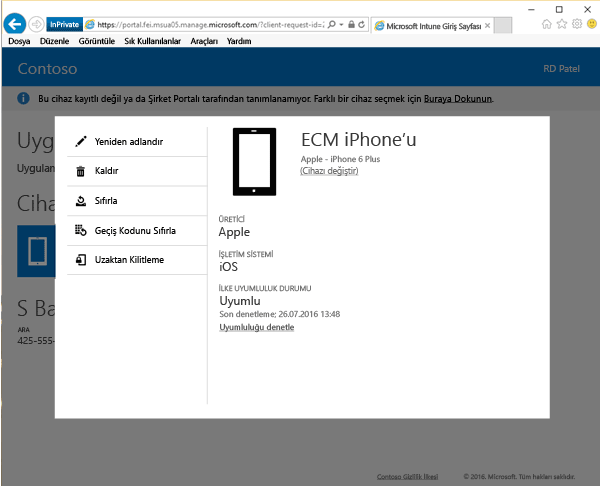

# Şirket Portalı web sitesinden cihazınızı yeniden adlandırma

Şirket Portalı web sitesinden kaydettiğiniz, yönetilen cihazınızı yeniden adlandırmayı öğrenin. Genel veya varsayılan model adına sahip bir cihazı, hemen belirlemenize yardımcı olabilecek şekilde yeniden adlandırın.  

1. [Şirket Portalı web sitesinde](https://portal.manage.microsoft.com/HelpDeskDialog) __Menü__ düğmesi > __Cihazlarım__’ı seçin.

2. Yeniden adlandırmak istediğiniz cihazı seçin.

  

3. **Yeniden Adlandır**'ı seçin.  

     
    

4. Cihazınızın adının göründüğü kutuya cihazınız için yeni bir ad girin. Sonra **Yeniden Adlandır** düğmesine dokunun. Cihazınız artık yeni adıyla görünür.

Bu bilgiler yardımcı olmadı mı? Şirketinizin destek bölümüne başvurun. Kişi bilgileri için [Şirket Portalı Web sitesine](https://portal.manage.microsoft.com/HelpDeskDialog) bakın.
