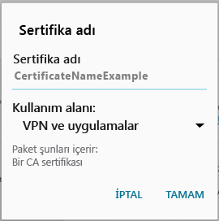

# Android cihazınızda şirketinizin destek biriminin gerekli kıldığı bir sertifika eksik

Cihazınız Intune’a kayıtlı değilse ve şirketinizin destek birimi tarafından gerekli kılınan bir sertifika cihazınızda bulunmuyorsa, Şirket Portalı uygulamasında oturum açamazsınız. Oturum açmaya çalıştığınızda şu iletiyi görürsünüz:

Bu sorunu düzeltmek ve gerekli sertifikayı almak için uygulamanız gereken iki temel adım vardır:

- Bir şirket veya okul bilgisayarına bakarak eksik sertifikayı belirleyin.
- Cihazınızı kullanarak eksik sertifikayı İnternet’ten indirin.

## Bir şirket veya okul bilgisayarına bakarak eksik sertifikayı belirleme

1. Bir bilgisayarda Internet Explorer’ı açın. Bu amaçla kullanabileceğiniz bir bilgisayarınız yoksa, şirketinizin destek birimine başvurun. Şirketinizin destek biriminin iletişim bilgileri için [Şirket Portalı web sitesine](https://go.microsoft.com/fwlink/?linkid=2010980) bakın.

2. [Şirket Portalı web sitesine](https://go.microsoft.com/fwlink/?linkid=2010980) gidin ve iş veya okul kimlik bilgilerinizle oturum açın.

3. Tarayıcı adres çubuğunun sağ ucunda, aşağıdaki ekran görüntüsünde gösterildiği gibi asma kilide benzeyen simgeyi seçin.

    

    Asma kilit simgesini görmüyorsanız, devam etmeyin ve şirketinizin destek birimine başvurun. Kilit simgesi güvenli oturum açtığınız anlamına gelir; dolayısıyla bu simgeyi görmüyorsanız devam etmemelisiniz.

4. **Sertifikaları görüntüle**’yi seçin.

    

5. **Sertifika** iletişim kutusunda **Sertifika yolu** sekmesini seçin ve ardından İnternet’ten almanız gereken sertifikayı belirleyin. Size gereken sertifikanın adı, önceki örnek ekran görüntüsünde vurgulanan sertifikayla aynı konumda olacaktır.

## Eksik sertifikayı Android mobil cihazınıza indirme ve yükleme

1. Bing veya Google gibi bir arama motoru kullanarak, önceki bölümde belirlediğiniz eksik sertifikanın adını arayın. Sertifika, “.crt” veya “.pem” gibi farklı "uzantılarla" bitiyor olabilir.

2. Web sitesinden kök sertifikayı indirin.

3. Sertifika indirildikten sonra, cihazınızda en üstten aşağı doğru sürükleyerek bildirimlerinizi açın ve bildirimler listesinde sertifikanın adına dokunun.

4. Aşağıdaki ekran görüntüsünde gösterilen **Sertifikayı Adlandır** iletişim kutusunda varsayılan sertifika adını kabul edin.

5. **Kimlik Bilgisi Kullanımı**’nın **VPN ve uygulamalar için kullanılır** olarak ayarlandığından emin olun ve **Tamam**’a dokunun.

    

6. Şirket Portalı uygulamasını kapatın.

7. Şirket Portalı uygulamasını yeniden açın. Artık Şirket Portalı uygulamasında oturum açabilmeniz gerekir. Yardıma ihtiyacınız olursa şirketinizin destek birimiyle iletişime geçin.

Önceki gösterilenle aynı “eksik sertifika” iletisini görüyorsanız ve yordamı zaten izlediyseniz, büyük olasılıkla şirketinizin destek biriminin yüklemenize yardımcı olması gereken bir sertifika daha vardır. Yardım için [Şirket Portalı web sitesinde](https://go.microsoft.com/fwlink/?linkid=2010980) bulunan iletişim bilgilerini kullanarak şirketinizin destek birimine başvurun.
